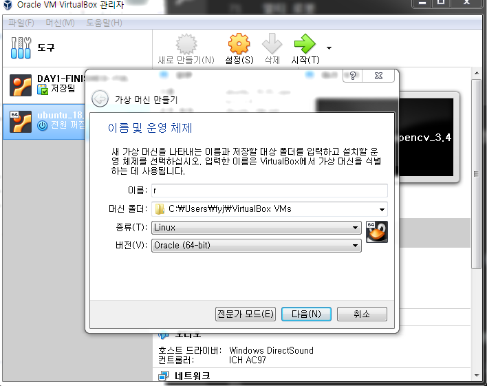
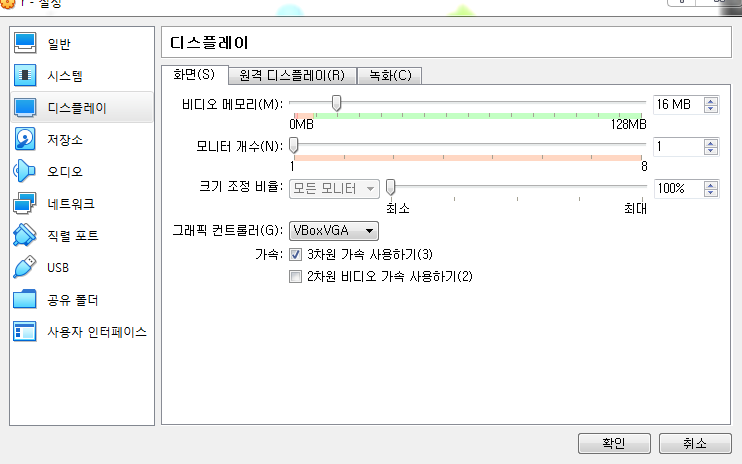
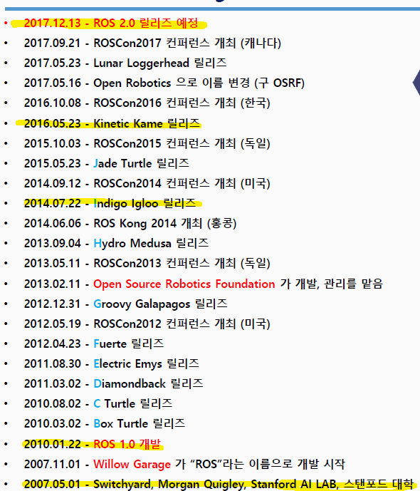
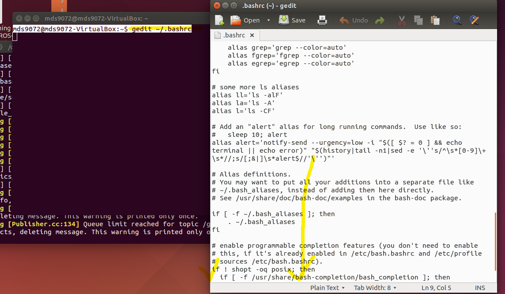
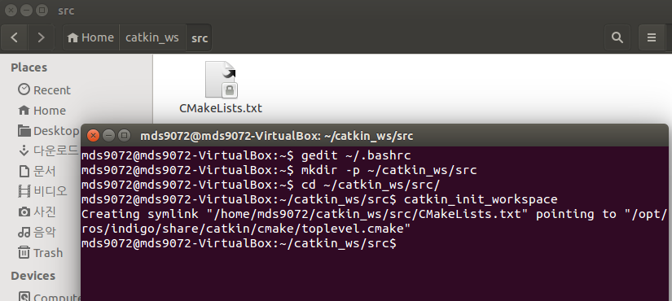
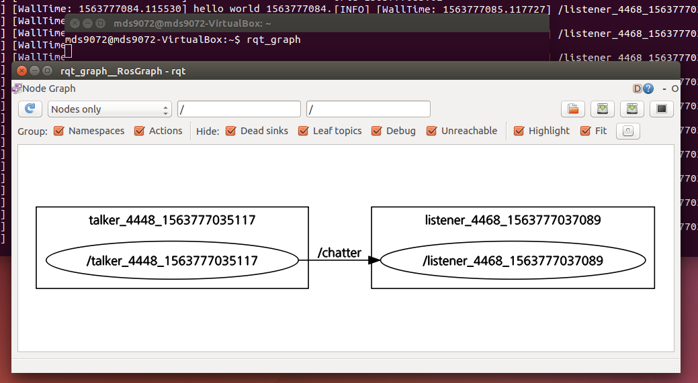
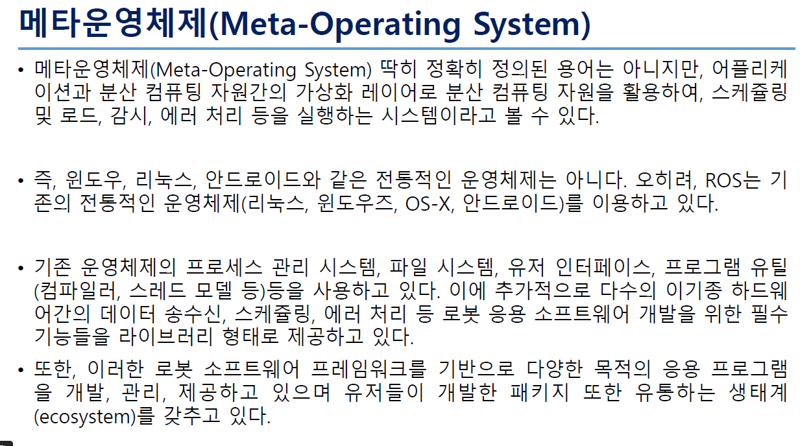

# ROS 수업
## 1일차

etc는 환경설정이 다되어있는 압축파일

환경설정에 있는 압축파일은 ROS순수파일

욕토는 빌드시스템
클릭하면 다만들어줌.
부트로더 , 운영체제 , ... 만들어짐
무거고 오래거린다. 하지만 자동화 된다.

로봇ros 으로 키워드해야 다양한 책들이 검색된다.

C언어 기반
ROS는 표윤석 거북이 까진 더봐야...유튜브 자료도있고
응용과 활용을 하려면 참고해야...

---

https://cafe.naver.com/openrt

로봇운영체제 ROS 공개강좌에서

2015 검색

	
ROSCon2015 총정리

---

	
ROSCon2015 총정리

로스 2.0 으로 크게 변경됨

이제서야 실시간을 지원하게됨.
현업에서는 2.0을 쓰고있지않다.
하지만 조금씩 자리잡아 갈것이다.

리얼타임은 약속을 지키느냐 안지키느냐 이다.

LTS 는 롱텀서비스

인디고 키넥트 베로딕 ros 2.0 정도가 LTS가 길다 
이 버전이 정말 중요 .. 무엇을 써야되는지 .. 언제까지 지원하는지..
사용가능 기한이 중요.
ROS지원이 오래되는것을 선정하는것이 중요

---
ROS 2.0 소개.파일

ROS 1.0
단일 로봇 지원.
컴퓨터 4대를 합쳐서 로봇한대.
24개의 프로그램이 합쳐져서 구동됨.(노드들)

워크스테이션 급 (슈퍼컴퓨터) 사양이 높음...
리얼타임 지원 안함....
인터넷연결상태가 좋아야됨.
가상 네트워크 VPN

주로 연구기관 아카데미에서 사용

ROS 2.0
멀티 로봇
낮은사양 cpu 구동
리얼타임
네트워크이 좀 나빠도 가능하게 완화

---
로보티스 e-manual

http://emanual.robotis.com/docs/en/platform/turtlebot3/overview/

정리가 잘되어있다.

---

# 설치 환경설정하기 

환경설정에서 압축파일을 시드라이브 알 폴더에 압축 풀어서넣는다

그리고 

버츄얼박스 환경설정 확장에서 
오라클 버전이 동일한것을 확장팩을 설치한다.

버츄얼 의 설정 환경설정 입력
호스트 키입력 어플리케이션으로 변경 후 엔터

그다음 확장
오라클 확장팩 설치 

새로만들기

우분투 64비트 확인 r2

이미지 지정해서 불러오기 
*만약 겹치거나 기존에 존재해서 오류나면 
uuid 설정 다시 하면된다.
압축이 잘못풀리거나 그렇다면 다시 풀면될수도있다.
매번 만들때 아이디를 변경해주면좋다.
만약 안되면 처음부터 차근차근 해보면된다.

이후에 선택후 만들기 하면  가상 머신이 만들어짐

설정 시스템 

칩셋 ICH9 / cpu 3개 / 

디스플레이

VBoxVGA 제일 위에꺼 / 3차원 가속 체크 ! / 비디오메모리 제일 크게 끝까지.

저장소
 ICH 6으로 설정 

 확인 후 

 리눅스 시작! 

 부팅되면 설정완료!

*뭔가 설정할때 안될때 최신버전을 하면 거즌다된다.

비디오메모리 크게잡는다.

ROS 가상운영체제에서 설정하는게 어려운것.

설정셋을 잘 알아두도록

pc가상환경 - 인디고

라즈베리파이 - 키넥트 

메로딕

리눅스 안에 히스토리 파일에 설치과정 명령어들 모아둠.

확장팩 해야된다.
3d 체크해야된다.
게스트확장 하면안된다.

---

uuid 변경하기

압축을 두번풀때 겹칠때 쓰는 명령어이다.

cd c:\Program Files\Oracle\VirtualBox\

c:\Program Files\Oracle\VirtualBox>VBoxManage.exe internalcommands sethduuid d:\r\r.vdi

윈도우 프롬프트에서 쳐주고 뒤에 d:\r\r.vdi 경로를 설정해줘야된다.

---

실습 시작

터미널에 23번 29번 명령어를 하나씩 실행하면 된다

로봇의 구동 순서 
찾아가야됨

이미지 딕텍션 이미지 인식

물건 가지고 제어 컨트롤

돌아옴 이동

---
p7

D:\2019 07 21 ROS AND QT 판교 장기 과정-stick\공유\001-월요일\2017 12 11 로보티즈 와플 관련 최신 자료\ros-seminar-master

10년간의 분석 파일

핵심은 인디고 키넥트

설치과정은 버전마다 다다르다... 구글링하면서 설치해야됨

---

CMake

D:\2019 07 21 ROS AND QT 판교 장기 과정-stick\공유\001-월요일\001-cmake

CMake는 윈도우는 윈도우파일로 리눅스는 리눅스파일로 다 바꿔줌.
이런 편의성 때문에 정말 많이 사용함.
변환을 하기위해서도 사용함.

---

p15 실습 *워크스페이스를 구축하기

워크스페이스 만들고 안에 패키지만들고 안에 노드를 만든다.

gedit ~/.bashrc

catkin_make 는
상위 폴더가서 해줘야됨

하면 build와 devel 디렉토리 생성됨.

최악의 경우 뭔가 빌드가 안되면
빌드 와 디벨 디렉토리 생성된거 지우고 다시 
catkin_make을 다시하면 다시 생성됨!

여기까지 워크스페이스를 구축한것

---

roscore 실습

모든 터미널을 다 종료하고 
roscore를 실행 
그리고 roscore는 따로 터미널에 켜놓고 실습을 한다.

제일먼저 띄우고 제일 마지막에 끝낸다.

이미 연결되었을때는 
roscore 가 죽어도 상관없는데

처음연결할때는 roscore가 죽으면 되지않는다.

누가 먼저 실행되는것은 상관없다.

누가 먼저실행되도 무조건 다되어야한다. 

이것이 ROS 스타일이다.

큐티라는 그래프 시각화 도구이다.

rosout 은 로그를 찍는것.

---

운영체제는 아니지만 운영체제 같은 것을
메타운영체제라 함 그게 ROS이다.
연결 다됨!

---

3장 p33

패키지 생성 p 15 하단부

source devel/setup.bash //셋배쉬
chmod 777 -R ./*        //권한오픈

내가만든 작업공간을 셋배쉬해야됨
반드시!
하면 텝키가 먹힌다.

