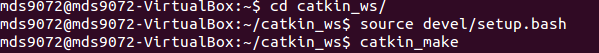
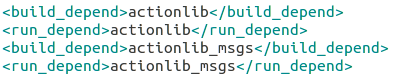
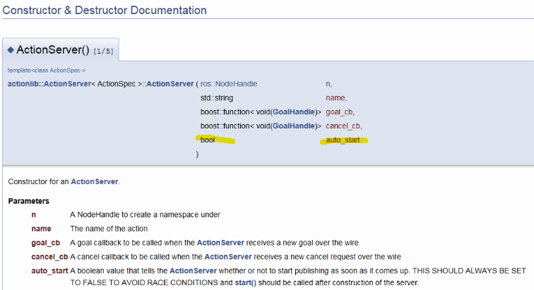
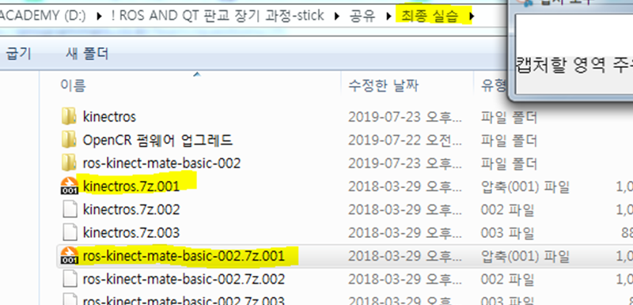
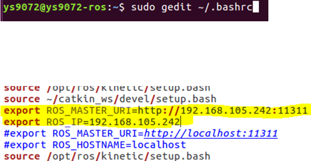

# 2일차 

grep 은 파일 내에서 검색하는 것

p46까지 진행후 위에 성공해야함..

자료형이 생성됨

p44 부터

basics 안에 msg 폴더 만들고
Complex.msg 파일만들고
그안에 예제 3-3 넣고

CMakeList에 package.xml 끌어다 넣고 

xml 추가!
..추가..추가..추가.!

---

서비스 

---
액션 p66
추가 xml 참고

p68 
auto_start

---

라즈베리 파이에 키넥트 설치

키넥트 라즈베리 버젼과 pc키넥트 버젼이 같아야한다.

라즈베리파이 SD카드 덤프 뜨기 

위에 압축이 pc

아래가 라즈베리파이 압축

1. 압축해제

2. Win32DiskImager-0.9.5-install.exe
('관리자 권한으로 실행'  -> 설치)

3. ros-kinect-mate-basic-002.img 를 굽는다. (Write)
(16GB라서 오래걸림)
이미지 복사가 완료되면, 우측 하단에 USB 아이콘을 우클릭해서/
'안전하게 제거'하고 '꺼내기'를 한다.

---

pc 키넥트 설정

k폴더에 가상디스크 만들기

설정 칩셋 ich9
프로세서 3개
디스플레이 최상 3d 비디오메모리 최대
저장소 ich6

마지막으로!!

네트워크 어뎁터에 브리지 로 설정한다.

NAT : 윈도우에게 인터넷이 되도록 부탁
내가 남을 찾아가는 건 된다.
그런데 남이 내 주소(가상의 주소 = 가짜 주소)로 찾아올 수 없다.

어댑터에 '브리지' : 로 바꿔주면 해결된다.
하나가 아니라 여러개의 컴퓨터끼리 접근이 가능하게 되는 것

 sudo gedit ~/.bashrc

 aosalxdp 

 ROS_MASTER_URI 주소 를 
 맞추고

 맨밑에 down하는 줄 #으로 주석처리 

 그리고 roscore 후 실행되는지 확인한다.

roscore할때 설명했던 것/
컴퓨터 4대로 로봇 1대를 동작시켜도 한다.
근데 컴퓨터 4대 중 1대만 roscore하면된다.

그럼 나머지 3대는?
ROS_MASTER_URI 를 찾아가서 하라는 것.
http://192.168.105.242:11311

http://192.168.105.242 = 인터넷 접속
11311 = 포트번호

새로운 창을 열때마다, 

down으로 network를 끄고
interface를 설정한다.

down으로 랜카드를 끄고
up으로 킨다.

(의미 : IP 주소를 강제로 고정시키는 조금은 무식한 방법 / 주소가 바뀌지 않도록 하는 것)

-> 필요없다.
그러므로 주석(#)처리한다

(Tip) 리눅스를 가장 안전하고, 빠르게 끄는 방법
#sudo shutdown –h now

ifconfig

내 인터넷 주소를 확인한다
동적IP 이기 때문(안쓰는 남는 번호로 그냥 얻어낸 것이므로, 몇번이 된지 알 수 없으므로, ifconfig로 확인한다.)
-> 가상이 아니라 '진짜 네트워크 주소'이므로, 각 pc별로 같을 수가 없다!

Point는 "라즈베리파이와 컴퓨터를 연결하기 위해서이다."

로봇 1대에 컴퓨터 4대가 들어가는 형태이므로,
서로 network로 연결해야한다.
그러기 위해서는 제대로 찾아가야 하므로 주소가 제대로 있어야한다.

ROS_MASTER_URI는 core의 주소
ROS_IP 는 내 주소

# source ~/.bashrc 
한번 해줘야 적용된다.

roscore가 잘 동작하는걸 확인 할 수 있다.

