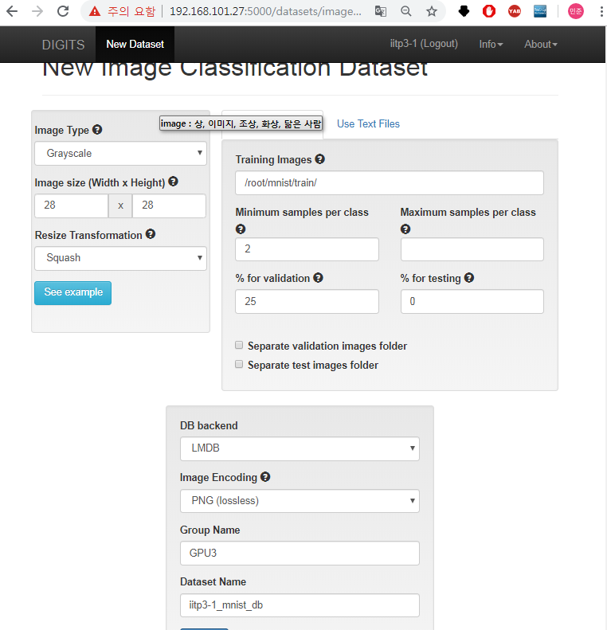
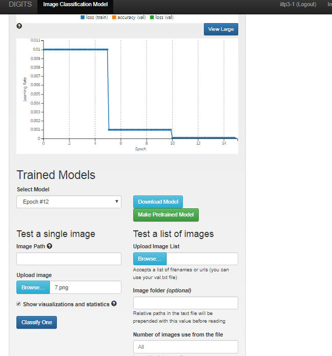

13주차 

--실습

http://192.168.101.27:5000

iitp3-1 

classification

다운받은 mnist 파일을
맵핑하는 과정 
그림파일과 라벨을 한 파일(data.mdb)에 넣는것

train할때 한파일에 맵핑된걸 가지고 불러들이는게 더 빠르다.

엑세스를 한번하는것과
매번 파일마다 엑세스하는것은 다르다.

구글르넷봇단

르넷이 더 좋다! 

러닝레이트는 줄어드는것이 맞다.

U 에서 보폭이 줄어드는게 당연하듯이.

 