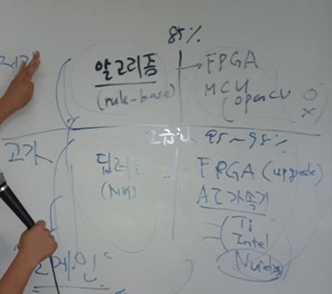

김혜진 강사님
월 (개요정리/환경설정/SSD트레이닝) 
목 Jetson 테스트 / pb파일로 -> TensorRT / SDK / Inference

왕진영 박사
화 수 (SSD테스트 / DataSet / Yolo / Jetson TX 소개 / 차선인식mix / VBox 서버 6개팀 GPU 1개씩) 

p3

kitti data 는 자동차관련 이미지 데이터들
kitti to darknet 

---
ssd는 텐서플로우를 이용
slam이란 라이브러리 

데이터 셋은 coco slim 

디텍션과 세그먼테이션은 구분을 해야한다. 

---

산업에서 굳이 딥러닝을 도입하려는 이유.

알고리즘을 통해서는 85퍼가 한계

95퍼이상으로 고급화를 위해서 필요하다

 