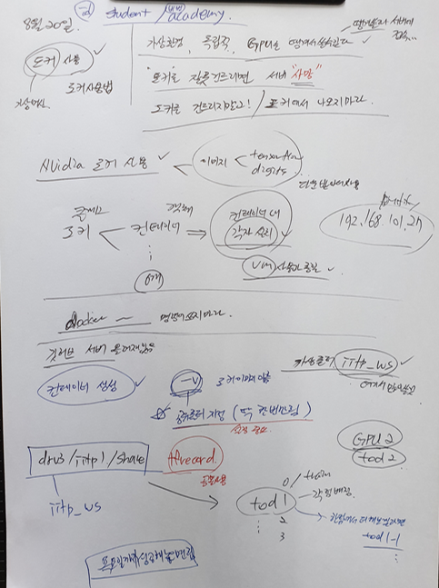

---
서버 도커 설치

----------------------------------------------------
<Group 2>
sudo NV_GPU=2 nvidia-docker run --name IITP2 -it -d --net=host \
 -v "/drv3/iitp1/share:/iitp_ws" \
 nvcr.io/nvidia/tensorflow:18.08-py3

sudo docker exec -it IITP2 /bin/bash
sudo docker restart IITP2
----------------------------------------------------
2-0 install package
$ pip install lxml
$ pip install pillow
$ pip install Cython
$ apt-get update
$ apt-get install python3-tk
$ pip install --user contextlib2
==========================================================================================================================================================================
2-1 Train용
$ cd /iitp_ws

mkdir tod2
cd tod2
$ git clone https://github.com/tensorflow/models.git
$ mv models train_models

===========================================
2-2 Export용
$ git clone https://github.com/tensorflow/models.git
$ mv models export_models
$ cd export_models
$ git checkout ae0a9409212d0072938fa60c9f85740bb89ced7e

*다른 브랜치 성공 확인*
.../export_models/research# ls
.../export_models/research# ls ../../train_models/research/

2-3 pycocotools, protocbuf 설치
-----pycocotools 설치-----
$ cd /iitp_ws/tod1/train_models/research

$ export PYTHONPATH=$PYTHONPATH:/iitp_ws/tod2/train_models/research:/iitp_ws/tod2/train_models/research/slim
$ git clone https://github.com/cocodataset/cocoapi.git
$ cd cocoapi/PythonAPI
$ make
$ cp -r pycocotools /iitp_ws/tod2/train_models/research/
-------------------------

-----protocbuf 설치-------
$ cd /iitp_ws/tod2/train_models/research
$ curl -OL https://github.com/google/protobuf/releases/download/v3.2.0/protoc-3.2.0-linux-x86_64.zip
$ unzip protoc-3.2.0-linux-x86_64.zip -d protoc3
$ mv protoc3/bin/* /usr/local/bin/
$ mv protoc3/include/* /usr/local/include/
$ protoc object_detection/protos/*.proto --python_out=.
$ python object_detection/builders/model_builder_test.py
OK가 뜨면 성공
----------------------
----------------------

3-3 train model modify
이제 우리가 꾸린 데이터로 train을 할 것이다.
어떤 모델로?: ssd inception v2 
해당 모델로 train을 하기 위해서 tensorflow에서 제공해주는
모델들의 config파일을 통해 쉽게할 수 있다.
해당 config 파일을 우리 데이터를 학습할 수 있도록 수정하자.

$ vim /iitp_ws/tod2/train_models/research/object_detection/samples/configs/ssd_inception_v2_coco.config
line: 151, 152 -> 주석(#) 처리
해당 라인은 transfer learning을 하거나 fine_tuning할 때 사용하므로 현재는 사용하지 않는다.

line: 170,184 -> path설정
해당 라인에 적혀있는 path의 tfrecord를 train하므로 우리데이터셋 경로로 바꿔주자.
170, 184: /iitp_ws/dataset/cocodata/tfrecords/ 여기에 ms만 지우면됨

line: 172,186 -> mscoco_label_map.pbtxt 경로를 설정해줘야 한다. 

172, 186: /iitp_ws/tod2/train_models/research/object_detection/data/mscoco_label_map.pbtxt

3-4 train
이제 학습에 필요한 파라미터들을 설정해주고 실행하면 된다.

mkdir /iitp_ws/tod2/save_models/ 폴더를 만든다
mkdir /iitp_ws/tod2/save_models/coco_test

$ PIPELINE_CONFIG_PATH='/iitp_ws/tod2/train_models/research/object_detection/samples/configs/ssd_inception_v2_coco.config'
$ MODEL_DIR='/iitp_ws/tod2/save_models/coco_test'
$ NUM_TRAIN_STEPS=10000
$ NUM_EVAL_STEPS=100
$ SAMPLE_1_OF_N_EVAL_EXAMPLES=1
------------------------------
터미널을 빠져나가면 안될 듯

$ python object_detection/model_main.py \
--pipeline_config_path=${PIPELINE_CONFIG_PATH} \
--model_dir=${MODEL_DIR} \
--num_train_steps=${NUM_TRAIN_STEPS} \
--num_eval_steps=${NUM_EVAL_STEPS} \
--checkpoint_dir=${PRE_TRAIN} \
--sample_1_of_n_eval_examples=$SAMPLE_1_OF_N_EVAL_EXAMPLES \
--num_clones=1 \
--ps_tasks=1

=================================
<<4 Export pb>>

$ cd /iitp_ws/tod2/export_models/research
$ export PYTHONPATH=$PYTHONPATH:/iitp_ws/tod2/export_models/research:/iitp_ws/tod2/export_models/research/slim

$ protoc object_detection/protos/*.proto --python_out=.
$ python object_detection/builders/model_builder_test.py
--> ok 확인

cp /iitp_ws/tod2/train_models/research/object_detection/samples/configs/ssd_inception_v2_coco.config ./object_detection/samples/configs/
$ vim ./object_detection/samples/configs/ssd_inception_v2_coco.config
line 101: override 부분 주석

$ INPUT_TYPE=image_tensor

-----------------------------
$ PIPELINE_CONFIG_PATH='/iitp_ws/tod2/train_models/research/object_detection/samples/configs/ssd_inception_v2_coco.config'
ls /iitp_ws/tod2/save_models/coco_test/
$ TRAINED_CKPT_PREFIX='/iitp_ws/tod2/save_models/coco_test/model.ckpt-10000'

mkdir /iitp_ws/tod2/pbfiles

$ EXPORT_DIR='/iitp_ws/tod2/pbfiles'
$ python object_detection/export_inference_graph.py \
--input_type=${INPUT_TYPE} \
--pipeline_config_path=${PIPELINE_CONFIG_PATH} \
--trained_checkpoint_prefix=${TRAINED_CKPT_PREFIX} \
--output_directory=${EXPORT_DIR}

==================================================


---





https://github.com/katebrighteyes/ssd_traing_export


p107


예제 


```python

%matplotlib inline
import cv2
import numpy as np
import tensorflow as tf
import matplotlib.pyplot as plt

PATH_TO_IMAGE = '/home/kimminjoon/Desktop/OpenCV_in_Ubuntu/Data/Lane_Detection_Images/test.png'
PATH_TO_FROZEN_GRAPH = '/home/kimminjoon/models/frozen_inference_graph.pb'
IMAGE_SIZE = (12, 8)

detection_graph = tf.Graph()
with detection_graph.as_default():
  od_graph_def = tf.GraphDef()
  with tf.gfile.GFile(PATH_TO_FROZEN_GRAPH, 'rb') as fid:
    serialized_graph = fid.read()
    od_graph_def.ParseFromString(serialized_graph)
    tf.import_graph_def(od_graph_def, name='')

def run_inference_for_single_image(image, graph):
  with graph.as_default():
    with tf.Session() as sess:
      # Get handles to input and output tensors
      ops = tf.get_default_graph().get_operations()
      all_tensor_names = {output.name for op in ops for output in op.outputs}
      tensor_dict = {}
      for key in [
          'num_detections', 'detection_boxes', 'detection_scores',
          'detection_classes'
      ]:
        tensor_name = key + ':0'
        if tensor_name in all_tensor_names:
          tensor_dict[key] = tf.get_default_graph().get_tensor_by_name(
              tensor_name)
      
      image_tensor = tf.get_default_graph().get_tensor_by_name('image_tensor:0')

      # Run inference
      output_dict = sess.run(tensor_dict,
                             feed_dict={image_tensor: image})

      # all outputs are float32 numpy arrays, so convert types as appropriate
      output_dict['num_detections'] = int(output_dict['num_detections'][0])
      output_dict['detection_classes'] = output_dict[
          'detection_classes'][0].astype(np.uint8)
      output_dict['detection_boxes'] = output_dict['detection_boxes'][0]
      output_dict['detection_scores'] = output_dict['detection_scores'][0]
      
  return output_dict

 image = cv2.imread(PATH_TO_IMAGE)
# the array based representation of the image will be used later in order to prepare the
# result image with boxes and labels on it.
image_np = cv2.cvtColor(image, cv2.COLOR_BGR2RGB)
# Expand dimensions since the model expects images to have shape: [1, None, None, 3]
image_np_expanded = np.expand_dims(image_np, axis=0)
# Actual detection.
output_dict = run_inference_for_single_image(image_np_expanded, detection_graph)
num_detections = int(output_dict['num_detections'])
rows = image_np.shape[0]
cols = image_np.shape[1]
for i in range(num_detections):
  classId = int(output_dict['detection_classes'][i])
  score = float(output_dict['detection_scores'][i])
  bbox = [float(v) for v in output_dict['detection_boxes'][i]]
  if score > 0.3:
    x = bbox[1] * cols
    y = bbox[0] * rows
    right = bbox[3] * cols
    bottom = bbox[2] * rows
    cv2.rectangle(image, (int(x), int(y)), (int(right), int(bottom)), (125, 255, 51), thickness=2)
image_np = cv2.cvtColor(image, cv2.COLOR_BGR2RGB)
plt.figure(figsize=IMAGE_SIZE)
plt.imshow(image_np)

```


---

예제 2 정답

image_inference_solution.py 


