# 1일차 수업

## 임베디드 시스템의 구조

 

프로세서란 CPU다 
암프로세서는 cpu다.

어셈블리어가 중요하다.
어셈블리어만 코딩할수있으면된다.
분석할수있는 정도까지만.

임베디드 시스템의 개념을 이해하기위해서는 
느낌만 가져가면되는것.

(교제필기 / 리딩)

## ARM Architecture

P66 
리틀엔디언과 빅엔디언에 대해서...

1. 리틀엔디언 하드웨어와 빅엔디언하드웨어가 따로 있는가?
Y or N <YES>

2. 컴파일도 리틀엔디언 컴파일러와 빅엔디언 컴파일러가 따로 있는가?
Y or N <YES>

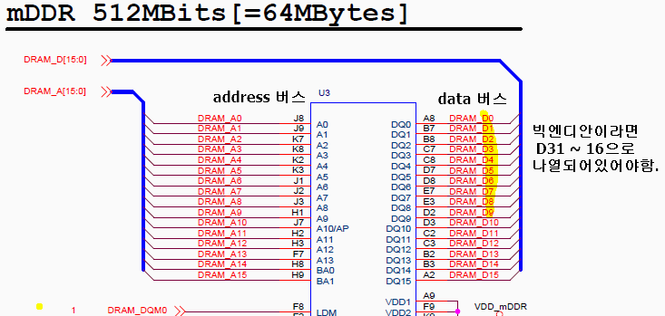

blog.naver.com/guile21c/59263789 참고

리틀엔디언으로 설계되어있어서 빅엔디언으로 할수없다.
버스 연결을 체크하면 빅엔디안인지 리틀인지 알수있다. 

file 파일명.c
file 파일명.o 
위의 리눅스 명령어로 파일 정보를 알수있다.

LSB 은 리틀엔디안
MSB 는 빅엔디안 

레지스터의 종류

두개의 레지스터의 용도는 다르다. 

프로세서 레지스터
:r로 시작하는레지스터 속도가빠른 기억저장소. 

하드웨어 레지스터
: 입출력을 위한 메모리주소를 갖는다. 

인터럽트는

마스터핸들로를 먼저 호출하고
서브 핸들러를 호출한다.

---

실습 예제 01폴더

파일 검색 방법

원하는 단어 입력후 

ctrl + shift + f

lib.S에 있는 곳 찾아서 더블클릭

어셈블리어 코드나옴

@은 주석임
/* */이것도 주석
//요건 안됨

레이블(label)  작성법
1. 알파뉴메릭(_ 포함)으로 작성 
2. 1번 COL(열)에 작성. 좌측으로 붙여서 작성
3. 콜론(:)은 있을 수도  없을 수도 ... 그래서 :붙이고 컴파일해본다. 

레이블만 1번 col에 작성하고
다른 명령어는 공백탭을 넣어줘야한다.
왜냐 레이블로 알아먹을수 있다. 

대문자하라면 대문자만
소문자하려면 소문자만
대소문자 혼합하지마라.
소문자 추천

/opt/CodeSourcery/Sourcery_G++_Lite/bin/arm-none-eabi-gcc -c -I/home/user/Desktop/m2450/lab/student/01_Hello_ARM_Student -I/opt/CodeSourcery/Sourcery_G++_Lite/arm-none-eabi/lib/include -I/opt/CodeSourcery/Sourcery_G++_Lite/lib/gcc/arm-none-eabi/4.5.2/include -g -Wall -Wstrict-prototypes -Wno-trigraphs -O0 -fno-strict-aliasing -fno-common -pipe -march=armv4t -mtune=arm9tdmi -fno-builtin -mapcs -o Main.o Main.c

/opt/CodeSourcery/Sourcery_G++_Lite/bin/arm-none-eabi-gcc -c -I/home/user/Desktop/m2450/lab/student/01_Hello_ARM_Student -I/opt/CodeSourcery/Sourcery_G++_Lite/arm-none-eabi/lib/include -I/opt/CodeSourcery/Sourcery_G++_Lite/lib/gcc/arm-none-eabi/4.5.2/include -g -Wall -Wstrict-prototypes -Wno-trigraphs -O0 -fno-strict-aliasing -fno-common -pipe -march=armv4t -mtune=arm9tdmi -fno-builtin -mapcs -o -S Main.S Main.c

-S를 넣으면 어셈블리어코드가 나온다. 

bl 은 함수호출 에 lr pc가잇다.

LR = 복귀 주소 (return address) 함수호출에 꼭필요한것임
pc = 이동할 함수 주소

mov pc,lr @리턴명령어 (pc=lr) 우측에서 좌측으로 대입이일어남

.global을 해야 다른 파일에서 접근할수있다. 
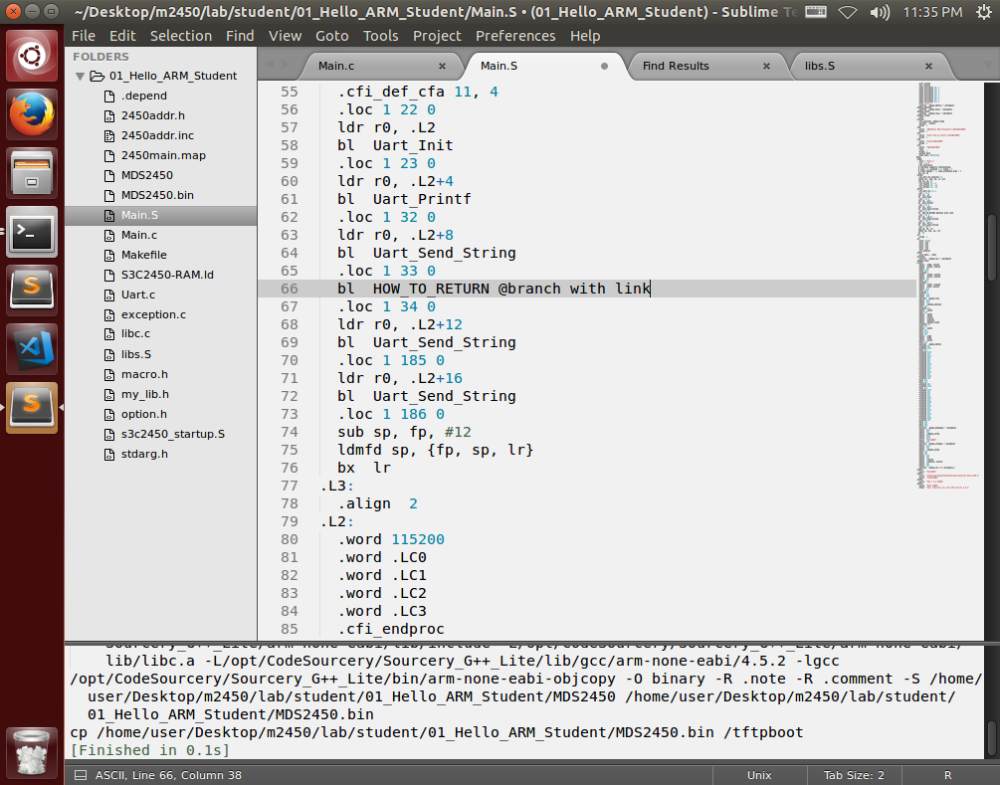
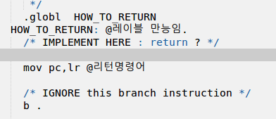
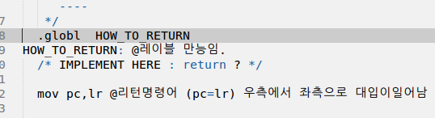

니모닉 코드(유사코드) directives(지시어) ==> .global

어셈블리어에서의 무한루프 
b . @ while(1);

	.globl  HOW_TO_RETURN
HOW_TO_RETURN: @레이블 만능임.
	/* IMPLEMENT HERE : return ? */	

	mov pc,lr @리턴명령어 (pc=lr) 우측에서 좌측으로 대입이일어남 

	/* IGNORE this branch instruction */
	b . @ while(1);
 
 이렇게하면 

 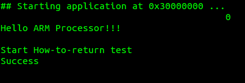

 success 나와야함.

HOW_TO_RETURN(#0, r1,r2,r3) 이런 규칙으로 어셈블리어로 인자값이 된다.

인자값이 어떻게 넘어가고 
어셈블리에서는 어떻게 처리하는지 볼수있다.

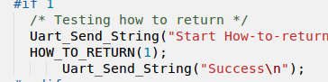

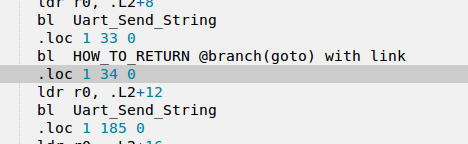
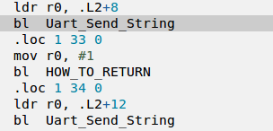

인자값이 4개까지는
레지스터로 처리
mov r0, #1 (이렇게 한줄로)
...

4개 이후부터는 
지역변수로 
처리해서 붙여넣는다.
명령어가 두줄로 되고 비효율적으로 된다. 
mov r3, #5
str r3, [sp , #0]
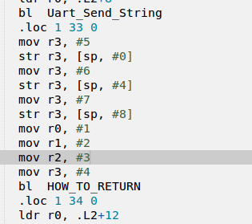

ATPCS(ARM/Thumb Procedure Call Standard)
C언어와 어셈블리어의 규칙

---
## 동작모드의 변환
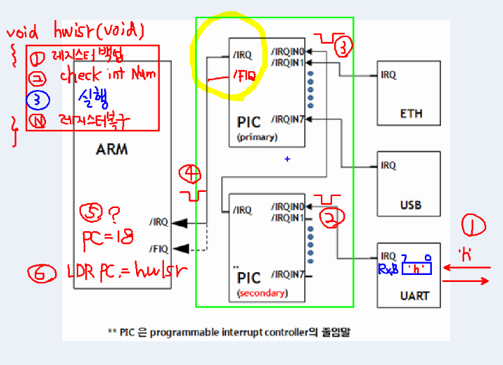

디스어셈블러코드 해보기
휴먼코드로 보기위해서

부트코드 번지수 참고해서 
MDS2450.dis 코드 보면 일치함
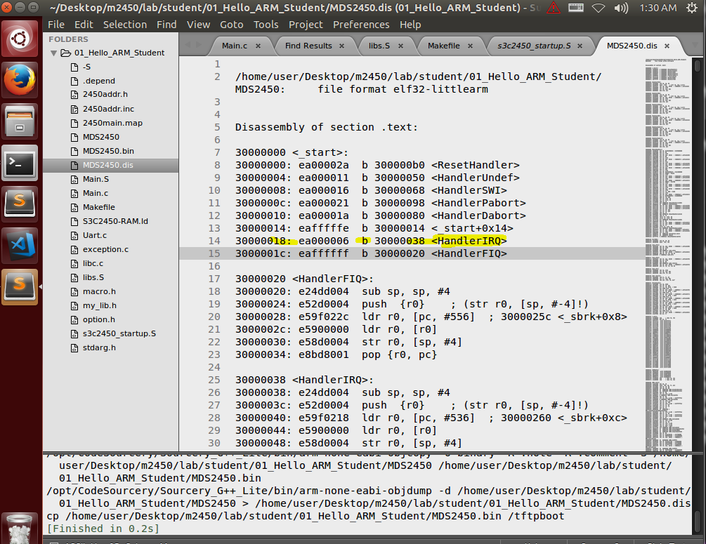
pc 18번에서 branch 가라 38로 인터럽트 곳으로
38번지가 함수시작하는데
레지스터 백업을함
이거 백업안하면 공유중인 r0이 깨진다. 
그래서 백업을해야된다. 백업을 소프트웨어적으로 해야된다. 
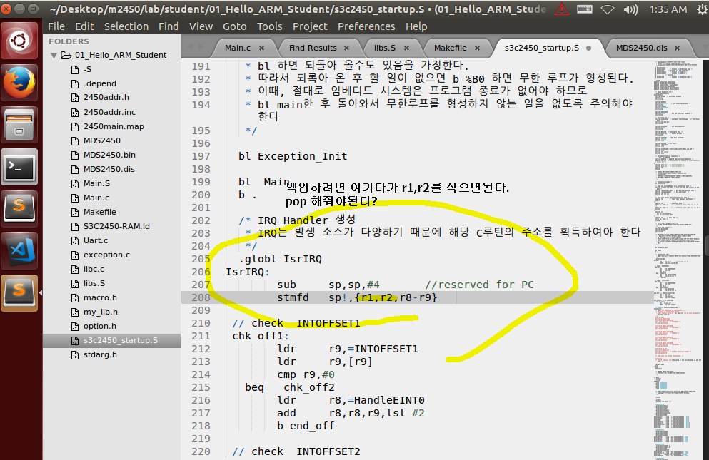

백업은 따로따로 했지만
cpsr, pc를 동시에 복원해야된다. 

pc는 인터럽트안에서 작업하고잇을것이고

복원이 따로되면 pc는 인터럽트내에서 떠돌게된다.

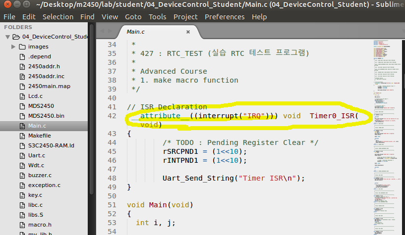

동시복원하는 코드이다. 

유저모드에서 동작모드로 바꿔놓고 귀족으로 바꿔놓고 
실행한다. 

***각 동작모드들은 각개인의 다른물리적인 공간의 스택을 가지고있다. 

IRQ의 스택은 일반코드의 main 일반 스택에 접근할수없다. 

