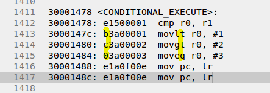

---
# 2일차 차량용디바이스 수업


## ARM 아키텍쳐

operationg 모드의 변환과 레지스터   

p94   
EmbeddedICE-RT란  
    
arm 프로세서가    
디버깅인터페이스를 가지고 있어야한다.  

ROM emulator    
  

요건 안에 ram이여서 프로그램을 바꿀수있다.    


---
파이프라인  

p100    
메스 라이브러리 사용   

-lm   


SIMD 병렬 연산  

  


VIC   
nested vectored interrupt controller  

필기 참고 비정렬 엑세스가 왜안되는지  


---
---
## ARM 프로세서의 명령어 **중요**

상대주소 방식  

ldr r3, [r0] @r0=034000000 word 4byte 32bit ,halfword   
ldr 읽어들이는 명령어 []는 포인터임   

ldr r3, [r0, #16] @0x34000016 에서 읽어오는것임 ptr+4  
        [base , offset] 이런걸 상대주소 표현이라함.  
ldr r3, [pc, #16]   

pc relative addressing @pc를 기준으로 얼마나 떨어져있는지(offset)  
indirect addressing   
absolute addressing 절대값 절대주소 (arm은 지원하지않는다.)  
뒤의 주소를 앞의 기계어에 변환하지않고 바로 넣는걸말함.  
  


뒤에 주소  머신코드를 바꿀때 pc+offset 으로 바꿔서 계산한다.  


---
```
C는
 int a, b;
  a=b;

mov r4, #0x???
mov r5, #0x???
ldr r0, [r4] 
str r0, [r5]
```
C코드와 비교하여 어셈블리어는 하드웨어를 제어한다는 느낌이 코드에서도 느낄수있다.   
리스크 계열에서의 로드 스토어 프로세스는 장점이 아니다 .단점이다. 코드가 4줄로 길다.  

시스크 계열은 로드스토어가 아니다.  
mov [r5],[r4] 만능키워드 레지스터 부터 다됨. 강점임.  

```

cmp r0,r1 @비교 
	 blt L1 @ 먼저적은게 비교기준임 less than
	 bgt L2 @ greate than a가 b보다 크다.
	 beq L3 @ equal
	 b _EXIT @예외처리
L1:
	 mov r0,#1
	 mov pc,lr
L2:
	 mov r0,#2
	 mov pc,lr
L3:
	 mov r0,#3
	 mov pc,lr
_EXIT:
	 mov r0,#3
	 mov pc,lr
```

어셈블리어는 생산성이 낮음.


조건부 실행 사용
조건에 맞을때만 실행해라.

     cmp r0,r1 @비교 
	 movlt r0,#1
	 movgt r0,#2
	 moveq r0,#3
	 mov pc, lr

     sublt
     mulgt
     andeq


성능도 좋아지고 코드도 짧아지고.


기계어로 바뀌들어가는것으 ㄹ보면 규칙이 보인다.


pc + offset
 offset 의 범위는 -32 부터 +32 까지
 restrict  제약사항

 bl myf1 @(1)lr=pc-4 (2)pc=pc+offset

---

logical shift left = lsl
mov r0,r0,lsl #2 @r0=r0<<2 

어셈블리어 예제 해보기


정답


---
비트연산

int flag;
if(flag & (1<<0))
{
    ....
}
TSTEQ r2, #5 @0101

and 연산


or는 무조건 1로 나오게 끔하고싶을때 주로 쓴다.

xor는 
두값이 다르면 1 
같으면 0이나옴.

0을 1이면 1이되고 1을 0으로 하면 1이됨 즉 바뀌면 참이기에
토글이라 말할수있다.


```c

while(1)
{
    int flag;

    if(rGPGDAT & (1<<0))
    {
        rGPGDAT &= ~(1<<0); //on
    }else
    {
        rGPGDAT |= (1<<0); //off
    }
    Time_Delay(1000);
}

while(1)
{
    rGPGDAT ^= (1<<0);  //xor 
    Time_Delay(1000);
}

```
펄스 만들때도 xor 를 활용할수있다. 

if(!(status ^ 0x1234))
if(status == 0x1234)

MVNEQ r1, #0 @0xffffffff
moveq r1, #0xffffffff  너무 큰숫자가 올수 없기때문에 문법적인오류이다.

활용

MVNEQ r1, #0xff @0xffffff00
moveq r1, #0xffffff00

moveq r1, #0xffffff00을 실제로 해보면 
디셈블에서 코드 확인해보면 MVN으로 바꿔서 알아서 처리해줌~


---

logical shift left = lsl

add r3, r1, r2, lsl #7
    저장용,오퍼렌드1, 나머지는 오퍼렌드2이다.\

    lsl #7 7만큼 왼쪽으로민다.
    lsl r3 r3만큼 왼쪽으로 민다. 
    lsr #2 2만큼 오른쪽으로 민다.

r3은 destination 레지스터, r1 은 오퍼렌드1 r2는 오퍼렌드2


mov r0,r0,lsl #2 @r0=r0<<2 

오퍼렌드1은 r0고 나머지는 오퍼렌드2 이다.


---

여기서부턴 데이터 프로세싱이다.

어셈블리 해석할때의 공식


1단계.find OP2
2단계.operation(OP code)
3단계.save(register write)

OP코드 Rd, Rs, OP2
```
add r0,r0,#1  		    @r0=r0+1
add r0,r0,r0  		    @r0=r0+r0=2r0
add r0,r0,r0,lsl #1  	@r0=r0+2r0=3r0   //왼쪽으로 1번미는것은 파워제곱하는것이다. 2의 1승을 곱하는것임
add r0,r0,r0,lsr #1  	@r0=r0+1/2r0=1.5r0
add r0,r0,r0,asr #1  	@r0=r0+1/2r0=1.5r0(부호) //asr은 부호비트를 살린다.필기 참고.
add r0,r0,r0,lsl r1  	@r0=r0+(2^r1)*r0 
add r0,r0,r0,rrx  //책 그림참고.반시계방향으로 돌릴수있다. 오른쪽으로 한비트 밀때 
```
* 더하기로 곱셈을 한것임
곱셈은 cpu파워가 더 많이 든다. 

더하기로 소수점을 곱하는 효과를 만들수있다.


add r0,r0,r0,lsl #1  	@r0=r0+2r0=3r0   

//왼쪽으로 1번미는것은 파워제곱하는것이다. 2의 1승을 곱하는것임

add r0,r0,r0,lsl #2  	@r0=r0+2r0=3r0  //2의 2승을 곱하는것임.


ror 동작은?
mov r0, #0xff , ror #8  @0xff000000   
mov r0, #0xff000000 요걸 위의 라인으로 바꿔준다 컴파일할때

mov r0, #0xff ,ror #8  
mov r0, #0xff ,ror #32  
회전할때 중간 기계어에 넣으려고할때 비트의 한계가있기때문에   
4비트만 가능함 그래서 30이상을 표현하기위해서 짝수 회전만하도록햇다.  
16 * 2 =32비트 회전  
4* 2 =8 비트 회전  
10 * 2 = 20 비트회전  
짝수회전만 가능하다.   
홀수 회전안됨.  

그래서 홀수 회전이 안되기에 사용하지않고 편법을 쓴다.  
ldr r0, =0x1230 이렇게 그냥 값을 그대로 넣는다.   

mov r0, 0x1230 이안됏는데//상수가 커서 원래는 안들어가는데  
mov r0, 0x1ff 위의것과 같다.   
근데
mov r0, 0xff 는 된다.  

ldr r0, =0x1230 됩니다. //mov쓰지말고 ldr를 넣고 해시를 적지말고 =(지시어(의사명령어))를 사용해야한다.  
=0x1230 는 [pc, #532]  

.global . = 의사명령어들 해독시키는것  

mov r0, #0x7f00 //24비트 회전했을때이다.  
11111110  
mov r0, #0xfe00 //23비트 회전했을때이다.  
값을 바꿔서 24비트 를 돌리면 23비트 회전한것이다.  
이런 꼼수는 8비트가 다 차있으면 이런 꼼수를 쓸수없게된다.  
  
mov r0, #0xff ,ror, #24  
mov r0, #0xff00 으로 표현하면된다   


결론 ldr , = 로 해결하면되고  

제약사항이 많다는것이 키포인트 이다.  


ldrb 여기서 b는 1바이트를 말함  


---

PSR 전송명령
===


mov MSR cpsr, r0    @ cpsr 쓰기 명령 //어떤값을 기록할때   

mov MRS r0, cpsr    @ cpsr 읽기 명령 //cpsr을 읽어올때   

mov 복사 접근으로 접근이안된다. 중요한 명령어이기때문이다.  
그냥 명령어만 사용해야된다.  
c문법으로 변환되지 않게 만든 명령어임 그리고 mov로도 접근을 막았다.보호가되는것.  
어셈블리어코드 로만 접근할수있다. 그만큼 안정성이 좋아진다.   

MSR 스페셜 범용   
   <---방향으로 생각하면 암기하기쉬움  
MRS 범용  스페셜  

MSR cpsr, r0    @ cpsr 쓰기 명령 //어떤값을 기록할때   

MRS r0, cpsr    @ cpsr 읽기 명령 //cpsr을 읽어올때   


MSR cpsr_f, r0  앞부분만 8bit만 새값으로 들어오가 나머지 16비트 부분은 돈케어이다.   

MSR cpsr_fsxc, r0  다 바꿀수있다.   

그래서 위의 것을 가지고 활용하자면 밑에처럼 한다.   

```
disableIRQ(); 이것만 적어도 인터럽트가 금지된다.   
....

.global disableIRQ 
disableIRQ:
    MRS r0, cpsr
    orr r0, r0, #0x80
    MSR cpsr_c, r0
    mov pc, lr


.global enableIRQ
enableIRQ:
    MRS r0, cpsr
    bic r0, r0, #0x80
    MSR cpsr_c, r0
    mov pc, lr
```


