# 3일차 수업시작

## p127
---
LOAD/STORE 명령어    

mov r4, #16  

ldr r0, [r1, r4, lsl #4]    @r1=0x30100000 //4번지에서 word 읽어온다 4바이트   
                              // r1, r4, lsl #4까지 op2 //256   offset    
str r0, [r2, r4, lsl #4]    @r2=0x30200000 저장한다.    

---

ldrb r0, [r1, #4]            @r1=0x30100000  //4번지주소에서 읽어옴//빅엔디안이라도 같다. //b라도 같다.  

31  2423    1615    87       @ b면 D에 저장 // h면 CD에 저장 나머지부분 돈케어  

A   B       C      D  

strb r0, [r2, #4]             

---

ldrsb r0, [r1, #4]            @r1=0x30100000 b는 D부분만 읽어온다.  돈케어부분을 s는 부호비트로 채운다.  

31  2423    1615    87       @ b면 D에 저장 // h면 cd에 저장  

A     B      C      D  

strb r0, [r2, #4]           //s를 로드에 붙일수없다. 부호를 따질이유가 없다.  


---
p129   
pre-indexed addressing Mode 먼저 주소를 계산하고 접근하는것 전위 연산과 비슷  

mov r4, #16  

ldr r0, [r1, #4]!            @r1=0x30100000  '!'이란 preindex 라고 함 오토 업데이트(자동갱신) 4번지에서                                         읽어오면서 r1=0x30100004 갱신함  
ldr r0, [r1, #0x64]!         @r1=0x30100000  오토 업데이트(자동갱신) 4번지에서 읽어오면서 r1=0x30100064 갱신함  

31  2423    1615    87         

A     B      C      D  

strb r0, [r2, #4]   
---
post-indexed addressing Mode 접근하고 나서 계산함. 후위연산과 비슷  

mov r4, #16  


ldr r0, [r1], #0x64      @r1=0x30100000    
                        // 0x30100000 읽어올것들은 블락켓[]안에 있는거만!가져온다. --> 0x30100064  

31  2423    1615    87         

A     B      C      D  

str r0, [r2], #4            @r2=0x30200000  

---
p131  

ldr r0, 0x30100000 이건 주소에 값을 읽어오는이다  

ldr r0, =0x30100000 이건 주소를 설정하는것임  
ldr r0, [pc +offset] 으로 이렇게 한것임   


ldr r0, =label_1 //레이블의 주소가 r0으로 들어가는것임  
...  
...  
...  

label_1: dcd 0x12345678  

---  

어셈블 루프문 실전예제  

while(평가){...}  
do{}while(평가);  
for(;;){}  

어셈에서는   
do{}while(평가);  
요걸 많이 쓴다.  

for(int i; i<100; i++)  

bls   

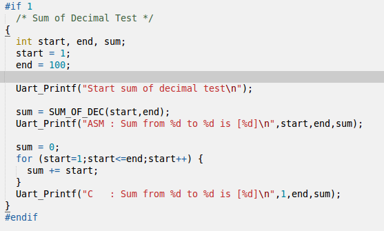  

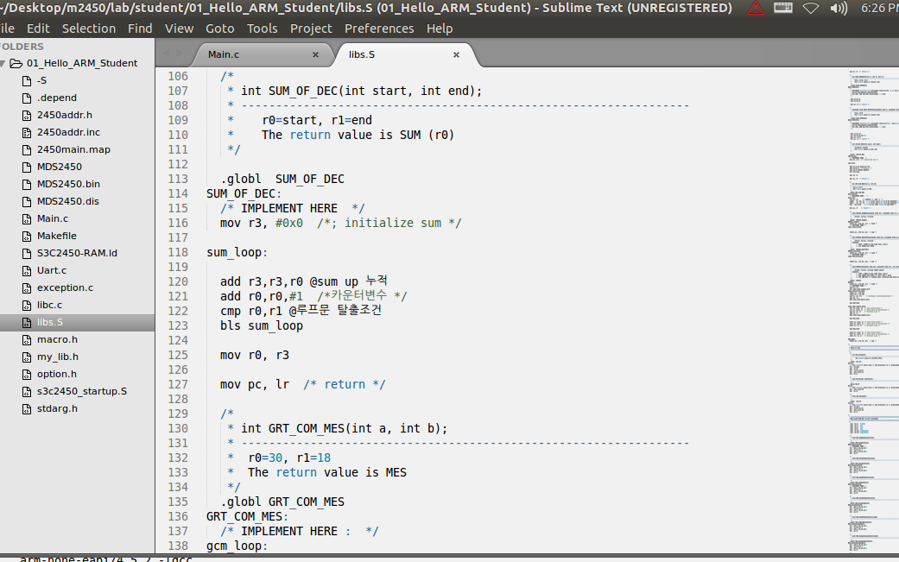  


---
dma 실습  

푸쉬 팝 을 하기때문에 mov pc, lr  안함!  

정답  
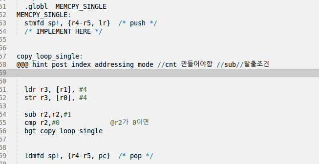  


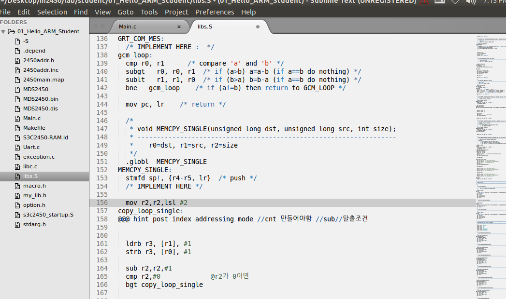  

위의거는 바이트단위   


메모리 접근하는 것을 느끼면된다.  
바이트단위의 접근을 볼수있다.   


pre index  

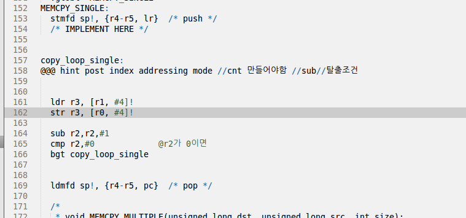  

---
p132   

블럭 전송 명령  

ldm r0,{r4,r5,r6}   @읽기(r0=0x30100000) 멀티플  정수배들의 나열    
                    @적어준 개수 만큼 읽어온다. 지금 {}3개니까 3word3*4 12  

ldr r4, [r0]!  
ldr r5, [r0]!  
ldr r6, [r0]!  

물론 코드줄도 짧지만 속도도 더빠르다. 그래서 속도를 높이고자할때 쓴다.   
복사는 DMA가 최고빠르고 ldm이 그다음으로 빠르다.   

stm r1,{r4,r5,r6}   @쓰기 (r1=0x30110000)  

이명령어를 쓰면 속도가 빠르게 나온다.  


ldm r0,{r4-r6,r9} 4개 그래서 16   
stm r1,{r4-r6,r9}   


ldm r0!,{r4-r6,r9} 16바이트씩 갱신함  
stm r1,{r4-r6,r9}  


ldmda r0!,{r4-r6,r9} 주소 내려가면서 갱신함  

ldmia r0!,{r4-r6,r9} 주소 증가하면서 갱신함  


ldmia r1!, {r3-r5}  
stmia r0!, {r3-r5}  

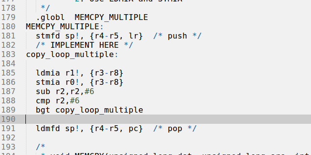  


ldm 은 디폴트로 ldmia 이다.   

ia 말고 ib 인크리먼트 비포는 빵꾸남 그래서 거의 ia를 쓴다. 거의 ib는 쓰지않는다.   

stmdb sp!, {r4-r5, lr} 	/* push */ 무조건 푸쉬할때는 fd나 db 접미사를 써야됨 스텍할때동일하기때문!  
ldmfd sp!, {r4-r5, pc}^	/* pop */  //mov pc,lr 리턴역할까지한다. ^이것은 인터럽트핸들러일때만 붙일수있다.   
                                    //어셈블리어에서 ^ pc와cpsr을 동시복원하는것이다.   
                                    //__attempt__(irq)와같다.   

푸쉬 팝의 개념이 중요하다.   

풀디센딩의 약자가 fd이다.   


s접미사  

subs  
cmp r2,#0 이걸 생략할수있다.   
subs r2,r2,#6  

---
왜 mov pc를 안하고 푸쉬 팝을 했는가>?  

안되는이유  
레지스터가 바꾸고 정리가 안되면 엉망진창됨  

레지스터를 다사용하고 다시 복구를해야된다.  


APCS (arm/thumb p.c.s)  
r0, r1,r2,r3  
임시저장소임  

호출후 다쓰고 나서 다시 값이 원상태로되어야함  

푸쉬팝할때   

ldmfd sp!, {r0-r5, pc}	/* pop */   
ro쓰면 안됨  
ldmfd sp!, {r4-r5, pc}	/* pop */  
r4-r5를 다시 오염된걸 정화시키는것임  

이거 정화시키지않으면   
문제가되는가? 잘돌아간다 하지만 이것이 정말 큰 문제를 야기함  
조심해야됨    

인터럽트 핸들러일경우도 마찬가지다!  
여기선 r0부터 오염될걸 정화시킨다.   
ldmfd sp!, {r0-r5, pc}^	/* pop */  //mov pc,lr 리턴역할까지한다. ^이것은 인터럽트핸들러일때만 붙일수있다.   
                                    //어셈블리어에서 ^ pc와cpsr을 동시복원하는것이다.   
                                    //__attempt__(irq)와같다.   

	

---
# lr 레지스터

lr의 한계  

1단계 호출이 한계다.   
그래서   
lr은 같이 공유하기때문에   
lr 분기해서 와서 다시 lr분기할수없다.   

그래서 스택포인터에서   
처음 가리키는 곳에 을 뛰고 하는것이다.  
처음가리키는곳에 데이터를 뛰어넘고 다음 주소부터 하는이유다.   


부트코드도 암으로 코드한다.  

thumb 코드 16비트를 확인할수있다.   
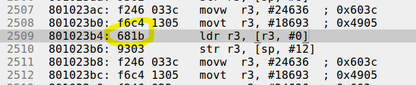  

---
p163  


clz 실습예제  

0x80   
0000 0000 0000 0000 0000 0000 1000 0000  
cls하면 1이 나오기전까지 0의 개수를 센다.  


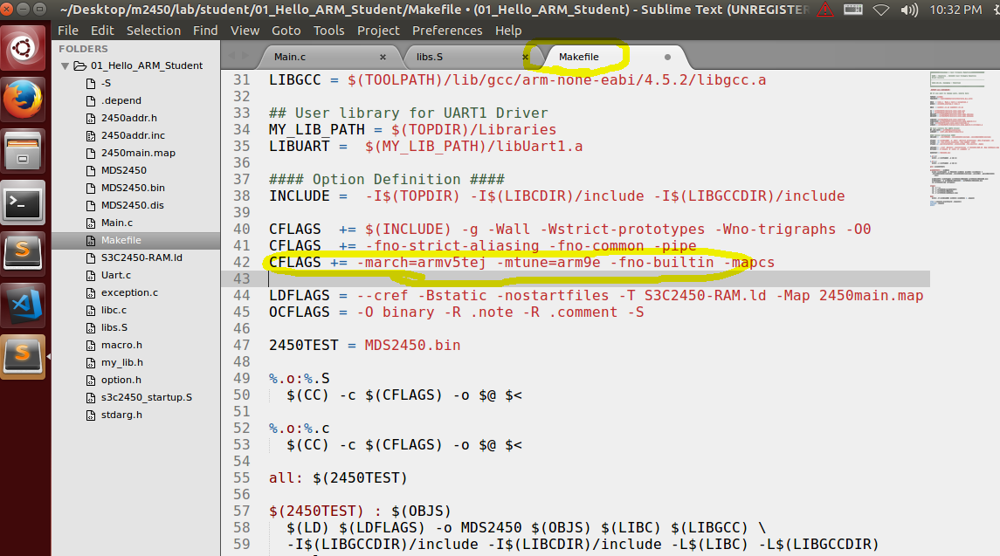  
컴파일옵션 설정 잡아야한다.  


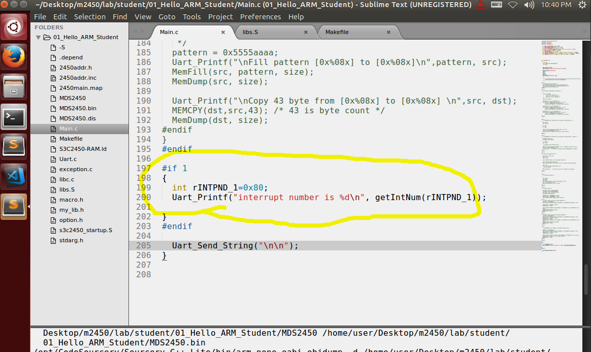  
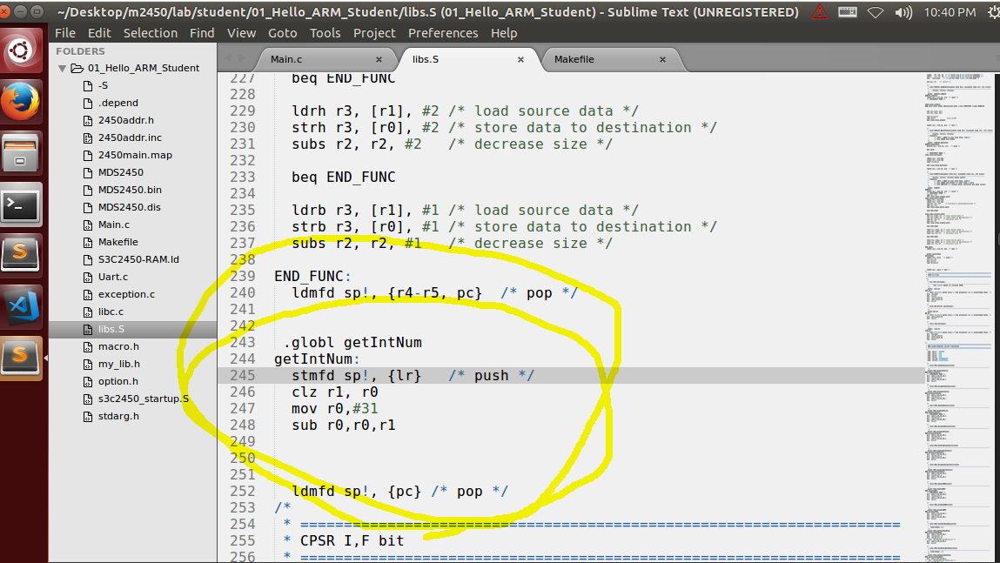  


clz이기때문에 아주쉽게 비트자리를 알수있다!  


---
암 어셈블리 안쓰고 소프트웨어를 절대 만들수 없다.  
필수적으로 쓸수 밖에없다.   


커널 포팅 할 때 어셈블리를 안볼래야 안볼수가없다.   

쉽게 배운것은 쉽게나간다....  
지금 배운것은 자기의 것은 아니다.   

어셈블리어에 대한 두려움을 없애면 성공한것이다.   

rtos   
리눅스 등장하기 전까지 군림햇던 운영체제이다.   
군사장비들 rtos 이다.   

하드웨어 이식은 어셈블리어 못하면 불가능   
못한다. 절대 .  


---
stmicro board  

만원  


---
## 캐시 메모리 (Cache)

cpu의 성능을 높여준다.   

캐시의 기본원리  


캐시에 미스가 났기때문에   
캐시에 들어가는것이다.   


int start, end, sum;  

for (start=1;start<=end;start++) {  
		sum += start;  

1) 공간참조  
    * 캐시에 미스가 났기때문에 캐시에 들어가는것이다. 그때 선언된 주변의 변수 메모리도 같이 캐시로넣는다. 변수 선언   주변의 변수들까지 같이 메모리를 읽어온다 가까운것들도 같이 사용될가능성이 높기때문이다. 주변의 변수들은 미스가   안나고 처음부터 히트가 난다. 변수선언도 가까운것역시 다같이 쓰일확율이 높다.   

2) 시간참조  
    * 루프 형태    
        * 포문  
    * 함수 형태  


캐시 메모리는 유한하기때문에   
이전것은 버리고 새것을 넣는다.   

메모리 저장 원리   
메모리 주소의 맨끝자리를 확인해서   
3000 0000  
3000 0004  
고정된 자리가 있다.   
그래서 저장하는데 만약  
저장할 자리가 없으면 버리고 들어간다.   

victim (저장된 캐시메모리 지워질메모리)  

캐시메모리는 캐시라인의 연속된 형태   

캐시라인마다 태그를 달수있다. (valid 그리고 dirty bit)  
데이터 채울 때 (valid)v를 1으로 흔적을 남김  


---
int i = 0  
i++  

데이터 캐시 에   
캐시 미스가 나서  
int i=0가 저장됨   
dirty bit를 1로만듬 . 오염 비트를 확인함 (태깅)   

데이터 캐시에는 1이증가햇는데 밖에 i는0이다   
inconsistent  불일치 일어남  
같게 일치시키는데 cost가 일어남   

write back (데이터케시만 증가시키고 0으로 남기고간다.)   
write through( 업데이트 비용발생함. 비용 감수해야됨) // 뚫고 수정한다는 의미의 through  
오염의 유무로 업데이트를 확인한다. 수정됨을 기억함   
업데이트시키고 victim으로 변경한다.   

심지어 write back이여도 업데이트 하게된다.   

강제로 업데이트는 insconsistent를 쓰면됨  
 MCR로 valid 들 업데이트 강제가능.  

 더티 플레그들을 전부다 업데이트 하는것을 캐시클린이라함  
 이 반대를 캐시 플러시 캐시데이터 플레그들을 초기화 전부다 미스나게 해준다. 다읽어드림  
 invalidate(무효화) = 캐시플러시   

sram 은 캐시 dram은 메모리   


----
캐시 실습  
캐시 성능 측정  

02 폴더 실습  
lib.c에 서 캐시 끄고 킨다.  

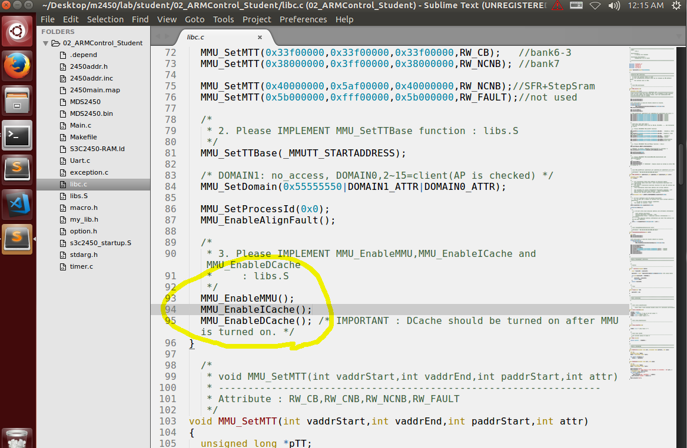  

포문으로 hit를 많이 내서 극단적으로 차이를 냇다.  

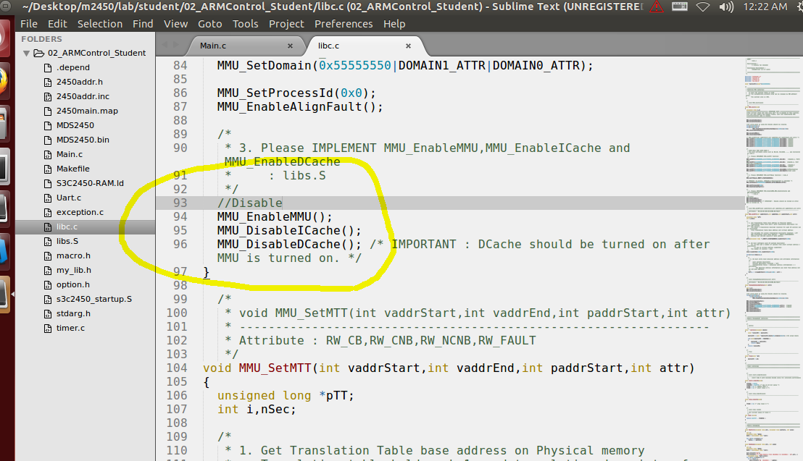  


Time spend for testing 0x5f0. 캐시 둘다 온  

Time spend for testing 0x6b38. i 디스에이블  

Time spend for testing 0xb4eb. d 디스에비블  

Time spend for testing 0xffff. 둘다 디스에이블 측정불가  


코프로세서 레지스터 제어방법  
cp15 제어 32bit   

          --  
mrc p15,0,r0,c1,c0,0 @읽기 우좌는 읽기다. c1이 r0로 복사되는것임  
    ------  --------  
mcr p15,0,r0,c1,c0,0 @쓰기  

c1을 1로만드는것임 밑에 코드 잠고  

.globl MMU_EnableICache  
MMU_EnableICache:  
	/* IMPLEMENT HERE */        
	mrc  p15,0,r0,c1,c0,0  
	orr  r0,r0,#R1_I  
	mcr  p15,0,r0,c1,c0,0  
	mov	 pc,lr  
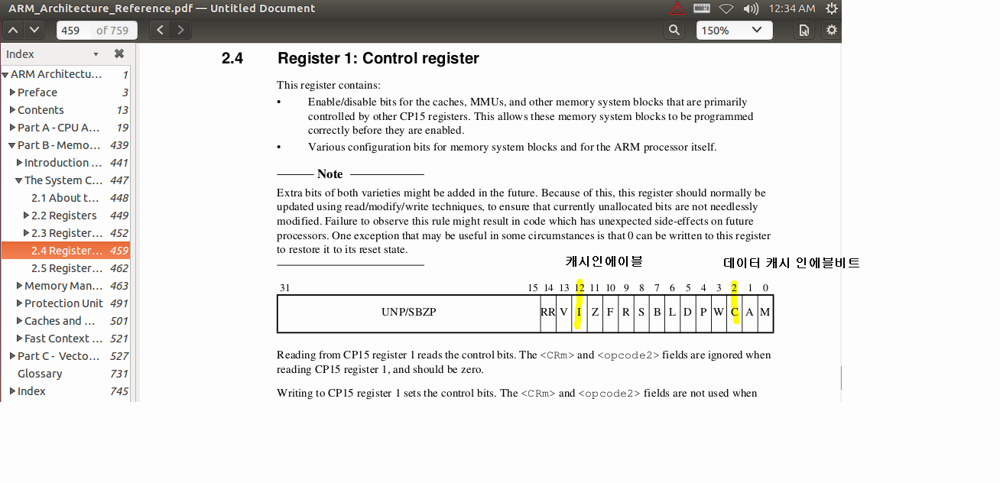  


비정렬abort 비활성화  

mmu   

c1레지스터 컨트롤하면 제어할수있다 .  

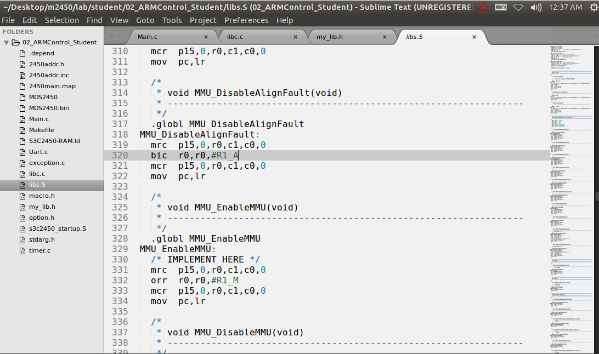  

쓰기명령인데   
r0의 쓰레기값을 넣는다? 아니다.  
쓰기 하게되면 c7, c7, 0  
(invalidate)무효처리 하게 하게한다.  
특정한 명령어를 수행하게 끔하는 비트셋이다.  
이러한 명령어들은 비트셋으로 제어한다.  

.globl MMU_InvalidateICache  
MMU_InvalidateICache:  
	mcr  p15,0,r0,c7,c5,0  
	mov	 pc,lr  

MMU는 사람이 세팅한데로 작동한다.  
cpu가 가상주소를 쏘면 3000 류로 번역해서 물리주소로 변환해라 라고 설정한거임  

메모리 보호기능 MMU가 켜져있을때만 된다.  
방을 보호하는것임. 메모리의 구역을 설정해서 접근을 막을수있다. 권한부여  

MMU는 OS 탑제 될때 사용된다.   
리눅스정도는 되어야 가치가있다 rtos 정도에서는 사용하지않는다.   


---
## MMU init분석  

MMU_DisableDCache();  
MMU_DisableICache();  
MMU_DisableMMU();  

디스에이블해야된다 분석에 앞서  

MMU_SetMTT(0x00000000,0x07f00000,0x00000000,RW_NCNB); //bank0 가상번지의 시작주소       
v 어드레스 시작과 끝  p어드레스의 시작만있고 끝은 필요가 없어서 안넣는다.(없어도 알수있기때문에)  
RW_NCNB //노케시 노버퍼 캐시를 쓰지않겟다. 저 주소 범위에잇다면 캐시에 담지않겟다.  캐시오프영역이기때문에!


RW_CB는 캐시에 담겟다. 이것도 활성화 되어야 캐시에 담을수있다. (c1레지스터 만 설정되서는안됨 둘다 되어야함)

128메가 공간을 맵핑한것임 가상을 물리로 한것임  

근데 왜 하는건데?  
 
수기필기 참고  

make page table 주소변환테이블 


mmu가 주소변환테이블로 꺼내봐서 맞춰줌 
그테이블 우리가 만든다. 
테이블을 메인 메모리에 만든다. 
mmu는 메인메모리에 있는줄 모른다. 

*pTT++ = (((paddrStart>>20)+i)<<20) | attr ; //가리키는걸 만들고있다 .주소변환테이블을 만듬.룩업 테이블 (전화번호부)


MMU_SetTTBase(_MMUTT_STARTADDRESS);//테이블의 위치정보 r0로 인자로 넘어감 


	.globl MMU_SetTTBase
MMU_SetTTBase:
	/* IMPLEMENT HERE */
	mcr  p15,0,r0,c2,c0,0
	mov	 pc,lr


레지스터들은 
캐시에 담아서 사용하는것이 아니다. 그래서 RW_NCNB이다. 

RW_FAULT 영역에 접근하면 시스템이 죽는다. 


요약정리
MMU init을 호출하면 
캐시와 mmu를 사용할수있다. 
동기화개념


mmu로 자원보호하는것이다. 아무나 접근해서 포멧할순없으니까 프로텍트하기위한것이다. 
가상주소가 있어야 효율적으로 가상메모리를 사용하는것이다. 
펌웨어에서는 d캐시를 사용하기위해선 어쩔수없이 가상주소를 활성화를 해야한다. 


https://kkamagui.tistory.com/351


```

