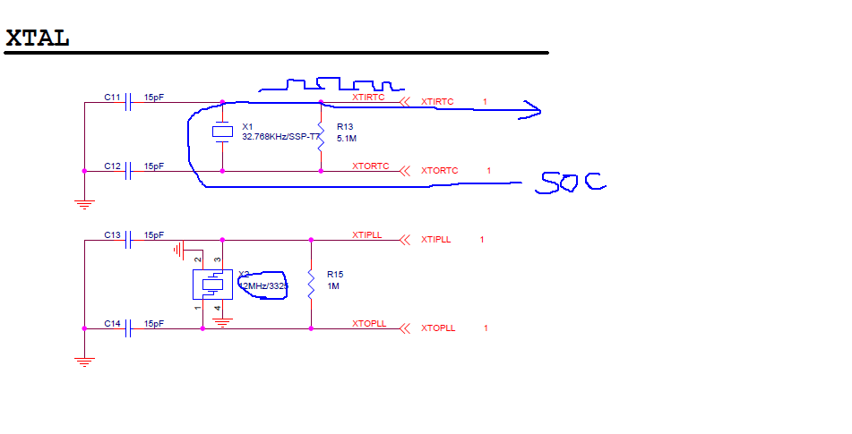
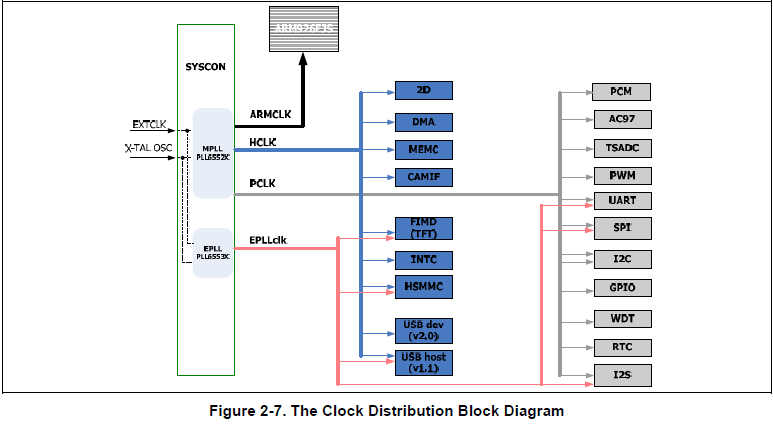

# 4일차 수업

## TCM

Cache Memory
===
1. I-cache / D-cache 활성화 방법

2. memory mapped I/O D-cache 비활성화
    rs 계속 바귀여야한다 사본데이터
    주변장치와 캐시의 원리가 맞지않다. 
    주변장치들은 비활성화해야한다. 

3. Cache Clean 과 Cache Flush(invalidate)
   시간이 지나면 자연스럽게 업데이트된다. 
   

--DMA 구조 그림 참고하세요!
io 디바이스와 주메모리가 자료를주고받기위해서 ram(d캐시)를 비활성화해야함 

===

MMU (메모리 메니저먼트 유닛)
MMU가 비활성화되었을때는 
바이패스 거쳐갈뿐 변환하지는않는다. 

1. 링커(Linker) 스크립트 파일에서의 주소 표현
    링커스크립트라는 소스 파일이있다.

    

    보낼때 물리주소로 보내야한다. 
    MMU init이 실행되기전까지 물리주소로 들어간다.
    그전까지 c0000 의 주소가 존재하지않는다 
    상대주소 분기 pc의 위치를 오프셋으로 알아서 그래서 돌아가는것임 


2. 예외처리(Exception) 벡터 테이블
   인터럽트 핸들러 
   인터럽트 되면 pc 18번지로 18번지는 IRQ가있다.
   거기서 분기함.
   cpu는 주소모름 던져주면 그냥 갈뿐이다.
   가상의 18번지와
   물리의 18번지는 다르기때문에 인터럽트걸리면 안된다 
   그래서 300번지18로 인터럽트 갈수있게 가상주소를 셋해야됨


    


3. 보호된 메모리 접근 -> Data Abort
   보호된건 소프트웨어적으로 다운되게됨
   

4. 존재하지 않는 가상메모리 접근 -> Data Abort
   특정영역을 벗어나면 죽지는 않고 쓰레기값만 가져옴


===
SoC

=== 
S3C2450 

clock







ddrclk은  dram 


===
실습예제 클럭 변경해보기~


이부분을 바꿔볼거임
534를 600으로


바꾸고 실행하면

화면이 깨지는 현상이 발생한다. 


느리게 설정해보기
534를 240으로 설정해보긔


화면에 사진이 뿌려지는게 상당히 느리게 로딩된다!


전력소모를 안한다. 


---
p240


SCS0
뱅크메모리 8개 
밑에서부터 0~8

3000 0000 은 6번 뱅크
왜? 실행이 3000 00000에서 실행인가?


SDRAM이 ㄱ거기에 연결되어서

네트워크 칩도 뱅크들 중에 하나 사용중이다. 

CS chip set
CE chip enable

nCS 는 네트워크 (비매모리) 외부에 연결할수있다. 


간단한 포팅이라도 특징을 알아야 할수있다. 

BSP 보드지원 패키지 
하드웨어를 제어하는 소프트웨어 자료들
회로도 부품이름, 리눅스 커널 소스코드 , rtos소스 코드 , 
부트로더 소스코드 ...


우리가 쓰는것은 16비트 매모리 이다. 


메모리 16비트 메모리를 32비트로 쓰려면
2개를 붙여서 쓴다 대게

검증된 같은 메모리를 같은 부품을 사용한다. 
가격을 싸게 만드려고 회로 설계를 다시해서
32비트 메모리를 16비트로 축소시키도함.

그렇게해서 삼성 -> 망고 -> ... 여러회사의 BSP가 나온다.

삼성 보드에 문제가 생기면 그걸가지고 설계한 나머지 보드들도
문제가 있다. 그래서 개념을 가지고 있어야 자체적으로 문제를 처리할줄알아야한다. 


DRAM

성능의 한계 종류 DDR333 DDR266
DDR 더블 데이타 레이트 
클럭이 266이다. 


----
## 임베디드 소프트웨어 개발 


크로스 컴파일러들  실행파일들

이러한것들을 툴체인이라 함

펌웨어gcc이랑 리눅스gcc와 다르다. 


코드 소서리  
리나로
... 
여러 툴체인들 그리고 다양한 버전들 패키지들
크로스 컴파일들이 존재한다. 
연대가 존재한다. 그 연대와 호환되는 버전들을 사용해야한다. 


---
링커 스크립트 파일

링커 스크립트 파일은 그 파일을 가지고 부분 부분들만 고쳐서 사용하는게 좋다 .야매로 하는거 추천

```
.text ... code
.rodata .. 문자스트링 (읽기전용)
.data ... global variable (initialized area) 초기화 한 전역변수
.bss(zi)... global variable (uninitialized area) 초기화 안된 전역변수 (0으로 초기화된것들까지 )
.heap*  .... dynamic allocation memory
.stack .... stack

```

```
스타트업 코드(링커스크립트파일) / 분석 
필요한부분만 복붙해서 쓰면됩니다~


/*---------------------------------------------------------------------------*/
/*- NAME: Test firmware Linker Script File for RAM Workspace                 */
/*---------------------------------------------------------------------------*/
/*                                                                           */
/*---------------------------------------------------------------------------*/
/*- File source          : mC100_RAM.ld                                      */
/*- Object               : Linker Script File for RAM Workspace              */
/*- created              : Jongin, Cha                                        */
/*---------------------------------------------------------------------------*/

OUTPUT_FORMAT("elf32-littlearm", "elf32-bigarm", "elf32-littlearm")
OUTPUT_ARCH(arm)
ENTRY(_start)

/* Memory Definitions */
__TEXT_START__ = 0x30000000;
_ISR_START = 0x33ffff00;
_STACK_SIZE = DEFINED(_STACK_SIZE) ? _STACK_SIZE : 0x2000;
_HEAP_SIZE = DEFINED(_HEAP_SIZE) ? _HEAP_SIZE : 0x200000;

/* Section Definitions */
SECTIONS               //예약어임
{
  /* first section is .text which is used for code */
  .text __TEXT_START__ : //시작주소 넣어주는것임 시작은 .text으로! 어떤 C코드들은 .text가 존재한다.
  {
  	__TEXT_START__ = .; //이거 없어도됨
    *startup.o (.text) 		//3000 0000번지 주소에서 먼저 시작해야되서 먼저 코드를 써준것
    *(.text)		//와일드카드 모든 텍스트들 여기로 집합해라.
    __TEXT_END__ = .; 	//텍스트들(코드들의 나열)의 맨마지막 부분 번지주소를 불러옴. 4의정수배가 아님 
    . = ALIGN(4);    	// 4의 정수배로 정렬하는것임.
  }
  
  /* .rodata section which is used for read-only data (constants) */
  .rodata :		//문자스트링
  {
    __RODATA_START__ = .;
    *(.rodata)
    *(.rodata.*)
    __RODATA_END__ = .;
    . = ALIGN(4);    
  }

  /* .data section which is used for initialized data */
  .data :
  {
    __DATA_START__ = .;
    *(.data)
    *(.data.*)
    __DATA_END__ = .;
    . = ALIGN(4);
  }  
  
  /* .bss section which is used for uninitialized data */
  .bss :
  {
    __BSS_START__ = .;
    *(.bss)
    *(.bss.*)
    __BSS_END__ = .;
    . = ALIGN(4);
  } 

  .heap (NOLOAD) : { //동적할당
     . = ALIGN(16);
    _heap = .;
    HeapBase = .;
    _heap_start = .;
    _start_heap = .;
    . += _HEAP_SIZE;
    _heap_end = .;
    HeapLimit = .;
    PROVIDE( __cs3_heap_start = _start_heap);
  }

  .int_vec  _ISR_START : //옵션 //캐시오프드 영역// 인터럽트백터영역 핸들러
  {
      s3c2450_startup.o(int_vect)
  } 

  _end = .;
  __end = _end;
  PROVIDE(end = .);

}

위의 파일을보면 stack이 없다 .
대부분의 파일들이 stack이 없다!

스택은 알아서 관리해서 써라 이기때문에 사용자에게 맡기는것.


```

0: 
	ldr	r3, [r0], #4   	/* post increment */
	str	r3, [r1], #4  	/* post increment */
	cmp	r2, r0
	bne	0b //0f는 앞으로 가 0b는 뒤로 0으로가라

0:

----

/* Initialize stacks */
	bl	InitStacks //본인이 철저하게 관리해라.

InitStacks:
	/* Don't use DRAM,such as stmfd,ldmfd......
	 * SVCstack is initialized before
	 * Under toolkit ver 2.5, 'msr cpsr,r1' can be used instead of 'msr cpsr_cxsf,r1'
	 */
	mrs	 r0,cpsr
	bic	r0,r0,#Mode_MASK
	orr	r1,r0,#Mode_UND|NOINT
	msr	 cpsr_cxsf,r1		/* UndefMode */
	ldr	sp,=UndefStack //스텍포인터를 초기화!!! 밑으로 다 초기화하는것임.
	
	orr	r1,r0,#Mode_ABT|NOINT
	msr	 cpsr_cxsf,r1		/* AbortMode */
	ldr	sp,=AbortStack


이것이 스택부분이 전부다.
이후의 스택오버플로우는 본인책임.


펌웨어할때 스택잡아둔 용량이 있는데 
그걸 넘게 쓰는경우가 있다.

----
소프트웨어 툴

---
exception handling

p258
reset 예외
1. POR(파워온리셋) 
2. H/W 리셋(리셋 스위치 입력)
3. WDT 리셋
4. S/W 리셋
5. PC = 3000 0000 //시작 주소부트코드로 보내는 방법


swi 0x55 //예외 처리 핸들러가 실행됨 소프트웨어적으로 인터럽트를 일으킨다. 원래 인터럽트는 물리적전기적으로 발생하는데 이는 소프트웨어로.
        // 시스템 호출이다 .이는 1이면 소프트웨어적으로 인터럽트를 일으켜 의도한바대로 가도록하는것이다. 
        //프린트f 이것또한 시스템 호출이며 // fopen 도 시스템호출이다. 
        //swi 함수 호출이 되면 유져모드여도 svc모드로 바뀐다.
        //요청이 일어났을때만 작동하며 , 끝나면 권한도 유져로 바뀐다. 
swi 0x23 //
swi 0x10
...

---

Prefetch & Data Abort
1. 비정렬 엑세스 (Data Abort only!)
2. 보호된 메모리 엑세스 (MMU )
3. 존재하지 않는 가상메모리 엑세스 


low vector  0

high vector 0xffff


HandlerDabort는 매크로다.
-#define 과 같다. 

```
필기 같이 참고 스택포인터 그림 필요
왜이렇게 복잡하게 해놓은것이냐 
ROM에서 나중에 핸들러 조작이나 변경을위해 유연성있게 만들어놓은것이다.

HANDLER HandDabort, HandDabort

/* macro 정의 */
	.macro HANDLER, HandlerLabel, HandleLabel //핸들러 전달인자 2개가 넘어가는것.
\HandlerLabel:                                  // 여기에 HandDabort. 치환되는것
	sub		sp,sp,#4	//	
	stmfd	sp!,{r0}		
						    
	ldr		r0,=\HandlerLabel                    //여기에 HandDabort 치환됨.
	ldr		r0,[r0]         
    str		r0,[sp,#4]      	
	ldmfd	sp!,{r0,pc}     	
	.endm
```

```
.globl IsrIRQ
IsrIRQ: 
        sub     sp,sp,#4       //reserved for PC
        stmfd   sp!,{r8-r9}   
 
 // check  INTOFFSET1
 chk_off1:
        ldr     r9,=INTOFFSET1   //31
        ldr     r9,[r9]
        cmp r9,#0
 	 beq   chk_off2
        ldr     r8,=HandleEINT0 //함수포인터테이블에 정리가 다되어있다. 
        add     r8,r8,r9,lsl #2
        b end_off

 // check  INTOFFSET2
 chk_off2:
        ldr     r9,=INTOFFSET2
        ldr     r9,[r9]
        cmp r9,#0
 	 beq   abt_return
        ldr     r8,=Handle2D
        add     r8,r8,r9,lsl #2

end_off: // generic interrupt
        ldr     r8,[r8]
        str     r8,[sp,#8]
        ldmfd   sp!,{r8-r9,pc} 


```

abort는 리턴 코드도 안넣는다. 의미가 없다.

그냥 무한루프로 끝낸다. 


---

FIQ 가 IRQ보다 빠르게 처리되는 이유

1) 파이프라인 파괴가 되는 것을 방지할 수 있다.
   vector테이블이 맨마지막줄일경우!
   

2) 우선순위 (2)가 IRQ보다 높다.
   
3) Private 한 레지스터(컨텍스트 저장 / 복원이 필요없)가 5개 존재(r8~r12)
   푸쉬팝을 안해도된다! 그래서 빠르다.


