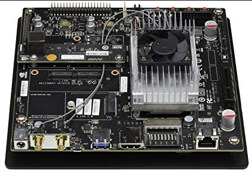

p268


```
스타트업 코드
bl	main	
b	. //메인의 큰루프를 넣는것임. 소트웨어전체종료가된후         
      //끝내기위해넣은것임 사용자입장에서 종료겟지만 루프를돌린것
      //넣지않으면 링커스크립트가 작동함.
/* Initialize RW/ZI Area */ //여기가 ro초기화데이터 ram으로 복사하는것
InitCVar:
	ldr  r0, =__RODATA_END__
	ldr  r1, =__DATA_START__
	mov r2, r0, lsr #12
	mov r3, r1, lsr #12

	cmp  r2, r3 //RAM구조인지 romram구조인지를 판별함 
	beq  2f
	ldr  r3, =__BSS_START__
1:               // Copy RW Region
	cmp  r1, r3
	ldrccb   r2, [r0], #0x1
	strccb  r2, [r1], #0x1
	bcc  1b

2:
	ldr  r3, =__BSS_START__
	ldr		r1, =__BSS_END__
	mov		r2, #0x0
3:      								// Clear BSS(ZI) Region
	cmp		r3, r1
	strccb	r2, [r3], #1
	bcc	 	3b

	mov     pc,lr
```
생각해보면 ram구조는 복사안해도되는데 복사를한다.
심볼데이터가 침범함 각종변수이름들이 심볼
심볼영역을 링커스트립트에서 추가 변경해주어야한다.


```
링커스크립트 파일

/* .rodata section which is used for read-only data (constants) */
  .rodata :
  {
    __RODATA_START__ = .;
    *(.rodata)
    *(.rodata.*)
    __RODATA_END__ = .;
    . = ALIGN(4);    
  }

  /* .data section which is used for initialized data */
  .data :
  {
    __DATA_START__ = .;
    *(.data)
    *(.data.*)
    __DATA_END__ = .;
    . = ALIGN(4);
  }  

```

p274

makefile에서 최적화 추가 설정


O0을
O1
O2로 최적화가능하다.
최적화옵션을 추가하거나 삭제도 가능하다.

------
# 쉘 스크립트


다운받기
bash 튜토리얼 --> d.pr/f/ZmZb0n+



nvidia Tx1
우분투 16버전 리눅스 설치

리눅스 2주교육인데
1주차에 너무 많은 것을 배운다...

---
포트는 이식
배쉬(배쉬셀)와 gcc를 포팅해서 리눅스커널개발
배쉬는 실행파일을 돌리는 플랫폼
gcc가 있어야 사용자가 응용프로그램을 개발할수있다.

사실상 배쉬와 gcc만 있으면 운영체제가 성립할수있다.

bash는 항상 실행중이엿다.
그리고 문법이 있다.

리눅스 터미널 에 입력하는것은(대화식)
배쉬에서 해석한다.

echo 거의 printf 와같다.
```
user@linux:~$ echo hello                   world
hello world

''을 씀으로 공백이 2개이상 읽는다.
user@linux:~$ echo 'hello                   world'
hello                   world

cat은 파일의 맨앞부터 보여주는 명령어
tail은 파일의 뒷부분부터 보여줌.
컨트롤 a는 맨앞으로 알파
컨트롤 e 맨뒤로 이동 end
컨트롤 z 스탑기능 중단시키는 기능 포징

user@linux:~$ tail /var/log/kern.log

user@linux:~$ head /var/log/kern.log  앞부분만 보고싶을때

alias 별칭
alias 별칭 ='~~~~' 
별칭이 다른 명령어 와 충돌나지않게 써야한다.

alias 엔터하면 목록보여줌
전체적용시키기위해서는 스크립트 파일에 넣어야한다!


subl ~/.bashrc  
상당히중요
자동실행 스크립트 터미널 열때마다 실행되는것.
약속된이름이 가지고잇음

이파일 끝부분에 써야됨

alias pbcopy='xclip -selection clipboard'
alias pbpaste='xclip -selection clipboard -o'
alias m='minicom -w -D/dev/ttyS0'
alias h='history'

여기서 저장해도

새로 터미널을 열어야 적용이되는것이다.
만약
그해당 터미널에서 적용하고자한다면

source ~/.bashrc를 해야됨

source는 스크립트를 실행하는 명령어이다.

---
함수만들기

subl ~/.bash_profile

이런 형식으로 함수를 만든다.
subl(){
}

---
v1에 복사해서 넣는다.
user@linux:~/Desktop$ read v1
hello world


user@linux:~/Desktop$ echo $v1
hello world

---
프롬프트로 입력받게해서 출력할수있다.
user@linux:~/Desktop$ read -p "Enter your name: " name
Enter your name: Kim Min Joon

user@linux:~/Desktop$ echo $name
Kim Min Joon

---
변수선언 그리고 할당
공백까지 포함시키고싶다면 ''을써야함.
user@linux:~/Desktop$ COLORS=purple; echo $COLORS
purple

-주의
user@linux:~/Desktop$ COLORS= purple; echo $COLORS 
공백이 있으면 안됨.
공백은 단어와 단어를 구분하는 기능이다.
쉘에서는 공백문자가 매우 중요하다. 

컨트롤 c가 안먹히면
큐
컨트롤 d

컨트롤 l은 화면 clear

user@linux:~$ COLORS=yellow
user@linux:~$ echo $COLORS
yellow

변수저장은 =
변수 호출은 $변수명
---
while문

no=0; while [ $no -lt 10 ]; do ((no=no+1)); printf "%02d\n" $no;done

while[]에서 평가
[브라켓이 사실은 명령어이다. test 
[]안에 잇는것을 평가하겠다.
-lt less than 이걸쓰면 평가가 숫자로 이뤄져야한다.

do 와 done 실행 종료 부분
(()) 계산은 소괄호 두개로 감싸야 한다. 
%02d는 두자리수로 찍겟다.

---
일괄변경기능

user@linux:~/Desktop/bash_tutorials/text/picture_text/mp4$ for name in *; do echo $name; done

for name in *; do rm $name; done
for name in *; do mv $name ${name}_01; done
for name in *; do mv $name ${name%%\.mp3}.wav; done
---
user@linux:~/Desktop/bash_tutorials$ subl countlines.sh


#!/usr/bin/env bash   //어디서든 작동됨
# 파일내의 라인수를 카운트 

lines=0
#for i in $(find . -type f); do 
for i in *; do 
rowline=$(wc -l "$i" | awk '{print $1}');
file="$(wc -l "$i" | awk '{print $2}')"; 
lines=$((lines + rowline)); 
echo "Lines["$lines"] " "$file" "has "$rowline" rows.";
done && unset lines

```
특수문자를 이해하는데 이해가 오래걸리고 많다.
특수문자 활용의 극대화 볼수있다.
!번호 history 과거애 했던 명령어 실행
!!은 가장최근의 것을 실행
cd ~/ 홈으로 간다.
~ 틸드명칭 
` 백코트 명칭

user@linux:~$ PATH1=`pwd`
user@linux:~$ echo $PATH1
/home/user
user@linux:~$ PATH1=$(pwd) 이걸더추천함


변수명은 글자 숫자 _바로 구성할수있다. 
varname=aa 
varname = aa =주위에 공백을 쓰면안된다.

 인용부호 꼭써라! 뒤에 더하여 문자를 붙일수있다.
 GAME="star craft"
 echo="${GAME}s" 

```
스크립트에 전달인자를 줄수있다.
user@linux:~/Desktop/bash_tutorials$ ./parameter.sh AA BB CC EE FF GG HH II JJ KK

```
```
렌덤값 호출
user@linux:111$ echo $RANDOM


스크립트가 커널소스의 일부분.

```
```
user@linux:~/Desktop/bash_tutorials$ PATH=$PATH:/home/user/Desktop

user@linux:~/Desktop/bash_tutorials$ PATH=/home/user/Desktop:$PATH

똑같은 프로그램이 설치되어있을때 앞서 선언되어있는 PATH의 것이 먼저 실행된다.

```
```
tr
cut

user@linux:~/Desktop/bash_tutorials$ /sbin/ifconfig eth0 | grep 'inet addr' | cut -d: -f2 | awk '{print $1}'

cut -d: -f2 :여기 를 뽑는다. :

awk '{print $1}' 2개중 앞에꺼 출력


파일 하나빼고 다 지워라 디렉토리까지 
user@linux:~/Desktop/bash_tutorials/text/picture_text/mp4$ rm -rf !(movie_2018-02-11.wav)
!특수문자 아까는 history엿는데 쓰는위치에따라 not으로 쓰인다.
이거 쓸때 진짜 신중하게 사용해야됨

rm -rf / home/user/Desktop/bash_tutorials
모두 다 날라가는 명령어 조심하고 주의진짜 쓰지도마라.

```
```
정규표현식
https://www.youtube.com/user/neowankyu

정규식은 언제든 활용가능하다.
정규표현식 파일 참고
sublime text의 강력함은 정규표현식 지원이다.

컨트롤 h 로 검색후 바꿀수있다.
([a-z]+)([0-9]+\.xls)
\10\2

[\d]{4}: \$[\d\.]+
\d는 0-9와 같은의미

(^[\w]+ )([\w]+)(\(.+\)\n\{\n)
\1\2\3\t\printf\("\2\\n"\);\n\n

grep  단어찾기 
fgrep 정규표현식 단어찾기 둘다되고
egrep 은 정규표현식만
sed 는 교체하는 명령어

```
```
if 문법

num=$1
re='☺︎'
if ! [[ $num =~ $re ]] ; then #=~ 정규식 패턴
   echo "error: Not a number" >&2; exit 1
else
    echo "is a number"
fi
```
for문
for(( ))

date
choices
case
select

export 는 상속을 시켜줌.
값이 안나오면 export해서 확인해보세요

xargs  위험한 명령어 . 고급 쉘사용자는 나중에 필히 해야될 것.


```


```


```


