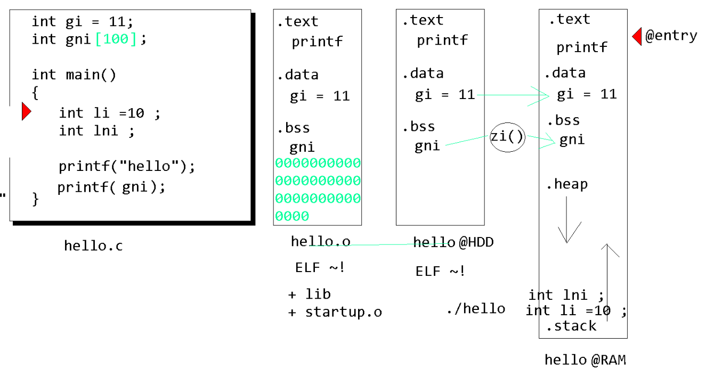

# 리눅스 시스템 프로그래밍

---
## 1일차 

이번 주수업은 OS로 넘어온것.

RTOS 와 리눅스  둘다 사용함. 

둘다 알고있어야한다. 

LINUX HOW TO USE

PORTING LINUX ON BOARD (PORTING)

DEVICE DRIVER PROGRAMMING   <---- 여기 먼저해야하지만...

APPLICATION PROGRAMMING     <----------- 이번주 교육할 주제

이러한 교육순서 문제로 이번주 교육이 터프할것이다................

----
리눅스 설치하기

Virtual Box 설치

실행 후 - 설정 네트워크 3 - 체크해제

어뎁터 1은 호스트전용
어뎁터 2는 브리지 - 아식스설정

창확대 알트 f11

sudo -s  //루트 계정으로 바꿈
비번 //mdsmds

ifconfig 하고 주소 안잡힌 이더네 번호 확인 후

root@ip6:~# ifconfig eth8 192.168.0.2

넣어줌

윈도우 폴더 열고 주소에 
\\192.168.56.101\root
치면
내컴퓨터에서 네트워크드라이브연결
\\192.168.56.101\root를 넣으면
고정폴더가  생성됨 이게 리눅스 폴더임.
다운받은 excise_lsp 파일 home에 복사해서 넣어라.

root@ip6:~# ls
exercise  exercise_lsp
root@ip6:~# chown -R mds:adm exercise_lsp

:w hello.c

정규식을 사용하려면 vi 에서는 sed에서 같이 써야된다. 

---
실습 

테라텀 키고 부트로더 

print  

설정 자료 준거 env.txt 

밑에부분전부다 한 라인씩 복붙 해서 넣는다.
시나리오 1까지

set bootdelay 5

set serverip  192.168.0.2	
set gatewayip 192.168.0.1	
set ipaddr    192.168.0.102	
set netmask   255.255.255.0	

; echo firmware download address
; echo linux zImage down address
; echo this should be hex. otherwise INITRD mount would fail !
set firmaddr 0x30000000	
set zImgaddr 0x32000000	
set ramdaddr 0x30800000 

; echo dongsoo board use UART1 as console
set ramdsize 16M
set terminal ttySAC1,115200n81	

set bootcmd_firmw tftp $firmaddr aImage.bin ';' go $firmaddr
set bootcmd_linux tftp $zImgaddr zImage  ';' bootm $zImgaddr
set bootcmd_getzr tftp $zImgaddr zImage  ';' tftp $ramdaddr ramdisk.gz 
set bootcmd_rdisk $bootcmd_getzr ';' bootm $zImgaddr
set bootcmd_initr nand read $zImgaddr 00080000 00500000 ';' nand read $ramdaddr 00600000 01000000 ';' bootm $zImgaddr
set bootcmd_yaffs nand read $zImgaddr 00080000 00400000 ';' bootm $zImgaddr

set bootargs_nfs root=/dev/nfs rw nfsroot=$serverip:/nfsroot ip=$ipaddr:$serverip:$gatewayip:$netmask::eth0:off:netmask=$netmask console=$terminal
set bootargs_ram initrd=$ramdaddr,$ramdsize root=/dev/ram rw console=$terminal
set bootargs_mtd root=/dev/mtdblock2 rw rootfstype=yaffs2 console=$terminal

;
; ======================================================================
; booting scenario #1.  TFTP - NFS
;
set bootcmd $bootcmd_linux
set bootargs $bootargs_nfs
save

---

.c
.i 전처리
.s 어셈블리어
.o 기계어

링커
elf relocated (.o + lib + startup.o)
elf excute (실행파일 완성@HDD )

@entry 

-----
.text   명령어  
.rodata 상수 리드온리
-----
.data 초기화된것
.bss 초기화 안된것 / 0으로 초기화된것들
-----

.data 와 bss 와 나눈것은
초기화안된것은 나중에 짤려도되기때문

----
NAND 구조

inter rom ram 이
nand가 혼자 주소 복사 안되니까 도와줌 

zimage 가 커널임

reset 하면

보드에 리눅스가 올라간것임.

Welcome to MDS2450
mds2450 login: root
# uname -a
Linux mds2450 3.0.22 #1 PREEMPT Sun Oct 1 11:17:54 KST 2017 armv5tejl GNU/Linux

---
리눅스에서 확인 (cc로 컴파일했다.)

root@ip6:~# file a.out
a.out: ELF 32-bit LSB executable, Intel 80386, version 1 (SYSV), dynamically linked (uses shared libs), for GNU/Linux 2.6.15, not stripped

root@ip6:~# uname -a
Linux ip6 2.6.32-24-generic #39-Ubuntu SMP Wed Jul 28 06:07:29 UTC 2010 i686 GNU/Lin

테라텀에서 확인

# uname -a
Linux mds2450 3.0.22 #1 PREEMPT Sun Oct 1 11:17:54 KST 2017 armv5tejl GNU/Linux

386과 arm의 인스트럭션이 다름
결국 그래서 
a.out이 테라텀에서 돌지안흔ㄴ다.
cc는 c위한 컴파일러다. 
크로스컴파일러로 해야 a.out이 둘다 모든곳에서 실행될수있다.

---

크로스 컴파일러 환경변수 설정

root@ip6:~# cd /usr/local/arm/4.4.1/bin/
root@ip6:/usr/local/arm/4.4.1/bin# cd 
root@ip6:~# export PATH=$PATH:/usr/local/arm/4.4.1/bin
root@ip6:~# echo $PATH
/usr/local/sbin:/usr/local/bin:/usr/sbin:/usr/bin:/sbin:/bin:/usr/X11R6/bin:/usr/local/arm/4.4.1/bin

크로스 컴파일
root@ip6:~# arm-none-linux-gnueabi-cc hello.c -o b.out

테러텀에서 b.out을 실행하면 실행이된다.

nfs폴더는 보드와 리눅스 공유폴더 시스템이다. 

