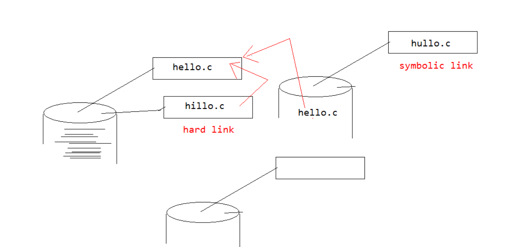
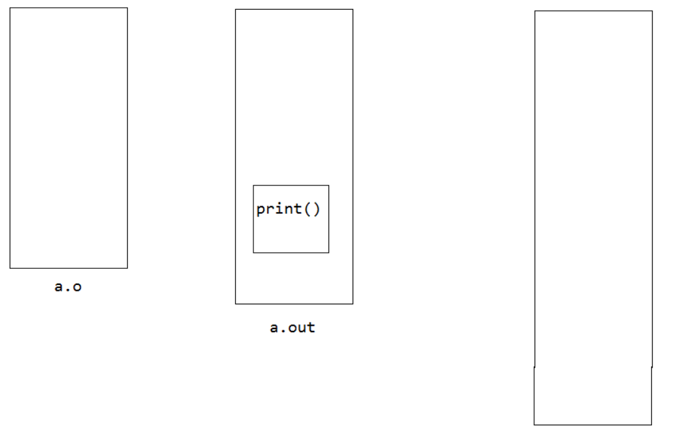
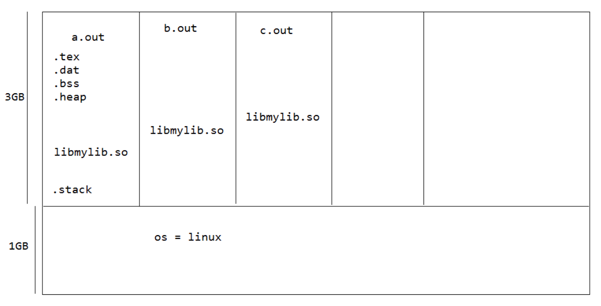
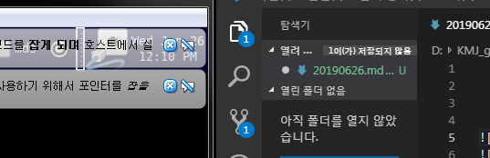

# 2일차

p11

root@ip6:~# stat hello.c 
  File: `hello.c'
  Size: 70        	Blocks: 8          IO Block: 4096   regular file
Device: 801h/2049d	Inode: 2361980     Links: 1
Access: (0777/-rwxrwxrwx)  Uid: (    0/    root)   Gid: (    0/    root)
Access: 2019-06-24 17:22:31.173800345 +0900
Modify: 2019-06-24 17:21:05.761039249 +0900
Change: 2019-06-25 09:47:56.500689920 +0900
root@ip6:~# 

change 는 메타파일 변화 
기본정보에대한 파일이 메타파일

1.c 1.o
2.c 2.o
3.c 3.o
4.c 4.o
========
    a.out

1.c가 변경되엇을때 1.o만 만들면 나머지는 컴파일할때 
안해도됨 근데 1.c만 바뀌엇다는것을 어떻게 알까?
modifiy파일에 수정시간. 수정발생
당연히 change도 변경됨. 기본정보 변경 발생(메타데이터)

make 타임스템프가 존재해서 
변경된것만 컴파일함.

1.c -> 1.i -> 1.s -> 1.o -> a.out

cc -c 1.c 는 1.o까지 만들고

cc 1.c 는 a.out까지 만들라는것

---

root@ip6:~/exercise_lsp/ch05/exer_make/type0# cat Makefile 
baz:foo.o      bar.o
	gcc -o baz foo.o bar.o

foo.o:foo.c
	gcc -c foo.c

bar.o:     bar.c
	gcc -c bar.c

clean:
	rm -f baz foo.o bar.o
root@ip6:~/exercise_lsp/ch05/exer_make/type0# make 
gcc -c foo.c
gcc -c bar.c
gcc -o baz foo.o bar.o
root@ip6:~/exercise_lsp/ch05/exer_make/type0# make clean
rm -f baz foo.o bar.o
root@ip6:~/exercise_lsp/ch05/exer_make/type0# make bar.o
gcc -c bar.c
root@ip6:~/exercise_lsp/ch05/exer_make/type0# make foo.o
gcc -c foo.c
root@ip6:~/exercise_lsp/ch05/exer_make/type0# baz
No command 'baz' found, did you mean:
 Command 'bat' from package 'bacula-console-qt' (universe)
 Command 'bam' from package 'bam' (universe)
 Command 'zaz' from package 'zaz' (universe)
 Command 'bzz' from package 'djvulibre-bin' (universe)
baz: command not found
root@ip6:~/exercise_lsp/ch05/exer_make/type0# make baz
gcc -o baz foo.o bar.o
root@ip6:~/exercise_lsp/ch05/exer_make/type0# 

---
gdb

root@ip6:~/exercise_lsp/ch05/exer_gdb# cat -n gdbTest.c 
     1	#include <stdio.h>
     2	#include <stdlib.h>
     3	main()
     4	{
     5		int i;
     6		double j;
     7	
     8		for(i=0; i<5; i++){
     9	
    10			j=i/2+i;
    11			printf("j is %f\n", j);
    12			*(volatile unsigned int*)(main+10) = 1; 
    13		}

*(volatile unsigned int*)(main+10) = 1; 
main 시작한 그 어느곳에 1값을 넣어라.
컴파일 무시하지말고 언사인드로 인트 값으로 형변환한값에 1을 넣어라.

root@ip6:~/exercise_lsp/ch05/exer_gdb# gdb test core

gdb test core 하면 

확인할수있다. 

gdb를 쓸게 못된다... 잘쓰지않는다...

----

root@ip6:~/exercise_lsp/ch06/exer_staticlib# gcc -c mylib.c
root@ip6:~/exercise_lsp/ch06/exer_staticlib# ls
main.c  mylib.c  mylib.h  mylib.o  _README.txt
root@ip6:~/exercise_lsp/ch06/exer_staticlib# ar rc libmylib.a mylib.o
root@ip6:~/exercise_lsp/ch06/exer_staticlib# ls
libmylib.a  main.c  mylib.c  mylib.h  mylib.o  _README.txt
root@ip6:~/exercise_lsp/ch06/exer_staticlib# gcc -o main main.c -L./ -lmylib
root@ip6:~/exercise_lsp/ch06/exer_staticlib# ls
libmylib.a  main  main.c  mylib.c  mylib.h  mylib.o  _README.txt
root@ip6:~/exercise_lsp/ch06/exer_staticlib# ./main
sum; 150
diff: 50

----

root@ip6:~# ls -i hello.c 
2361980 hello.c //고유의 아이디

root@ip6:~# cp hello.c hallo.c
root@ip6:~# ls
a.out  b.out  exercise  exercise_lsp  hallo.c  hello.c
root@ip6:~# ls -i h*
2361987 hallo.c  2361980 hello.c
root@ip6:~# ln hello.c hillo.c
root@ip6:~# ls
a.out  b.out  exercise  exercise_lsp  hallo.c  hello.c  hillo.c
root@ip6:~# ls -i h*
2361987 hallo.c  2361980 hello.c  2361980 hillo.c

ln은 복사를 하지만 고유번호까지 같다. 

root@ip6:~# echo hillo hillo >> hillo.c
root@ip6:~# cat hello.c
#include<stdio.h>

int main(){
	printf("hello world\n");
	return 0;
}
hillo hillo

숫자 즉, 고유번호가 진짜 파일이고
나머지이름은 이름표일뿐이다. 

ln 을 하드링크라한다.
파일에 또다른 이름표를붙인것

root@ip6:~# ln -s hello.c hullo.c
root@ip6:~# ls
a.out  b.out  exercise  exercise_lsp  hallo.c  hello.c  hillo.c  hullo.c
root@ip6:~# ls -i h*
2361987 hallo.c  2361980 hello.c  2361980 hillo.c  2359894 hullo.c
root@ip6:~# ls -l h*
-rwxr-xr-x 1 root root 70 2019-06-25 12:43 hallo.c
-rwxrwxrwx 2 root root 82 2019-06-25 12:45 hello.c //이름표가 두개
-rwxrwxrwx 2 root root 82 2019-06-25 12:45 hillo.c //이름표가 두개
lrwxrwxrwx 1 root root  7 2019-06-25 12:48 hullo.c -> hello.c   //7의 의미가 hello.c의 글자수  맨앞이 l로 표시됨 링크파일임 바로가기이다.

심벌릭 링크가 바로가기 

---
p29 공유라이브러리 실습

echo $PATH

mds@ip6:~/exercise_lsp/ch06/exer_sharedlib/lib$ make
gcc -shared -W1,-soname,libmyfunc.so.1 -o libmyfunc.so.1.0.1 myfunc.o
ln -s libmyfunc.so.1.0.1 libmyfunc.so
mds@ip6:~/exercise_lsp/ch06/exer_sharedlib/lib$ cd ..
mds@ip6:~/exercise_lsp/ch06/exer_sharedlib$ make
gcc -g -Ilib    -c -o hello.o hello.c
gcc -o hello hello.o -Llib -lmyfunc
mds@ip6:~/exercise_lsp/ch06/exer_sharedlib$ ./hello
./hello: error while loading shared libraries: libmyfunc.so: cannot open shared object file: No such file or directory
mds@ip6:~/exercise_lsp/ch06/exer_sharedlib$ export LD_LIBRARY_PATH=$LD_LIBRARY_PATH:./lib
mds@ip6:~/exercise_lsp/ch06/exer_sharedlib$ echo $LD_LIBRARY_PATH 
:./lib
mds@ip6:~/exercise_lsp/ch06/exer_sharedlib$ ./hello
You can do it!!
mds@ip6:~/exercise_lsp/ch06/exer_sharedlib$ ldd echo
ldd: ./echo: No such file or directory
mds@ip6:~/exercise_lsp/ch06/exer_sharedlib$ ldd hello
	linux-gate.so.1 =>  (0x0063c000)
	libmyfunc.so => ./lib/libmyfunc.so (0x00cb4000)
	libc.so.6 => /lib/tls/i686/cmov/libc.so.6 (0x00110000)
	/lib/ld-linux.so.2 (0x007bd000)

hello.c

#include "myfunc.h"
#include <stdio.h>

int main(void)
{
        say_hello();

        while(1){
                sleep(5);
                printf(".");
                fflush(stdout);
        }
        return 0;
}

으로 수정하고 make 한 뒤에 

./hello & //백그라운드 실행

ldd 라이브러리 의존성 확인 하는 명령어

root@ip6:~/exercise_lsp/ch06/exer_sharedlib# ..ldd hello
	linux-gate.so.1 =>  (0x00b94000)
	libmyfunc.so => ./lib/libmyfunc.so (0x00d60000)
	libc.so.6 => /lib/tls/i686/cmov/libc.so.6 (0x003f6000)
	/lib/ld-linux.so.2 (0x00d78000)

pmap 프로세스 매모리 구조 확인

여기서 라이브러리 공유하는걸 볼수있다. 
lib 주소가 같다. 

root@ip6:~/exercise_lsp/ch06/exer_sharedlib# pmap .2282.
2282:   ./hell2
00110000   1356K r-x--  /lib/tls/i686/cmov/libc-2.11.1.so
00263000      4K -----  /lib/tls/i686/cmov/libc-2.11.1.so
00264000      8K r----  /lib/tls/i686/cmov/libc-2.11.1.so
00266000      4K rw---  /lib/tls/i686/cmov/libc-2.11.1.so
00267000     12K rw---    [ anon ]
00872000      4K r-x--  /home/mds/exercise_lsp/ch06/exer_sharedlib/lib/libmyfunc.so.1.0.1
00873000      4K r----  /home/mds/exercise_lsp/ch06/exer_sharedlib/lib/libmyfunc.so.1.0.1
00874000      4K rw---  /home/mds/exercise_lsp/ch06/exer_sharedlib/lib/libmyfunc.so.1.0.1
00e28000      4K r-x--    [ anon ]
00fdd000    108K r-x--  /lib/ld-2.11.1.so
00ff8000      4K r----  /lib/ld-2.11.1.so
00ff9000      4K rw---  /lib/ld-2.11.1.so
08048000      4K r-x--  /home/mds/exercise_lsp/ch06/exer_sharedlib/hell2
08049000      4K r----  /home/mds/exercise_lsp/ch06/exer_sharedlib/hell2
0804a000      4K rw---  /home/mds/exercise_lsp/ch06/exer_sharedlib/hell2
b784a000      8K rw---    [ anon ]
b7859000     12K rw---    [ anon ]
bfc10000     84K rw---    [ stack ]
 total     1632K
root@ip6:~/exercise_lsp/ch06/exer_sharedlib# ........pmap 22.66
2266:   ./hello
00110000   1356K r-x--  /lib/tls/i686/cmov/libc-2.11.1.so
00263000      4K -----  /lib/tls/i686/cmov/libc-2.11.1.so
00264000      8K r----  /lib/tls/i686/cmov/libc-2.11.1.so
00266000      4K rw---  /lib/tls/i686/cmov/libc-2.11.1.so
00267000     12K rw---    [ anon ]
005df000      4K r-x--    [ anon ]
0061e000      4K r-x--  /home/mds/exercise_lsp/ch06/exer_sharedlib/lib/libmyfunc.so.1.0.1
0061f000      4K r----  /home/mds/exercise_lsp/ch06/exer_sharedlib/lib/libmyfunc.so.1.0.1
00620000      4K rw---  /home/mds/exercise_lsp/ch06/exer_sharedlib/lib/libmyfunc.so.1.0.1
00726000    108K r-x--  /lib/ld-2.11.1.so
00741000      4K r----  /lib/ld-2.11.1.so
00742000      4K rw---  /lib/ld-2.11.1.so
08048000      4K r-x--  /home/mds/exercise_lsp/ch06/exer_sharedlib/hello
08049000      4K r----  /home/mds/exercise_lsp/ch06/exer_sharedlib/hello
0804a000      4K rw---  /home/mds/exercise_lsp/ch06/exer_sharedlib/hello
b7773000      8K rw---    [ anon ]
b7782000     12K rw---    [ anon ]
bf88f000     84K rw---    [ stack ]
 total     1632K

ps 현재 프로세스 확인

fg fore ground
백그라운드에 잇는걸 포그라운드로 가져와라 하고 
cntrl + c 해서 종료 

kill 프로세스 죽이기
root@ip6:~/exercise_lsp/ch06/exer_sharedlib# .kill. -9 2301

---

동적라이브러리 

이거 참고
https://sens.tistory.com/33

---

