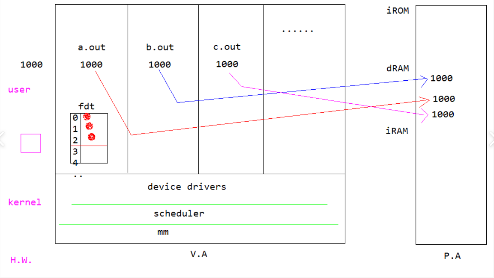

  # system call

  리눅스는 x86기반으로 개발되어서 곳곳에 흔적이 있다. 
  우리는 ARM 기반으로 살펴볼것이다. 

  시스템콜은 os를 호출하는것인데
  하드웨어적으로 거쳣다가 감.

---

-rwxr-xr-x 1 root root 7175 2019-06-24 17:22 a.out
-rwxr-xr-x 1 root root 7924 2019-06-24 17:35 b.out
drwxr-xr-x 9 root root 4096 2017-12-04 16:06 exercise
drwxr-xr-x 9 mds  adm  4096 2019-06-24 11:30 exercise_lsp
-rwxr-xr-x 1 root root   70 2019-06-25 12:43 hallo.c
-rwxrwxrwx 2 root root   82 2019-06-25 12:45 hello.c
-rwxrwxrwx 2 root root   82 2019-06-25 12:45 hillo.c
lrwxrwxrwx 1 root root    7 2019-06-25 12:48 hullo.c -> hello.c

   권한  링크수 오너 그룹 사이즈  생성날짜  시간 파일명

-요건 일반파일
d는 디렉토리
l은 심벌릭링크 
p는 파이프
s는 소켓

---
p37

고수준 파일입출력과 저수준 파일입출력이있다.

int fd = open(....) // 저수준 파일 입출력 함수

FILE *pf = fopen(....) // 고수준 파일 입출력 함수

---
mds@ip6:~/exercise_lsp/ch08$ vi open.c

#include <stdlib.h>
#include <stdio.h>
#include <sys/types.h>
#include <sys/stat.h>
#include <fcntl.h>

int main()
{
        int fd;
        fd = open("hello.txt", O_CREAT|O_WRONLY, S_IRUSR|S_IWUSR|S_IRGRP|S_IWGRP);
        printf("file open : %d \n", fd);

}

mds@ip6:~/exercise_lsp/ch08$ vi open.c 
mds@ip6:~/exercise_lsp/ch08$ cc open.c 
mds@ip6:~/exercise_lsp/ch08$ ls
addr_make.c  a.out   fflush.c  lseek.c  read.c       readnb.c  select_test.c
addr_read.c  dup2.c  fly.txt   open.c   _README.txt  select.c  write.c
mds@ip6:~/exercise_lsp/ch08$ ./a.out 
file open : 3

----

파일 읽기 쓰기 실습 예제

umask 

---
데이터=

mds@ip6:~/exercise_lsp/ch08$ cat fly.txt 
Fly me to the moon And let me play among the stars
Let me see what spring is like on Jupiter and Mars
In other words hold my hand
In other words darling kiss me
on Jupiter and Mars
In other words hold my hand

메타데이터=

mds@ip6:~/exercise_lsp/ch08$ stat fly.txt 
  File: `fly.txt'
  Size: 209       	Blocks: 8          IO Block: 4096   regular file
Device: 801h/2049d	Inode: 2360088     Links: 1
Access: (0744/-rwxr--r--)  Uid: ( 1001/     mds)   Gid: (    4/     adm)
Access: 2019-06-26 15:13:58.239347456 +0900
Modify: 2013-03-13 10:01:56.000000000 +0900
Change: 2019-06-24 11:32:39.109728672 +0900

---
p58

출력의 방향을 바꿈
mds@ip6:~/exercise_lsp/ch08$ echo hello world
hello world
mds@ip6:~/exercise_lsp/ch08$ echo hello world >> hello.txt

stderr 로찍은것임 stdout과 보는 방식은같지만..아님
에러 출력을 바꿈
mds@ip6:~/exercise_lsp/ch08$ make
make: *** No targets specified and no makefile found.  Stop.

mds@ip6:~/exercise_lsp/ch08$ make
make: *** No targets specified and no makefile found.  Stop.
mds@ip6:~/exercise_lsp/ch08$ make 2> error.txt

