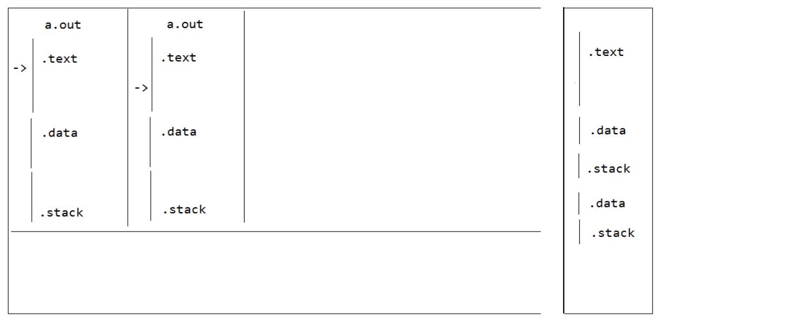
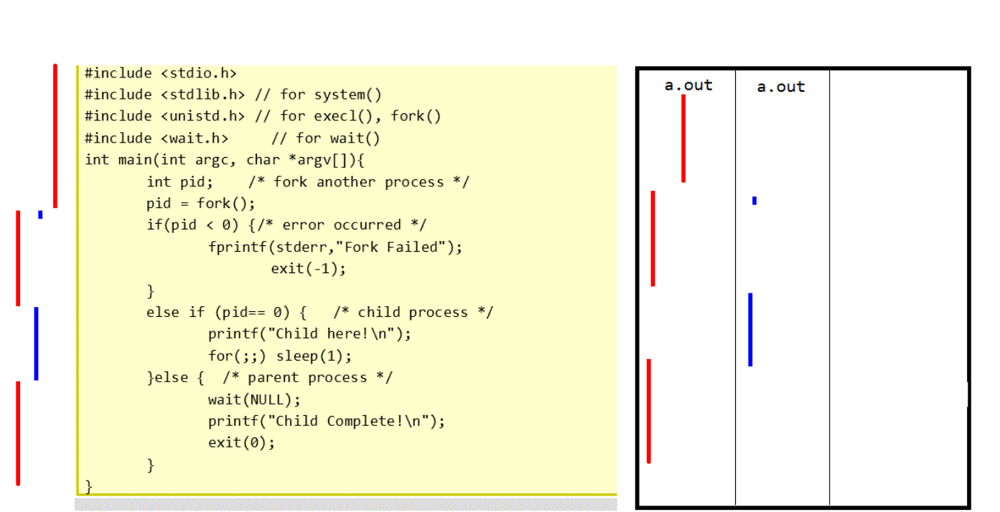
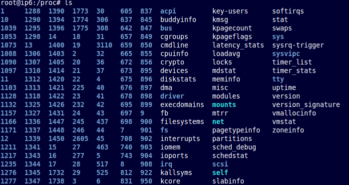
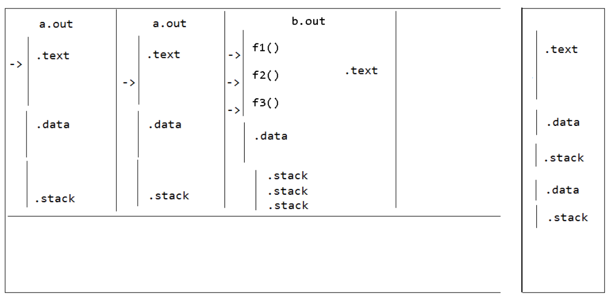
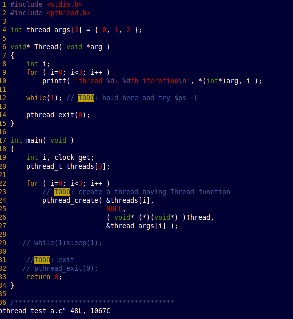
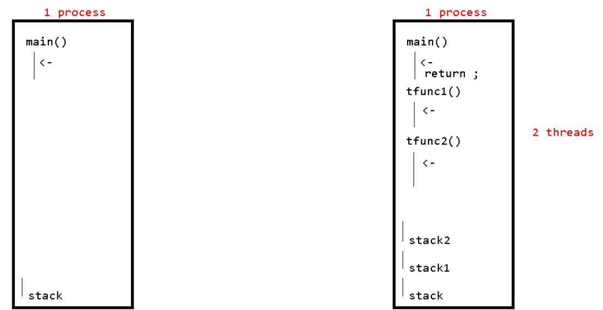
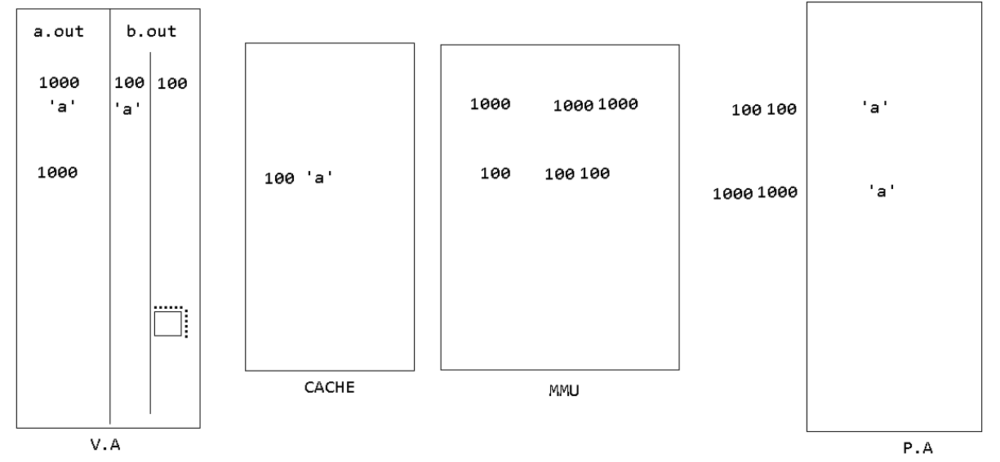

4일차






mds@ip6:~$ ps -ef
UID        PID  PPID  C STIME TTY          TIME CMD
root         1     0  0 08:51 ?        00:00:00 /sbin/init     // 펌웨어다. 모든프로세스의 어머니 //모든 유져프로세스의 어머니
root         2     0  0 08:51 ?        00:00:00 [kthreadd]      //펌웨어다.  모든 커널프로세스의 어머니 // 커널스레드의 어머니 
root         3     2  0 08:51 ?        00:00:00 [migration/0]   
root         4     2  0 08:51 ?        00:00:00 [ksoftirqd/0]
root         5     2  0 08:51 ?        00:00:00 [watchdog/0]
root         6     2  0 08:51 ?        00:00:00 [events/0]
root         7     2  0 08:51 ?        00:00:00 [cpuset]
root         8     2  0 08:51 ?        00:00:00 [khelper]
root         9     2  0 08:51 ?        00:00:00 [netns]
root        10     2  0 08:51 ?        00:00:00 [async/mgr]
root        11     2  0 08:51 ?        00:00:00 [pm]
root        12     2  0 08:51 ?        00:00:00 [sync_supers]
root        13     2  0 08:51 ?        00:00:00 [bdi-default]
root        14     2  0 08:51 ?        00:00:00 [kintegrityd/0]
root        15     2  0 08:51 ?        00:00:00 [kblockd/0]
root        16     2  0 08:51 ?        00:00:00 [kacpid]
root        17     2  0 08:51 ?        00:00:00 [kacpi_notify]
root        18     2  0 08:51 ?        00:00:00 [kacpi_hotplug]
root        19     2  0 08:51 ?        00:00:00 [ata/0]
root        20     2  0 08:51 ?        00:00:00 [ata_aux]


sleep 100 
sleep 200 
을 터미널 창에서 실행하면

bash가 부모 프로세스가 된다. 

UID        PID  PPID  C STIME TTY          TIME CMD
mds       1775  1773  0 08:57 pts/0    00:00:00 bash
mds       1926  1775  0 09:27 pts/0    00:00:00 sleep 100
mds       1927  1775  0 09:27 pts/0    00:00:00 ps -f


----


mds@ip6:~$ sleep 5


^C
[1]+  Done                    sleep 100
mds@ip6:~$ sleep 5
^Z
[1]+  Stopped                 sleep 5
mds@ip6:~$ bg
[1]+ sleep 5 &
mds@ip6:~$ fg
bash: fg: job has terminated
[1]+  Done                    sleep 5
mds@ip6:~$ sleep 10
^Z
[1]+  Stopped                 sleep 10
mds@ip6:~$ fg
sleep 10
^Z
[1]+  Stopped                 sleep 10
mds@ip6:~$ bg
[1]+ sleep 10 &
mds@ip6:~$ ps
  PID TTY          TIME CMD
 1775 pts/0    00:00:00 bash
 1939 pts/0    00:00:00 ps
[1]+  Done                    sleep 10

---

ps -ef,-l-L 요정도만
top

----


스케줄러

root@ip6:~/exercise_lsp/ch09# ps -l
F S   UID   PID  PPID  C PRI  NI ADDR SZ WCHAN  TTY          TIME CMD
4 S     0  2254  1775  0  80   0 -  1528 wait   pts/0    00:00:00 bash
4 R     0  2275  2254  0  80   0 -   625 -      pts/0    00:00:00 ps

PRI 이가 우선순위임
NI는 나이스값


대부분 80임  - 기본

85 5
76 -4
78 -2


---
추가 문제 선생님

hello.c작성

  1 #include<stdio.h>
  2 
  3 int main(int argc, char** argv){
  4     int i = 0;
  5     while(1){
  6 
  7     printf(argv[1]);
  8 
  9     fflush(stdout);
 10     for(i=0;i<0xFFFFFFFF;i++);
 11     }
 12 
 13     return 0;
 14 }

a.sh작성

  1 nice -3 ./a.out A &
  2 nice -6 ./a.out B &


gcc hello.c 

. a.sh 으로 실행
----
프로세스 디스크립터

proc  





그림 참조 




b.out

f1()

f2()

f3()

.data

.stack
.stack
.stack

f1 함수를 main
f2 함수를 main
f3 함수를 main
같은 전역변수를 봄 전역변수 공유
스택은 각각 따로사용


프로세스는 하나씩 구분되어잇지만

스레드는 프로세스 내에 여러개가 존재함.


---

기존에 있던 main 을 리더 스레드라 할수있다. 
나머지 스레드를 자식스레드라함. 자식 스레들 은 형제스레드들이라함.

프로세스는 스레드를 담고있는 그릇(컨테이너)이다. 디폴트로 스레드(main)를 하나 담고있다. 

스레드를 스케줄을 한다. 


---

p93 

스레드의 스케줄 비용이 저렴하다. ??
밑에 정리 
그리고 그림 참고,.

캐시의 로칼리티 

a.out 의 1000번지 주소 와

b.out의 1000번지 주소 사용은 분명 다른값이다.

캐시에 있는 1000번지 주소가 남아잇으면 b.out이 a.out이 저장한 캐시의 값을 가져오면 안됨.

그래서 프로세스가 바뀌면 캐시에 값을 다 비워야한다. 

프로세스 내에서 즉 스레드 내에서 스레드로 바뀌면 캐시에 있는 내용을 재활용할수있다. 


---

kill %1 jobID를 적어서 죽일수잇다.

p96

kill로 
프로세스를 죽이면 안에 스레드들이 다같이죽음

그리고 코드상에서 
먼저 main스레드를 종료하고 스레드가 살아잇으면
메인프로세스가 좀비상태가된다. 

root@ip6:~/exercise_lsp/ch10# ps -L
  PID   LWP TTY          TIME CMD
 2605  2605 pts/0    00:00:00 bash
 3680  3680 pts/0    00:00:00 a.out <defunct>
 3680  3681 pts/0    00:01:36 a.out
 3680  3682 pts/0    00:01:36 a.out
 3680  3683 pts/0    00:01:36 a.out
 3790  3790 pts/0    00:00:00 ps




root@ip6:~/exercise_lsp/ch10# gcc pthread_test_a.c -lpthread

메인 리드 스레드를 스레드로서 종료시키는것과
메인 종료는 다르다. 


---
p99

cfs 를 RT로 만들어보자

```C
  1 #include <stdio.h>
  2 #include <pthread.h>
  3 #include <sched.h>
  4 #include <unistd.h>
  5 #include <sys/types.h>
  6 
  7 int thread_args[3] = { 0, 1, 2 };
  8 
  9 void* Thread( void *arg )
 10 {
 11     int i;
 12 //    nice(10);     // only for SCHED_NORMAL
 13     for ( i=0; i<100; i++ ){
 14         printf( "%d", *(int*)arg);
 15     }
 16 
 17     fflush(stdout); // try if you have not displayed 2s all enough !
 18 
 19     //system("ps -l -L ");
 20 
 21     sleep(100); //sleep for probe
 22 
 23     pthread_exit(0);
 24 }
 25 
 26 int main( void ) {
 27     int i;
 28     pthread_t threads[3];
 29 
 30     int policy;
 31 
 32 
 33     pid_t mypid;
 34 
 35     /*TODO: thread attribute variable here */
 36     pthread_attr_t  thread_attrs;
 37 
 38     /*TODO: thread schedule parameter here */
 39     struct sched_param  param;
 40 
 41     mypid = getpid();
 42 
 43     policy = sched_getscheduler(0); // get policy of self
 44     printf("current policy is : %s \n", (policy==0) ? "SCHED_NORMAL" : (policy==1) ? "SCHED    _FIFO" :(policy==2) ? "SCHED_RR" : "else" );
 45 
 46 /*
 47 #define SCHED_NORMAL            0
 48 #define SCHED_FIFO              1
 49 #define SCHED_RR                2
 50 #define SCHED_BATCH             3
 51 */
 52 
 53 #if 1
 54     param.sched_priority = 30;  /*  1 - 99 */
 55     sched_setscheduler(mypid, SCHED_FIFO, &param);  //RT 로 바꾸자
 56 
 57     policy = sched_getscheduler(0); // get policy of self
 58     printf("current policy is : %s \n", (policy==0) ? "SCHED_NORMAL" : (policy==1) ? "SCHED    _FIFO" :(policy==2) ? "SCHED_RR" : "else" );
 59 #endif
 60 
 61 
 62     for ( i=0; i<3; i++ ) {
 63 
 64 #if 1
 65 
 66     /*
 67         2 options of  : inherit( default: follow Mom's ) or explicit ( my own )
 68     **/
 69 
 70 
 71         /*TODO: initialize thread atrribute variable here */
 72         pthread_attr_init( &thread_attrs );
 73            pthread_attr_setinheritsched(&thread_attrs, PTHREAD_EXPLICIT_SCHED);      ///////추가 중요함
 74         /*TODO: set schedule policy : round-robin here */
 75         pthread_attr_setschedpolicy( &thread_attrs, SCHED_FIFO );  /* you can't change unde    r inherit. just follow leader thread's **/
 76 
 77         /*TODO: set thread priority : 15 */   /* you can't change under inherit. just follo    w leader thread's **/ 


```


자식이 아무리 우선순위를 바꿔도
부모의 우선순위를 상속 .물려받는다. 

rt권한으로 변경하고자하면 슈퍼 권한이여야한다.
스케줄 생성 할때 디폴트가 부모의것이다.
PTHREAD_INHERIT_ScHED;은 디폴트


만약 부모와 다른 값의 우선순위를 가지고싶다면 
PTHREAD_INHERIT_ScHED;
s= 이부분이 
s = pthread_attr_setinheritsched(&attr, inheritsched);이걸
pthread_attr_setinheritsched(&thread_attrs, PTHREAD_EXPLICIT_SCHED);로 적용해야됨


---







