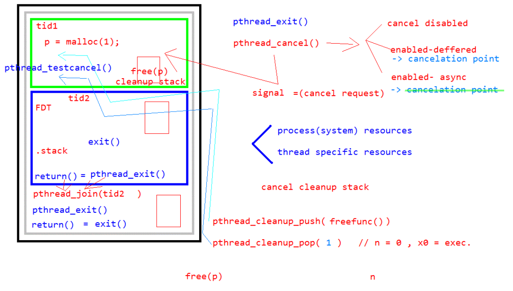

p105

그림1참고

리더스레드에서 리턴은 프로세스 exit와 같다. 프로세스 종료임

자식 스레드에서 exit하면 프로세스 종료됨
근데 자식 스레드 에서 리턴은 스레드 exit이다. 

리더 스레드에서 스레드exit하면 다른 스레드들 살아잇다.

프로세스시스템   자원 //예를들어 파일디스크립터들

스레드특정       자원 //

스레드가 가지고 있던 fdt 나 스텍 프로세스 시스템 자원들을
리턴하거나 스레드exit하면  
pthread_join()이 자원을 해제해줌.
안해주면 해제안되고 프로세스 끝날때 해제됨
(어테치드 붙어있는상황이때임 )
(디테치드는 분리된상태 자원을 자기가 알아서 해제함.)

스레드 특정 자원 은 malloc이다.
malloc 이후 free  해줘야됨.
pthread_cancel(쓰레드ID) //끝내 스레드들 다 죽여 정리해.
어느시점에서 스레드가 죽을지모름.
free안하고 죽을수잇음 그러면 메모리 릭이발생함.

cancel disabled 된 상태 
-죽어라 해도 못죽어!라고하는상태

cancel enabled  deffered - 이게 디폴트 방식
- 시그널을 보냄 
- signal = (cancel request)
- cancelation point가 있다. 어디서 죽어야하는지를 아는것.
- 아무데서나 죽지않는다. sleep도 그중하나다.
- cancel cleanup stack을 생성함. 스레드 종료할때 모아둔스택들 실행됨
  - 프리같은건 무조건 수행해야됨 그런것들을 저장하는곳
  - 이스택에 저장된것들을 다 처리하고 나가면됨
- pthread_cleanup_push( freefunc() )
- pthread_cleanup_pop( n ) //n=0,x0=exec
- 스레드 특정 자원해제를해줌
- malloc 할당받고 주속 지정하는 찰라에 죽으면 온전한릭발생 
- pthread_testcancel() cancelation point를 지정해줌

cancel enabled async -  
- cancelation point 없음.
- 보장할수없음.
- 책임은 사용자에게 잇다.

----

동기화 
p111

---
p119 
실습예제 해보기

sem_t        sem;  /*TODO: semaphore variable - sem */
  6 pthread_t   task;
  7 
  8 void Thread( void ) {
  9     int i = 0;
 10     int val;
 11 
 12     while(1) {
 13         i++;
 14 
 15         sem_wait( &sem ); /* TODO: take semaphore */
 16 
 17         sem_getvalue( &sem, &val ); /* get sem value to val */
 18         printf( "wakeup %d: value = %d\n", i ,val );
 19 
 20         if ( i > 5 ) break;
 21     }
 22 }
 23 //----------------------------------------
 24 void main( void )
 25 {
 26     int i = 0, j, val;
 27 
 28     sem_init( &sem, 0, 3 ); /* TODO: init unnamed semaphore */
 29 
 30     pthread_create( &task, NULL, (void*(*)(void*))Thread, NULL );
 31 
 32     while(1) {
 33         sleep(1);// 여기서 슬립줘야 스레드로 넘어감.
 34         i++;
 35 
 36         printf( "sem post %d\n", i );

---
p124
 뮤택스 실습예제해보기

 p122
 뮤택스 삭제방지 기능 => 뮤택스 가지고 죽엇다. 에러메시지를 받는다. 
 삭제를 못하게 하는것은 아니다. 
 삭제된 뮤택스를 사용하게끔해준다.

 roburst attr 세팅하면
뮤택스 가지고 죽어도 
다른곳에서 뮤택스 락풀고 다시 쓸수 있다.

ㅡㅇㄴ

