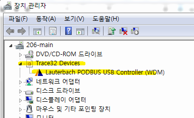
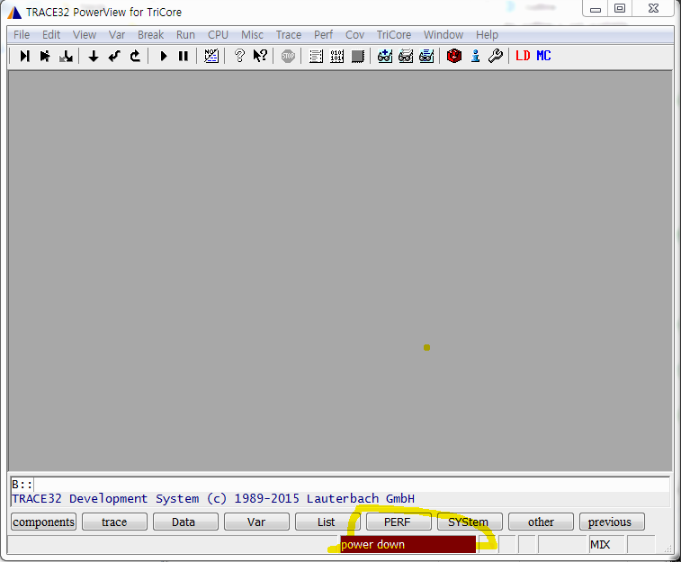
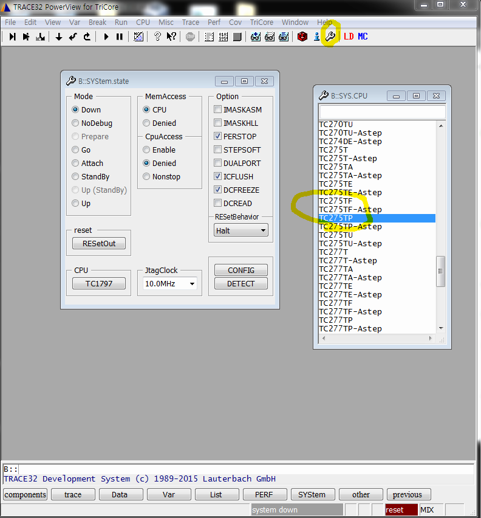
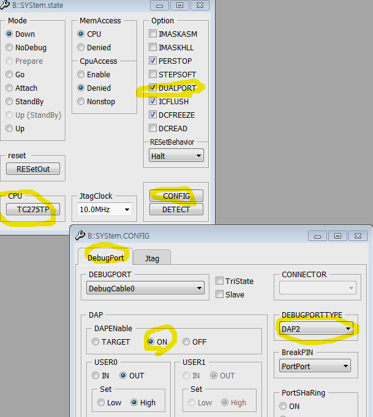
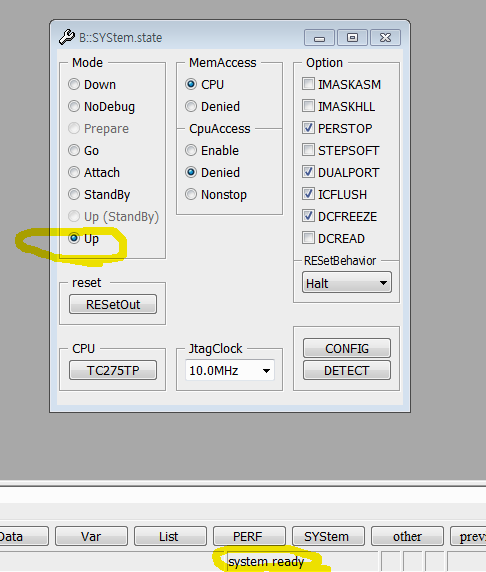
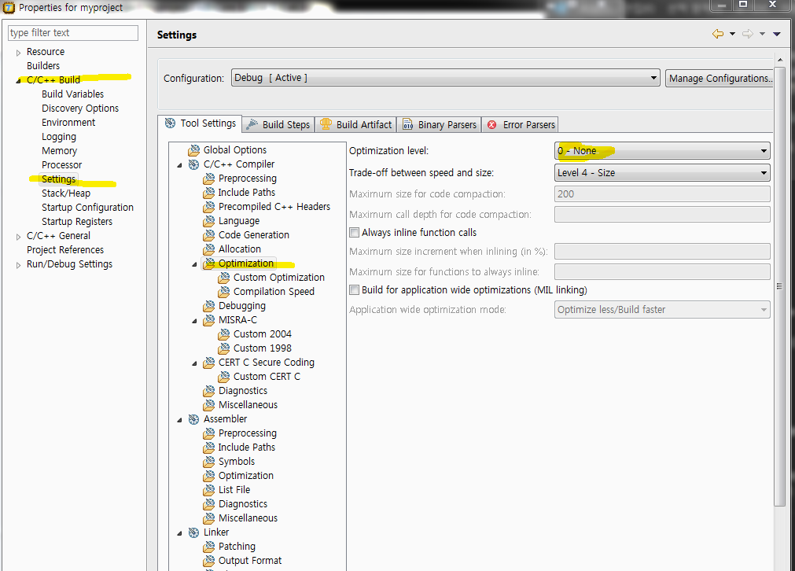
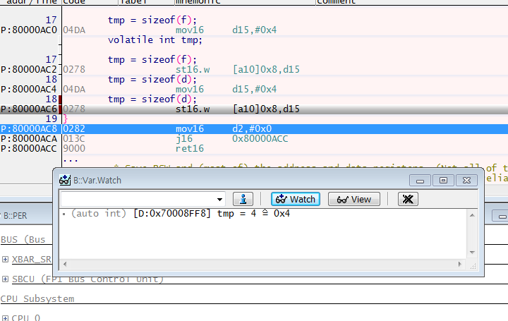
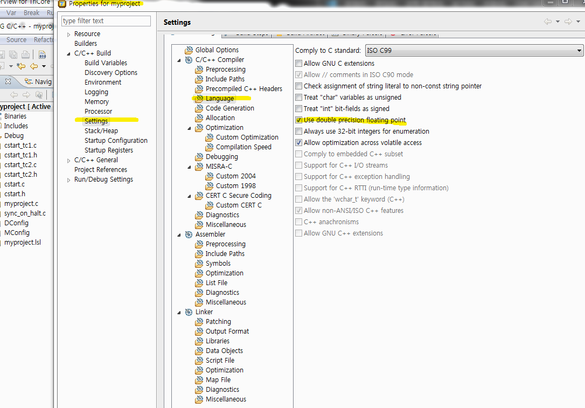
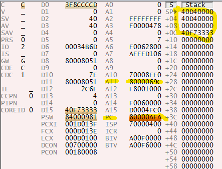

디버거 설치 세팅

t32 폴더와 타스킹 폴더 다운

t32폴더 C드라이브에 옴긴다.

타스킹은 셋업파일 을 실행해서 설치한다.

네임은 . 으로 하고 설치 디폴트로 시작

설치 끝내고

환경변수 설정을한다.

내컴퓨터 속성 고급 환경변수 

시스템변수 새로만들기

변수 이름과 값을 기재하고 만든다.
LM_LICENSE_FILE
7594@192.168.101.26


tricore eclipse ide 실행
C:\Workspace_AURIX

workbanch

---새 프로젝트 

파일 - new - 타스킹 트리코어 프로젝트 
 프로젝트 네임 myproject 
 hello world c project

보드에 잇는 트리코어에 적힌것을 보면 
헤더파일 제공 CA C스텝 그래서 TC27xc 뒤에 c가 붙으니까 헤더지원을 받기위해서
체크를 한다. 

프로젝트 빌드를 해보고 버그를 체크한다. 

디버거 순서 중요!!

디버거에 먼저 전원 주고
타겟연결하고
타겟에 전원 준다.

제거할때 역순으로

타겟에 전원을 제거하고 타겟을 분리 하고 디버거에 전원을 제거한다.

이순서를 지켜야 디버거에 손상이 없다. 

파워 led on

select 1초간 점멸되면  

정상이다.

디버거의 작은 끈을 뎁이라한다.

보드에 보면 숫놈으로 작게 1이 적혀잇는것을 찾고
뎁의 빨간 줄이 1과 붙게 해서 연결한다.


C:\T32\bin\windows에 

t32mtc.exe  트라이 코어용 디버거 실행파일이다. 

C드라이브에 Temp라는 폴더를 만든다. 


드라이버 안잡히면 
장치관리자에 


잇어야된다. 드라이버 설치 하면됨.


타겟의 전원상태를 보여준다.
전원이 연결되지 안된상태 파워다운







코어는 전기가 들어가면 그냥 계속 실행을하는데
디버거는 그것을 정지시킬수있다. 
특정 시점에서 브레이크 시키고 메모리를 읽고 레지스터를 읽고 상태를 체크가능
jtag기반은 실시간 디버깅이 아님 런타임중에 안됨
실시간이 가능하려면 듀얼포트가 되어야한다. 
듀얼은 런타임에 가능함 
예전것은 불가능
우리것은 체크가능하긴한데 실시간은 아니다.
우리는 제이텍이아니라 뎁이다. 
설정에서 제이텍을 뎁2로 변경하고 뎁인에이블을 온시킨다. 



현재상테 리셋인데 

모드를 업을 누르면 
하단에 시스템 상태가 시스템 레디로 바뀐다. 




상위에 LD를 버튼을 누르면 
디버깅이 보인다.


오른쪽 상단은 레지스터

왼쪽 상단
검은색어드레스는 버츄얼 어드레스
파란색 코드라인 13 14는 라인넘버
디스어셈블해서 보여줌
왼쪽이 머신코드  오른쪽이 디스어셈블한것
1대1 매칭임.
디폴트로 디버거는 16진법으로 보여준다. 
16비트 32비트 섞어서 씀


label의 main:은 심볼이다.
함수는 주소다 

main(); 

()요게 펑선 콜 오퍼레이터 
피연산자는 함수라는 타입main

main의 값 0x80000BB6 으로 (); 점프해라.


왼쪽 하단은 IO 관련

오른쪽 하단은 
하위레벨을 다룰때 콜스택을 보여준다. 


타스킹에서 컴파일 옵션을 줄수있다. 
프로젝트단위 혹은 파일단위로 줄수있다.
오른쪽클릭하고 프로퍼티



아까 는 디버거할때 코드 끝에 가잇엇는데 이유가
최적화옵션때문에 컴파일이 무시한것

위의 설정이 무시하지않도록 옵션을 내린것이다.
컴파일 최적화옵션 0none

하위레벨에서 0레벨로 컴파일 최적화를 낮춰도
공간이 너무 작기때문에 디버깅옵션이 강하게 되어잇어서
디버깅이 안잡히게되고 디버깅전문가를 부르게된다. 
낮춰도 컴파일이 디버깅을 읽지않는다. 

volatile을 쓰면 디버깅이 잡힌다.

컴파일 설치하면 관련된 문서가 존재하고 같이 설치된다. 
메뉴얼폴더가 존재


환경변수 
C:\Program Files (x86)\TASKING\TriCore v4.3r3\ctc\bin 
PATH에 bin; 뒤에 C:\Program Files (x86)\TASKING\TriCore v4.3r3\ctc\bin 추가한다.

그리고 

C:\Workspace_AURIX\myproject\Debug 에서 
cmd 열고  메뉴얼참고하면서 사용할수잇다.


ctc_user_guide.pdf 7장 정도는 보고 사용하면좋다.


 코어 메뉴얼은 하위레벨 시스템을 한다면 봐야한다. 
 개발할때 디버깅할때 필요하다.
 볼륨1이 코어 메뉴얼
볼륨2가 어셈블리 메뉴얼


---

한컴MDS 기술지원팀
DT부서 
SDS 1팀
좋은부서이다. 들어가서 많이 배울수있다.

덴소
발레오 

---
p69
float 확인해보기 

sys.up 리셋한번함.
엔트리포인트 스타트 포인트 
오릭스 엔트리 포인트는 sys.up 주소를 알수있다. 부트코드주소 a000020

go main 은 main 함수로 가라.

브레이크 포인트 설정후 go 클릭 하면 멈춤

tmp에 우클릭후 add to 워치 

float와 double 의 사이즈가 둘다 4이다. 






기본적으로 플로트를 쓰는게 속도나 최적화때문에 설정되어있는것이고
위처럼 체크를 하면 더블을 강제적으로 쓰게되면서 처리하기위해서 80사이클을 쓰게된다. 
성능은 떨어지고 최적화도 할수없게된다. 

기본 디폴트 옵션 그리고 옵션 에 따라 
적용되는 사이클 수가 다르다. 
옵션이 매우 중요 ..


---
p70 실습해보기

디버거는 실행 전
execute 전을 가리킨다. 

스택포인터를 눈으로 확인할수있다. 




r.undo

```
/*****************************************************
 *
 * myproject.c
 *
 * Description : Hello World in C, ANSI-style
 *
 */

void func(void)
{
	volatile float f = 6.625;
	volatile double d = 6.625;

	volatile int tmp;
	volatile double a = d + 1.1;


	if(sizeof(f) == sizeof(d))
	{
		tmp = 1;
	}
	else
	{
		tmp = 2;
	}
}

int main(void)
{
	volatile float f = 6.625;
	volatile double d = 6.625;

	volatile int tmp;
	volatile double a = d + 1.1;

	func();

	if(sizeof(f) == sizeof(d))
	{
		tmp = 1;
	}
	else
	{
		tmp = 2;
	}
}
```


