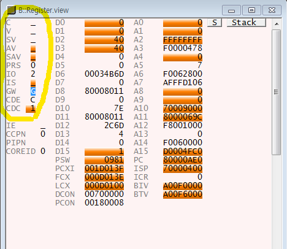
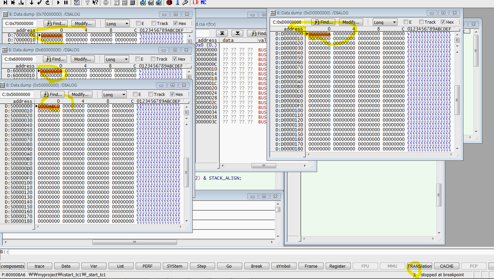
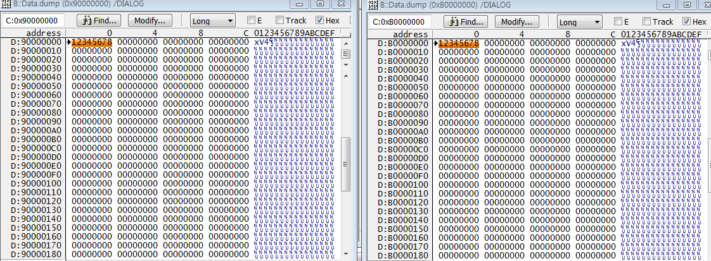
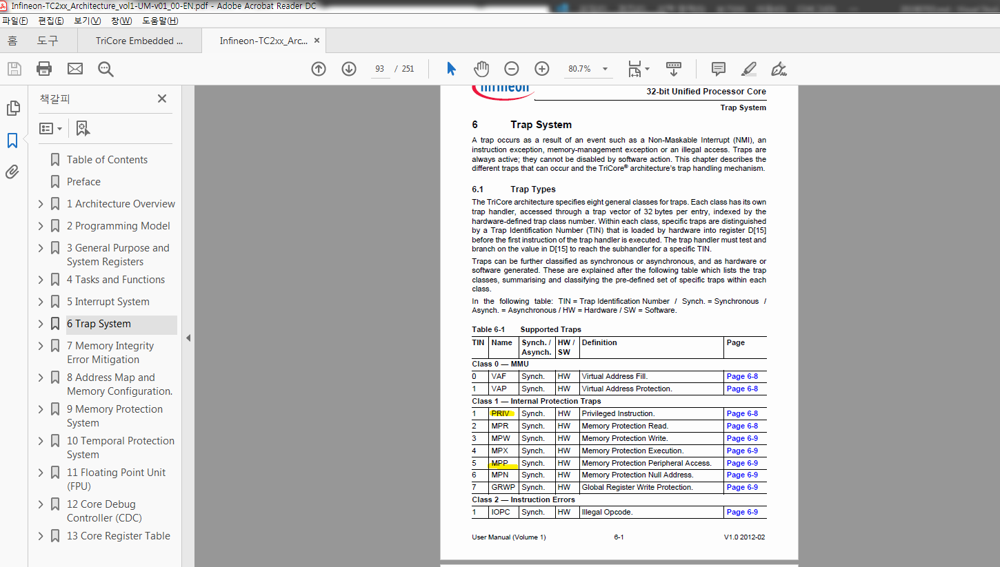
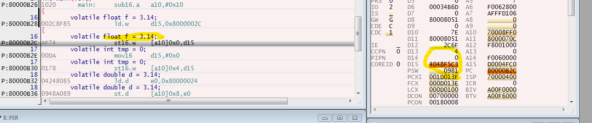
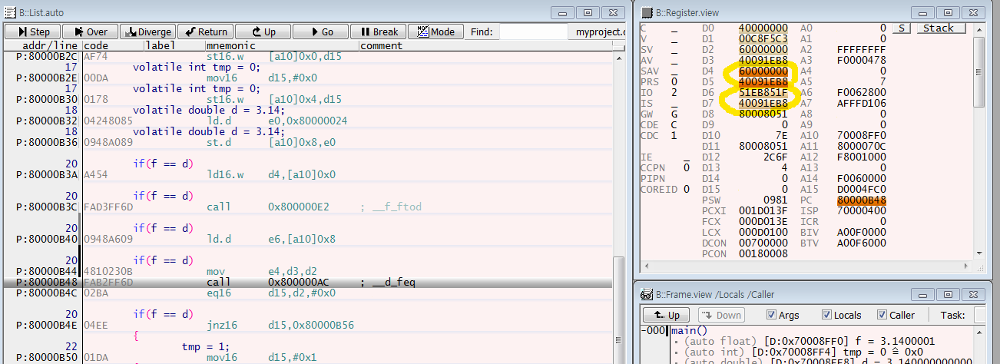

# 3일차

p71

오릭스 ram 은 0x7000 0000 부터  write가능한 영역
(뭔가 잘못되면 abort처럼 trap이 발생 )

---
EABI 문서
calling convention  우리 MCU는 콜링할때 이런 방식으로 하겠다. 

argument passing
데이터나 포인터가 넘어갈수있다.

2.2.3.1 Non-Pointer Arguments
Up to four 32-bit non-pointer arguments are passed in registers D[4] through D[7]

2.2.3.2 64-bit Arguments
Up to two 64-bit arguments are passed in the register pairs D[4]/D[5] (extended register E[4]) and D[6]/D[7]
(extended register E[6]).

2.2.3.3 Pointer Arguments
Up to four pointer arguments are passed in registers A[4] through A[7].

레지스터 인자값의 수가 넘어가면
나머지는 스택으로 넘어가게된다. 

리턴할때 
배열은 문법자체가 불가능
구조체는 리턴가능
성능자체가 떨어짐. 그래서 포인터 사용

load effetive 

 
스크레치 패드 레지스터  인자값으로 사용해서 넘기고 끝남.
지워져도 되게끔 만들어줌. 안중요하지않다. 

하지만! 로우 컨텍스트들이 중요하지않지만 인자값을 넘기고 
사용되게될때 중요해지며 그땐 어퍼컨텍스트 즉, 중요레지스터에 백업해주기도하고
내가 그상황을 고려해서 백업을 직접해줘야될때도 있다. 

D와 C는 프라이빗 주소로
같은 주소인데 글로벌하게 접근하게 하는 주소가잇고
다이랙트로 접근하는 주소가 있다. 

모든 접근할 주소를 
C,D로 접근한다. 
0번 코어 1번코어 ... C,D를 통해서 접근하게한다. 
실제로는 다 다른 주소로 접근하는것이다.
서로 간섭하지 못하게 해준다. 

0x90000000 영역은 
캐시에 저장하는것

0xB0000000 영역은
캐시에 저장하지않고 바이패스 해서 저장하는것 영역임.
(사실 캐시에 저장햇는지 확인할수 없다. 디버거는 그렇게 저장된걸 보여줄뿐임)

p81 보호정책에 의한 트렙

----

p119

void func(int arg1, int* arg2)
{

}

int main(void)
{
	volatile float f = 3.14;
	volatile int tmp = 0;
	volatile double d = 3.14;

	if(f == d)
	{
		tmp = 1;
	}
	else
	{
		tmp = 2;
	}
}

데이터 인코딩 방법에 따라 차이가 생긴다.

더블 정밀함 설정 함

3.14를 표현하는것이 다르다.

encoding 하면서 달라진다. 

32비트 표현과 64비트 표현이 다르고 비교할수없다.

4바이트 8바이트 두개를 서로 더한다면
똑같은 타입으로 맞춰야됨.
8로 늘려서 더하는데
이것도 위험함 뭐로 채워질지모르기때문에
그러나 짤라서 4바이트로 더하면
뭐가 짤릴지 예상이 되기때문에 더 안전함?

23비트 만 받으니까 짤린다. float으 ㄴ

double은 52비트를 다 받은것.

fraction 부분 더 많이 받은거임.

비교 해보면 뒷자리까 0ㅇ으로 채워짐.

그렇기때문에

컴파일러마다 값이 다를수있기때문에

float 비교는 하지않는다.

volatile float f = 3.14;
는 상수 실수는 double이다. 

float =  double인 상황이다.

옵션에서 
더블 정밀함 설정 을 체크 해제하면 
상수 실수가 float으로 바뀐다. 

----

enum은 네임스페이스가 달라도 상수로써 쓰이기때문에 
이름이 같으면안된다.

가변적인데 옵션에서 
4바이트로 고정을 설정할수있다. 

enum tag
{
	A = 123256,
	B
};

enum tag1
{
	C = 100,
	D
};
void func(int arg1, int* arg2)
{
	volatile char a = 10;
}

int main(void)
{
	volatile float f = 3.14;
	volatile int tmp = 0;
	volatile double d = 3.14;

	volatile enum tag AAA;
	volatile enum tag1 BBB;

	tmp = sizeof(AAA);
	tmp = sizeof(BBB);

	if(f == d)
	{
		tmp = 1;
	}
	else
	{
		tmp = 2;
	}
}

----

ld.b

옵션 char 를 unsigned로 바꾸면

ld.bu 로 바뀜

