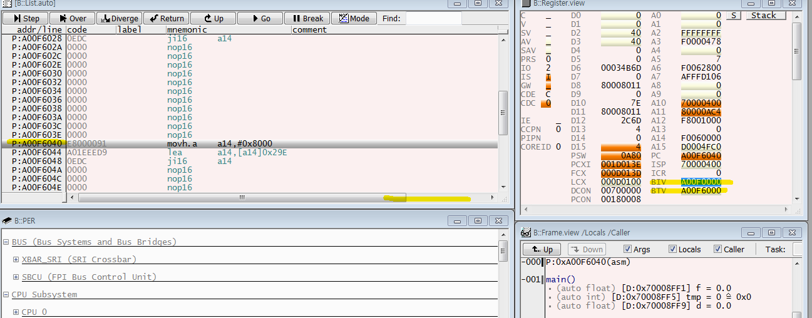

st16.w [a10]0x0, d15
a10의 값을 변경
짝수를 홀수로

R.S A10 0x70008ff1

강제로깨고 넘기면 트랩에빠짐
 트랩계산

64비트 32나누면 2
D15가 4

함수 포인터 배열 선언
void (*ID[10])(void);

volatile char A[10] = "string"; 
7바이트 복사본을 만든것

volatile char *B = "string";

원본 자체를 바꿀수있다. 복사를해서 사용하면됨.
문자열 자체를 수정가능함. 크기도 가변적임

A[1] = 'a';
B[1] = 'a';

*(A+1) = 'a';
*(B+1) = 'a';

B[1]는 0x8000 는 ROM 영역 
수정불가 영역
트렙빠짐
근데 바로 빠지는게 아니고 좀 지나서 에러빠짐
이건 비동기 데이터 엑세스 에러.

데이터 타입이 일치해야 연산가능
형변환도 쓰려면 문서로 작성해야됨
유니언은 되도록 쓰면안된다.
하지만 IO에서 써야 효율적이다.

---

int main(void)
{
	volatile unsigned int A = -1; 
	volatile signed int B = 1;   
	volatile int tmp = 0;
	
	if(0xFFFFFFFF > 0x00000001)
	if(unsigned int > signed int) //앞에 타입에의해 비교가 달라진다.
	//무엇을해야 1이되는가?
    //변수는 선언할때 잘보인다. 
    //상수리터럴 은 보이지않는다. 
    // 0x

	if(A > B)
	{
		tmp = 1;
	}
	else
	{
		tmp = 2;
	}
}

요두개는 무조건 이테그 프로모션이 발생하기때문에 생각을해야됨.
char
short

이밑으로는 큰 자료형으로 묵시적 형변환.
signed int
unsigned int
float
double
long double

---
p137

/*****************************************************
 *
 * myproject.c
 *
 * Description : Hello World in C, ANSI-style
 *
 */

typedef int (*ID)[3];
typedef int ARR[2][3];

int main(void)
{
	ID var;
	ARR var1;
}
//실수의 확률을 줄이기위해서 그리고 가독성을 위해서 재정의 하여 가린다.
//헤더와 include에 정의해놓는다.

typedef int (*ID)[3];

int (*FN)(int,int);

typedef int ARR[2][3];

int main(void)
{
	ID var;
	ARR var1 = {{1,2,3},{4,5,6}};
	int tmp;
	// var1: int [2][3]

	//tmp = ((FN)var1)(1,2);
	tmp = ((int (*)(int,int))var1)(1,2);
	//tmp = ((void (*)(void))var1)();
}

---
p150

typedef 연습하기 
풀고 묶기 하기

typedef short * SSI;
typedef SSI (*AP)[3];
typedef AP (*FP)(void);

FP var;

short * (*(*var)(void))[3];

---
문제

/*****************************************************
 *
 * myproject.c
 *
 * Description : Hello World in C, ANSI-style
 *
 */

void func(int *arg)
{
    // a -> 'A'
    volatile char a = (char)arg;
    // b -> 10
    volatile short b = (short)arg;
    // c -> 500
    volatile int c = (int)arg;
    // d -> 1000
    volatile long d = (long)arg;
    // e -> 3.14
//    volatile float e = (float)arg;
    // f -> 6.625
//    volatile double f = (double)arg;
    // *P -> 123
    volatile int * p = arg;
}

struct va_tag
{
    char a;
    short b;
    int c;
    long d;

    float e;
    double f;
    int *p;
};

int main(void)
{
    int start = 123;

    struct va_tag var = {'A', 10, 500, 1000, 3.14f, 6.625, &start};

    func(&var);
}

---
해답
/*****************************************************
 *
 * myproject.c
 *
 * Description : Hello World in C, ANSI-style
 *
 */

typedef short * SSI;

typedef SSI (*AP)[3];

typedef AP (*FP)(void);

//short * (*(*var)(void))[3];
//
//
//
//SSI (*(*var)(void))[3]
//AP (*var)(void);
FP var;

struct va_tag
{
    char a;
    short b;
    int c;
    long d;

    float e;
    double f;
    int *p;
};

void func(int *arg) //구조체의 주소를 받는다. 구조체의 시작주소
{
    // a -> 'A'
    volatile char a = (*(struct va_tag *)arg).a;
    // b -> 10
    volatile short b = (*(struct va_tag *)arg).b;
    // c -> 500
    volatile int c = (*(struct va_tag *)arg).c;
    // d -> 1000
    volatile long d = (*(struct va_tag *)arg).d;
    // e -> 3.14
    volatile float e = (*(struct va_tag *)arg).e;
    // f -> 6.625
    volatile double f = (*(struct va_tag *)arg).f;
    // *P -> 123
    volatile int * p = (*(struct va_tag *)arg).p;
    volatile int tmp = *p;

    //(*). == -> //값에 점 를 하냐 주소에 ->를 하냐의 차이
    //(*). == -> //값에 점 를 하냐 주소에 ->를 하냐의 차이
    (*(struct va_tag *)arg).c;
    ((struct va_tag *)arg)->c; //(struct va_tag *)arg->c; 연산자우선순위때문에 안됨  
        
    
    a = *((char *)arg + 0); //그 순간의 데이터 타입을 알아야한다.  // arg는 (int *) 이다. //char * + int -> *(char *)는 char 타입만큼 값을 읽는다.
    b = *(short *)((char*)arg + 2);

    p = ((struct va_tag *)arg)->p;

//그 순간의 데이터 타입을 알아야한다.  
// arg는 (int *) 이다. 
//char * + int -> *(char *)는 char 타입만큼 값을 읽는다.가중치
    //  읽어올값의 크기 , 메모리 주소이동+ 가중치
    a = *          ((char *)arg + 0);
    b = *(short *) ((char *)arg + 2);
    c = *(int *)   ((char *)arg + 4);
    d = *(long *)  ((char *)arg + 8);
    e = *(float *) ((char *)arg + 12);
    f = *(double *)((char *)arg + 16);
    p = *(int **)  ((char *)arg + 20);
    tmp = *p;
}

int main(void)
{
    int start = 123;

    struct va_tag var = {'A', 10, 500, 1000, 3.14f, 6.625, &start};

    func(&var);
}

---
포인터 배열과
함수포인터 배열의 차이

#include<stdio.h>
int main()
{
	short *(*(*var)())[5];
	short *(*P)[5]; 

	short *(p)[5]; 
	
	printf("%d ",sizeof(var));
	printf("%d ",sizeof(P));
}

----

실습 세팅설정

file - import - general - existing projects into workspace

-achive file (압축 파일) 압축파일 선택하고 피니시~

---
명령어 메뉴얼 보는법

ja main  pc를 가공해서 main으로 간다.

PC = {disp24[23:20], 7’b0000000, disp24[19:0], 1’b0};

절대주소를 가공해서 효과적인 주소를 만든다.

최상위 비트 4비트를 만들고 , 7비트를 바이너리로 0으로 채움,
19비트 부터 0까지, ... 가공해서

pc에 저장

