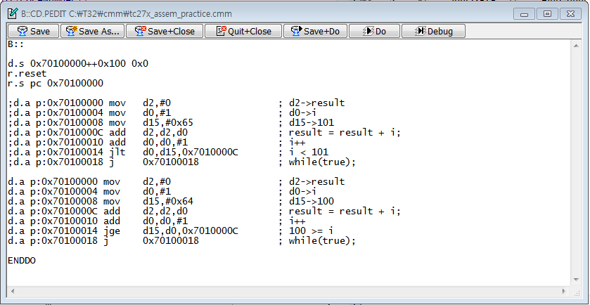
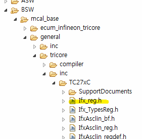

디버깅할때
반복문은 
반복문 탈출 조건 이후 의 브렉포인트 설정하고
go하면 편함
그리고 반복문내에 문제가 있는지 
크게 확인할수있다. 

---
실습

#include "IfxPort_regdef.h" 
클릭하고 f3누르면 이동함.

---
LED 껏다켜기

#include "IfxPort_reg.h"

void core0_main(void)
{
	volatile int i = 0;
	MODULE_P11.OUT.B.P6 = 0x01; //((PORT_PIN_OUT | PORT_PIN_MODE_GPIO) >> 3);
	MODULE_P11.IOCR4.B.PC6=0x10;

	for(;;)
	{
		MODULE_P11.OUT.B.P6 ^= 0x01;

		for(i=0; i<0x1fffff; i++){;}
	}
}

