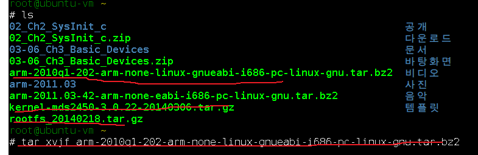
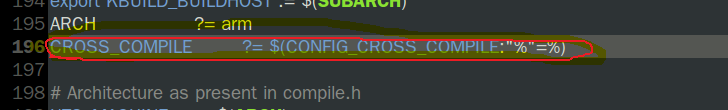
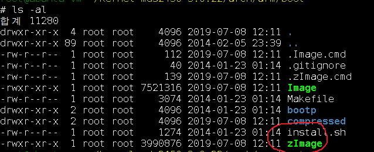
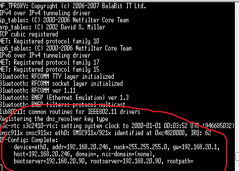
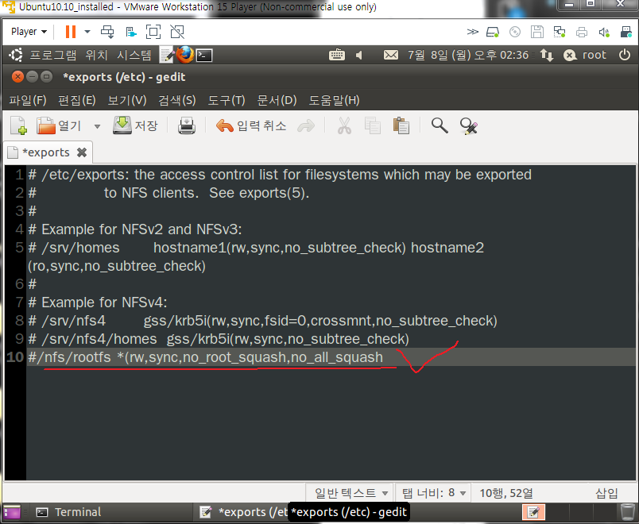
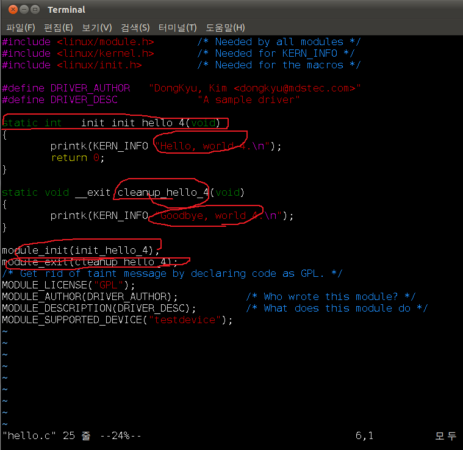

# 9주차 


파일 디스크립터 - 파일 기술자 파일 지시자.

정수를 리턴 .3번부터. 012 는 예약되어서 쓰고있다. 

다음부터 오픈하면 3번부터.


위에서 봤을때 다 파일로 처리함
그래서 LED든 뭐든.. 다 파일로 처리함
주변장치에 대한 통일해줌. 


스핀락.


이더넷 카드 는 커널 
인터넷창은 여러개 


이력서 관리 


---
p12
윈도우는 커널소스를 오픈하지 않는다.

커널소스

방대함


커널소스마다 작은 메이크 파일이 존재
100개가 넘는다. 


Ko


---

arm-2010q1-202-arm-none-linux-gnueabi-i686-pc-linux-gnu.tar.bz2
크로스컴파일러

kernel-mds2450-3.0.22-20140306.tar.gz                            
디바이스 드라이버스 소스

rootfs_20140218.tar.gz
루트파일시스템





arm-2010q1-202-arm-none-linux-gnueabi-i686-pc-linux-gnu.tar.bz2
크로스컴파일러
압축풀면 

2010q1나옴

root@ubuntu-vm ~
# gedit /etc/environment 

PATH="/usr/local/sbin:/usr/local/bin:/usr/sbin:/usr/bin:/sbin:/bin:/usr/games:/root/arm-2011.03/bin:/root/arm-2010q1/bin"

root@ubuntu-vm ~
# source /etc/environment 

소스는 적용하는것

arm- 에서 텝을 해보면 설정이 되었는지 확인할수있다. 


root@ubuntu-vm ~
# tar xvzf kernel-mds2450-3.0.22-20140306.tar.gz

컴파일하기전에 해야할 이명령어를 해야됨 
이보드에 맞게 설정이 된걸 포팅한것임.
# make mds2450_defconfig 


root@ubuntu-vm ~
# cd kernel-mds2450-3.0.22
root@ubuntu-vm ~/kernel-mds2450-3.0.22
# ls
COPYING        Makefile        build_kernel  init    samples   virt
CREDITS        Module.symvers  crypto        ipc     scripts
Documentation  README          drivers       kernel  security
Kbuild         REPORTING-BUGS  firmware      lib     sound
Kconfig        arch            fs            mm      tools
MAINTAINERS    block           include       net     usr
root@ubuntu-vm ~/kernel-mds2450-3.0.22
# make mds2450_defconfig
  HOSTCC  scripts/basic/fixdep
  HOSTCC  scripts/kconfig/conf.o
  HOSTCC  scripts/kconfig/zconf.tab.o
  HOSTLD  scripts/kconfig/conf
#
# configuration written to .config
#
root@ubuntu-vm ~/kernel-mds2450-3.0.22


root@ubuntu-vm ~/kernel-mds2450-3.0.22/arch/arm/boot
# ls
Image  Makefile  bootp  compressed  install.sh  zImage

zImage의 저장 위치!




#CROSS_COMPILE	?= $(CONFIG_CROSS_COMPILE:"%"=%)
수정
CROSS_COMPILE	?= arm-none-linux-gnueabi-


cd ~과 cd /root 는 같다.
cd / 는 다른위치이다.


/root 에 압출 풀고 파일 놔둔다.

그리고 다 압축풀고

위의 설정을해준다.

make clean 하고
make zImage 를 하면 
커널 컴파일을 한다.

zImage가 리눅스 커널파일이다.


커널파일!!!!!!!!!!!!!! 



tftp 설정

cd /etc/xinetd.d 

gedit tftpd 

작성!

service tftp
{
	protocol = udp
	port = 69
	socket_type = dgram
	wait = yes
	user = nobody
	server = /usr/sbin/in.tftpd
	server_args = /tftpboot
	disable = no
}


cd /etc/xinetd.d 
여기로 들어가서

mkdir /tftpboot
chmod 777 /tftpboot
/etc/init.d/xinetd restart

netstat -au


테라텀에서
연결한다.

ifconfig 로 

ifconfig eth1 1... up 해서 연결한다.


tftp 300800 zImage

bootm 30008000

계속 업을 해준다. 


파일시스템을 찾지못하는상태이다.



   nfs 네트워크 파일시스템 
이보드에 파일시스템이 있는것처럼 가져다 쓸수있다. 
파일시스템 찾아서 대장 프로세서 유닛 프로세서 파일시스템을 만들어줘야 돌기시작한다. 

테라텀
printenv


요두개 가 가장중요.

dev 가 디바이스 이다. 

bootcmd=tftp 32000000 zImage;bootm 32000000

bootargs=root=/dev/nfs rw nfsroot=192.168.20.90:/nfs/rootfs ip=192.168.20.246:192.168.20.90:192.168.20.1:255.255.255.0::eth0:off console=ttySAC1,115200n81





/etc/init.d/nfs-kernel-server restart


/etc/network/interfaces 
gedit interfaces 에서

eth1  주소 확인

auto lo
iface lo inet loopback

auto eth3
iface eth3 inet static
address 192.168.20.90
netmask 255.255.255.0

설정하게되면 자동으로 up을 해준다.!


파일시스템을 못찾을때 
커널 패닉
exports 파일을 확인한다.

혹은 nfs 폴더를 지우고 다시 압축을 푼다.


ipaddr 와 server C클래스까지 같아야함.

ipaddr=192.168.20.111
serverip=192.168.20.90

여기서 A.B.C.D 클래스에서

C클래스까지 같아야 한다. 


---


nfs란
네트워크 파일시스템을 연결해놓는것이다.

보드 리눅스와
pc 리눅스가 공유폴더로 연결된상태이다.

테러텀에서 

cd /  
와

pc /nfs/root 

가 같은 곳이다. 


---
module-13

폴더풀고 makefile 수정

KDIR	:= /root/work/embedded/linux-3.12.14

커널의 위치를 수정해준다.
KDIR	:= /root/kernel-mds2450-3.0.22

커널의 위치 
설정하고


make clean make

 그럼
 ko 파일나온다.


root@ubuntu-vm ~/module
# ls
13_module.zip   hello.ko     hello_param.c      hello_param.o
Makefile        hello.mod.c  hello_param.ko     modules.order
Module.symvers  hello.mod.o  hello_param.mod.c
hello.c         hello.o      hello_param.mod.o

```
mds2450 login: root
# cd
# touch aaa
# pwd
/root
# cd /
# ls
bin      etc      lib      mnt      proc     run      sys      usr
dev      home     linuxrc  opt      root     sbin     tmp      var
# touch aaa
# insmod hello.ko //커널에 넣기
Hello, world 4.
# rmmod hello.ko //커널에서 빼기
Goodbye, world 4.
#
```

static 한파일내에서만 쓰겟다!!
커널에 방대한 파일에서 겹치는 함수가 많다.
그걸막기위해 static 선언을해준다. 함수앞에

모듈안에서는 printf가안되고 printk를 할수있다.




가장간단한 모듈!
```
#include <linux/module.h>       /* Needed by all modules */
#include <linux/kernel.h>       /* Needed for KERN_INFO */
#include <linux/init.h>         /* Needed for the macros */

#define DRIVER_AUTHOR   "DongKyu, Kim <dongkyu@mdstec.com>"
#define DRIVER_DESC             "A sample driver"

static int __init init_hello_4(void)
{
        printk(KERN_INFO "Hello, world 4.\n");
        return 0;
}

static void __exit cleanup_hello_4(void)
{
        printk(KERN_INFO "Goodbye, world 4.\n");
}

module_init(init_hello_4);          //함수 포인터변수 넘긴다.
module_exit(cleanup_hello_4);
/* Get rid of taint message by declaring code as GPL. */
MODULE_LICENSE("GPL");
MODULE_AUTHOR(DRIVER_AUTHOR);           /* Who wrote this module? */
MODULE_DESCRIPTION(DRIVER_DESC);        /* What does this module do */
MODULE_SUPPORTED_DEVICE("testdevice");

```

makefile 수정해보기
```
obj-m += hello_KMJ.o
obj-m += hello_param.o

#KDIR   := /lib/modules/$(shell uname -r)/build
KDIR    := /root/kernel-mds2450-3.0.22

all:
        make -C $(KDIR) SUBDIRS=$(PWD) modules

clean:
        make -C $(KDIR) SUBDIRS=$(PWD) clean

```

```
# insmod hello_KMJ.ko
Hello, KMJ world.
# rmmod hello_KMJ.ko
Goodbye, world 4.
# insmod hello_KMJ.ko
Hello, KMJ world.
# insmod hello_KMJ.ko
insmod: can't insert 'hello_KMJ.ko': File exists
# insmod hello_KMJ.ko
insmod: can't insert 'hello_KMJ.ko': File exists
```
insmod는 한번만 이후에는 빼야함.
혹은 리붓해야한다.


root@ubuntu-vm ~/kernel-mds2450-3.0.22/arch/arm/boot
# ls
Image  Makefile  bootp  compressed  install.sh  zImage


https://www.joinc.co.kr/w/Site/Embedded/Documents/LinuxKernelModuleProg


원래 보드에 맞게 커널 포팅을 해야됨
zImage 커널을 압축한것.
커널시스템파일 


