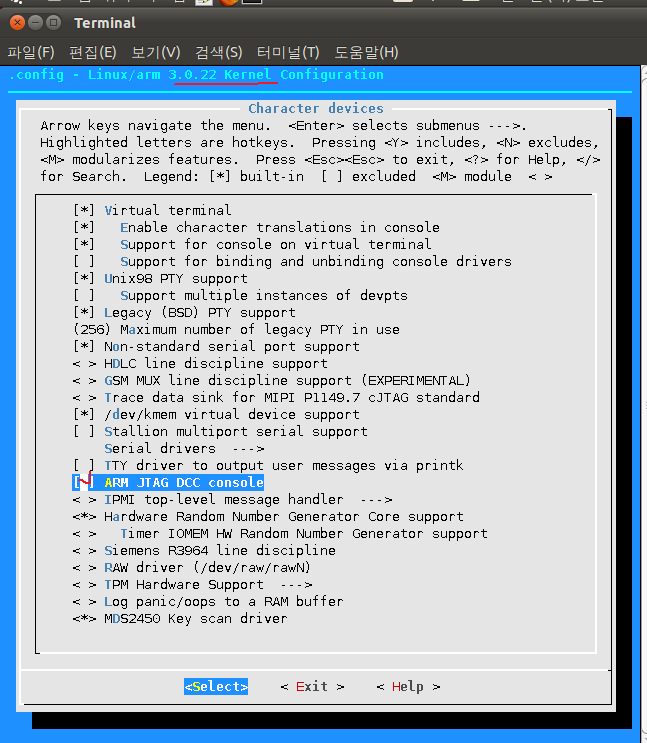
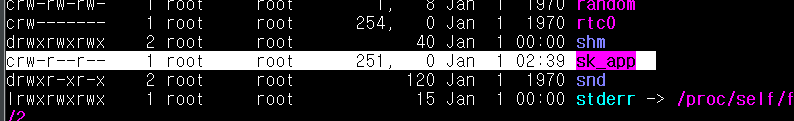

P17 그림 참고

커널영역은
커널프로그래밍 영역이다.

저수준 - 파일스크립트 저수준 로우 레벨에서의 파일입출력
LED를 특수 장치파일로 만든다 파일로 다루기위해서
LED를 파일오픈한다.

VFS 이것을 지나가면 전부다 파일로 다룬다 파일로본다.


고수준 - 파일 오픈 fopen이 고수준 파일입출력 
fopen fwrite ... 이것으로는 LED를 못킨다.


디바이스 드라이버 

문자 디바이스드라이버  C라고 표기

저장장치 디바이스 드라이버 B라고 표기

네트웍 디바이스 드라이버
조금 다르게 취급한다. 


주번호가 같으면 비슷한 이름들이다.
구분하기위해서 마이너넘버가 존재

---

커널 디렉토리안에서
make menuconfig



스페이스바로 체크하고 해제한다

커널에 static 하게 포함시키겟다는것 

---

모듈을가지고 insmod 안하고 컴파일한다면

한줄만 커널파일을 바꾸면
make zImage  커널컴파일 한다. 
엄청 오래걸림..

모듈이 개발되어서 insmod로 바로 적용가능해짐.

커널이 동작중인 상태에서!!! 적용이가능하다는점.

```
테라텀에서 
커널버전이 동일해야된다. 
커널버전이 다르면 튕겨낸다. 
밑에서 버전을 확인할수있다.

mds2450 login: root
# uname -a
Linux mds2450 3.0.22 #64 PREEMPT Mon Jul 8 12:11:37 KST 2019 armv5tejl GNU/Linux
#

```

proc 디렉토리는 시스템 인포메이션 창고.
cd proc/1 status
idle 프로세서가 0번이다. 

---
특수 장치파일 등록 예시
```
root@ubuntu-vm /proc/1
# mknod /dev/led c 240 0
root@ubuntu-vm /proc/1
# ls -al /dev/led
crw-r--r-- 1 root root 240, 0 2019-07-09 09:56 /dev/led
```

심볼릭링크  소프트링크라하기도함
하드링크 

함수포인터 void형 포인터 변수 
커널을 연결해서 편하게 함수를 쓸수 있게해주는 방법이다.

책 추천 
리눅스 디바이스 드라이버 - 저자 유영창

네트워크 디바이스 드라이버 
eth1 은 (이름있는 파이프) 


파일스크립터 오픈 후에 꼭 close하도록!

커널 코드 

Ko 커널 오브젝트는  즉 객체로써 디바이스를 관리하겟다
즉 재사용성을 높이겟다는것.

---

p26

실습
open 디렉토리

makefile 수정

make 후 

sk.o 파일 nfs로 보냄

실행 확인


모듈소스 분석하는 방법은
밑에서 위로 읽는다.

```
if(sk_major) {
		sk_dev = MKDEV(sk_major, sk_minor); //내가 특정 메이저번호지정할때!
		error = register_chrdev_region(sk_dev, 1, "sk");
	} else { //지정안하고 지정해달라고 부탁할때
		error = alloc_chrdev_region(&sk_dev, sk_minor, 1, "sk");
		sk_major = MAJOR(sk_dev);    //메이저넘버 받을수잇는함수다.
	}
	if(error < 0) {      //에러처리
		printk(KERN_WARNING "sk: can't get major %d\n", sk_major);
		return result;
	}
	
    cdev_init(&sk_cdev, &sk_fops); // 케릭터 device  cdev


struct file_operations sk_fops = { //sk_fops이 태그명 
    .open       = sk_open,      
    //함수포인터변수에 sk_open의 주소를 준다. 매개변수형식이 동일하다.
    //sk_open을 DD개발자가 작성해야될 코드부분이다.

    .release    = sk_release,   //함수포인터변수이다.
};
```
//

커널함수이다. 이미 만들어놓은 함수들.
//커널에서 자동을 할당해서주는 번호 
251번

---

sk_app.c
```
 fd = open("/dev/SK", O_RDWR); //파일디스크립터는 dev 밑에 sk를 가리킨다. 

```
sk_app.c는 컴파일하려면 gcc로 하는게 아니다 이건 intel
# arm-none-linux-gnueabi- 로
arm-none-linux-gnueabi-gcc -o sk_app sk_app.c
nfs 로 보냄.
실행하면 안됨

테라에서
./sk_app
에러남.

이유가 뭘까? 장치 파일이 등록되지 않아서 실행되지않았다!

sk.ko를 모듈을 돌려놓고 

mknod /dev/sk_app c 251 0 로 장치파일을 디스크립터로 메이져번호를 부여하고 등록 해준다.



그리고 나서 실행을해야 실행됨


sk_cdev.owner = THIS_MODULE; //this 와 같다.

sk_cdev.ops = &sk_fops; //주소를 넣는다.
error = cdev_add(&sk_cdev, sk_dev, 1); //1은 dd1개를의미함


---

mknod를 써주면 특수 장치 파일로 바꿔줌
어플리케이션 위에서 파일로 열수있다. dev/sk(sk는 스켈레톤 뼈대)
열고 파일디스크립터를 리턴해줌 


getchar();
close(fd); //파일디스크립터 

---

write 구현해보기

read write 코드

write
copy from user app에서 커널로

read
copy to user  커널에서 app 으로


기준이 application 인것같다.
app이 읽고 쓴다.


과제1
```
 어플리케이션 계층에서 일차원 문자배열을 선언하고 그 주소를 
read함수를 이용하여 커널영역으로 넘겨주면, 커널영역에서 
대문자를 할당하여 copy_to_user를 사용하여 다시 응용계층으로 넘겨주면
최종적으로 어플단에서 대문자를 찍는 프로그램을 작성하시고 

copy_from_user도 적용해보세요 ..(소문자를 찍는 프로그램)


다시 문제를 해결해보자 충분히 할수있다 
안되면 창호한테 물어보기.
read 예제를 가지고 해보기!

```


4바이트이상은 copy tofrom user

4바이트미만은 get, put user.


배열로 데이터를 보내는것보단 
구조체를 통해서 보내는경우가 많다.


과제2
```
: copy_to_user()/copy_from_user() 사용
 응용프로그램이 보내준
아래 구조체 형식의 데이터를 드라이버가 받아서 출력시키고 
드라이버는 같은 구조체 형식으로 또 다른 데이터를 응용프로그램에게
보내주고 응용프로그램이 출력시키는 코드를 구현하세요

/*  구조체 포맷  */
typedef struct
{
   int age;  //나이 :35
   char name[30];// 이름 : HONG KILDONG
   char address[20]; // 주소 : SUWON CITY
   int  phone_number; // 전화번호 : 1234
   char depart[20]; // 부서 : mds
} __attribute__ ((packed)) mydrv_data; 
            //구조체의 패딩바이트제거해준다.


//   sprintf(k_buf->name,"HONG KILDONG");

```
해답. mydrv-copy_to_user_답안


어플하고 연동할수있고 특수장치로만들어야 연결할수있는것.

---

파이널 과제 
write 로 led 켜기

예전에는햇던 led접근은 os없이 led접근한것.
다이렉트로 주소로 접근하면안되고

커널에 있는 디바이스 주소를 접근은 
커널에 허락맡고 접근해야된다.

kva = ioremap(0x7F008810,28) ;// 이렇게 허락받고 주소를 데칼코마디처럼 복사해서 리턴해줌. kva 에 넣고 
그걸 가지고 쓰면됨 예전처럼.


