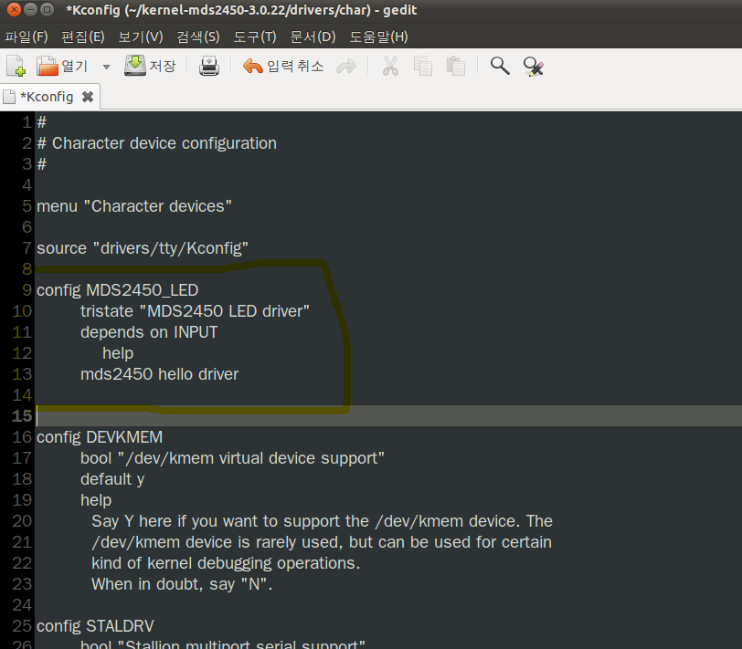
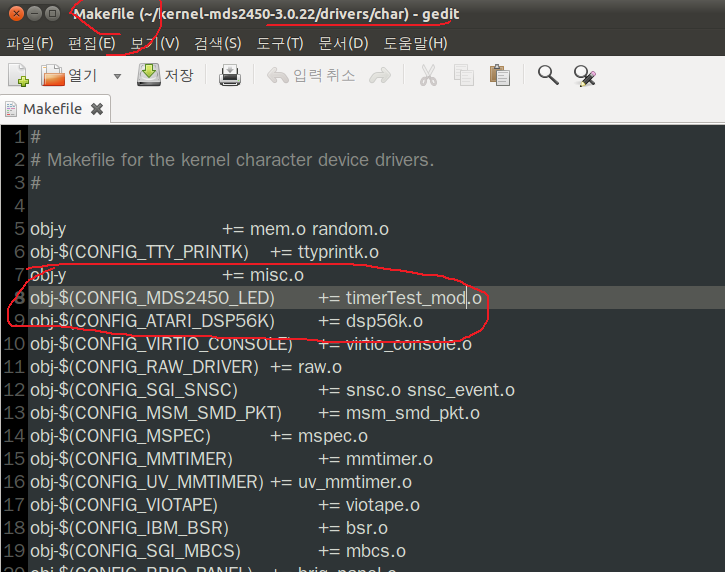
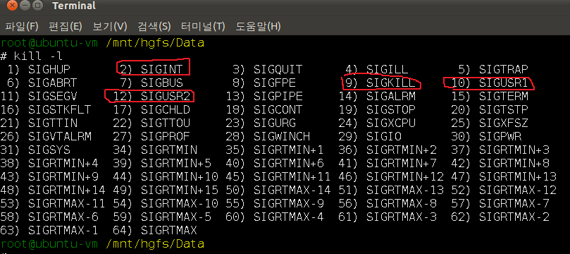

4일차 

# 타이머 인터럽트 
커널에서 정보를 찾아야한다면
cat /proc/devices 


30008000 위치에 zImage가 존재하며

그위치에서 압축이 풀린다.

압축을 풀고 32000000 으로 간다음에 실행함.

틱타이머 

리눅스 시간적개념을 총괄하는것이 jiffies 이다.

---

타이머 
실습

타이머 압축풀고
메이크파일 위에 주석풀고
밑에는 주석처리해주고

실행
이건 pc에서 타이머 실행하는것
피시 리눅스 에서 

insmod timerTest_mod.ko 

root@ubuntu-vm ~
# tail -f /var/log/messages

프로젝트 목표

디바이스 드라이버에 타이머를 포팅하고
커널이 부팅될때 LED가 깜빡거리게 하시오

---

1. pc -> ARM (포팅 )
2. ARM -> LED 제어 (타이머 인터럽트)
    kva 써야하고 //
    kva = ioremap(0x56000060,28) ;
3. DeviceDriver 작성
4. 커널에 포함
5. 부팅하면 자동으로 깜빡거리게한다.




Kconfig과 관련된 문법들이다.
리눅스 커널 소스 디렉토리에 있는 Kconfig를 설정 담당해줌

make menuconfig 라는 명령어는 항상 커널 최상위 디렉토리에서 해야된다.




메이크파일 수정후 

타이머 모드 시파일  
drivers/char 에 넣어야한다.


그리고 커널 zImage를 

커널 디렉토리 최상위에서 make zImage해서 

arch/arm/boot 에 zImage 생성된걸 다시 보드로 보낸다. 

그리고 그걸 부팅하면  timer.c 소스의 init을 부팅할때 로드한다 
그 소스에 Led제어 소스를 넣으면 부팅하고 계속 깜빡인다.


---

추가 프로젝트

완료 후 

app에서 write로 stop을 줘서 

stm stop  del 한다.

경호 소스 참고!!

---


---

봉주니 점심시간 이후 수업 필기

p 130부터 시작


tasklet 다운받고

버튼 누르는거 확인하고

키패드 인터럽트 방해해서
키안누리는거 해보기

답은 포문 /r 로 
키이벤트함수에 
for(p=0; p<0x1000; p++)
  printk("\rtest = %x", p);


하지만 
테스크큐=워크큐를 통해서 지연처리를 큐로 
빼서 
전부다 처리할수있다.

.c.ko 파일 참고!


DECLARE_DELAYED_WORK(mywork,(work_func_t)mywork_queue_func);

지연처리 매크로 등록


(work_func_t)mywork_queue_func 요게 지연처리함수


static irqreturn_t

rebis_keyevent(int irq, void *dev_id, struct pt_regs *regs)
{
    //struct rebis_key_detection *gd = (struct rebis_key_detection *) dev_id;
    //int             state;
	printk("\nkeypad was pressed \n");
	schedule_delayed_work( &mywork,0);//여기서 처리할일을 넘겨주고 바로 인터럽트 복귀한것.


지연처리 매크로를 어디에 쓰면 좋을까?
이런 키가 눌리면서 지연해야될 특정한 
경우를 생각해서 코드로 만들어보세요

쉽게 말해서 잡이 쓰레드에 등록하는것이다.
커널 스레드처럼 메커니즘을 만든것이라 볼수있다. 


---


점심시간 이후 과제


터미널 쉘에서 치는것들은 소스로 구현할수있다.

system("insmod sk.ko");
system("mknod /dev/SK c 251 0");

alias 적용이안된다.

```c


#include <linux/errno.h>
#include <linux/kernel.h>
#include <linux/module.h>
#include <linux/slab.h>
#include <linux/init.h>
#include <linux/delay.h>
#include <linux/interrupt.h>
#include <linux/device.h>
#include <asm/io.h>
#include <asm/irq.h>

#include <mach/regs-gpio.h>
#include <plat/gpio-cfg.h>
#include <linux/gpio.h>
#include <linux/sched.h>

int my_kill_proc(pid_t pid, int sig) {//sig usr 1을 보내라.
    int error = -ESRCH;           /* default return value */
    struct task_struct* p;
    struct task_struct* t = NULL; 
    struct pid* pspid;
    rcu_read_lock();
    p = &init_task;               /* start at init */
    do {
        if (p->pid == pid) {      /* does the pid (not tgid) match? */
            t = p;    
            break;
        }
        p = next_task(p);         /* "this isn't the task you're looking for" */
    } while (p != &init_task);    /* stop when we get back to init */
    if (t != NULL) {
        pspid = t->pids[PIDTYPE_PID].pid;
        if (pspid != NULL) error = kill_pid(pspid,sig,1);
    }
    rcu_read_unlock();
    return error;
}
```
과제: LED 디바이스 드라이버에서 User 시그널을 발생시켜 이 시그널을 
      LED와 연동되고 있는 응용계층의 프로세스의 ID를 파악한 후, 
      시그널을 전달하면 미리 등록되어 있던 
      시그널 핸들러를 응용계층에서
      호출하는 프로그램을 작성하시오.

*** 기능정리 *** 
*응용영역

1) 프로세스 ID를 확인하기 위한 변수선언 ?? 
   pid_t pid
2) 프로세스 ID 확인 (무슨 함수???)
   getpid()
3) 응용영역에서 프로세스 ID를 디바이스 드라이버로 전달하는 기능
   write(파일디스크립터, &id, 4) 함수 사용
    get_user에서 보내준 pid 사용

4) usersignal 등록 및 핸들러 등록
5) 무한루프 or 쓰레드....

*드라이버영역
1) 커널타이머 핸들러에서 주기적으로 시그널 발생 
    (커널 영역에서 --> 응용계층으로)
2) 시그널발생시 프로세스 ID를 응용영역에서 전달받아 해당 프로세스에
   User 시그널 발생  
   (ex my_kill_proc) //my_kill_proc(PID, SIGNAL) //바로 어플리케이션으로 쏴줌 커널에서 SIGUSR1을 app으로쏘면 어플에서 반응이됨
   my_kill_proc --> 이 함수를 쓰세요..!!!


---

시그널 

kill -l
 시그널 10 12 usr1 usr2 는 사용자가 사용하라고 준 시그널 번호임




sigcatch1.c 파일 코드보시고
실행 gcc로 하시고 보시면댑니다!
갓봉보로봉봉

(signal(SIGINT, mySigHdlr) == SIG_ERR) { //SIGINT 신호를 받으면 mySigHdlr 해라.


